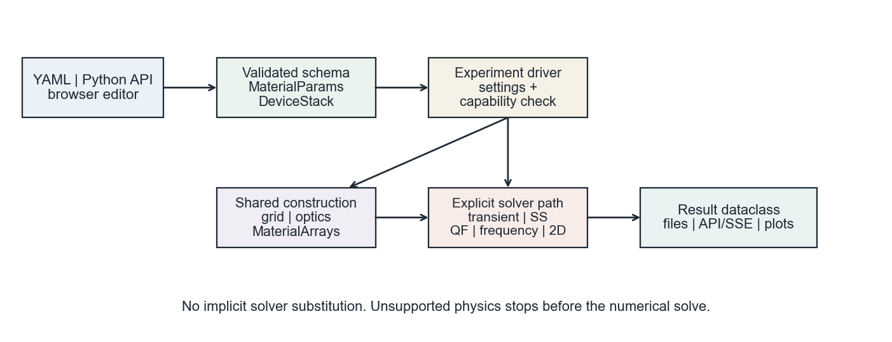
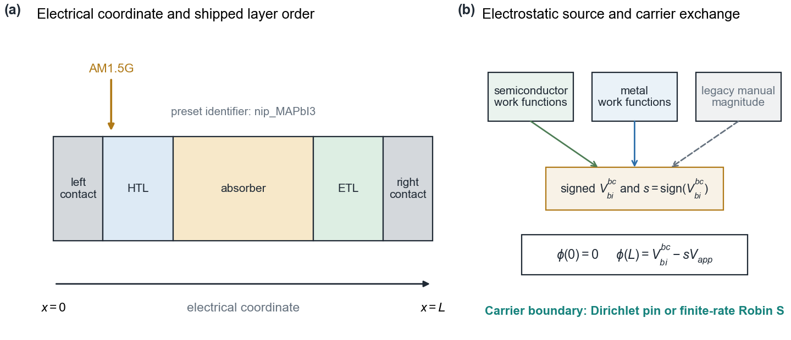
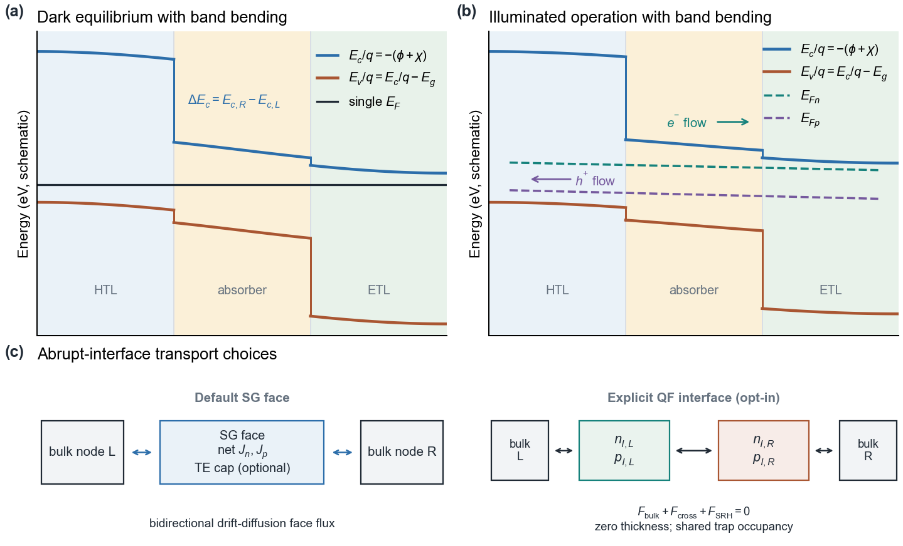
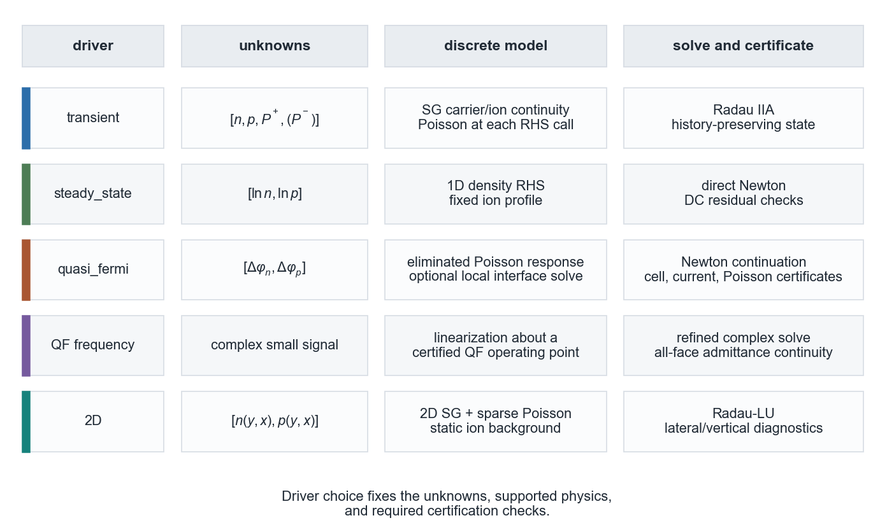
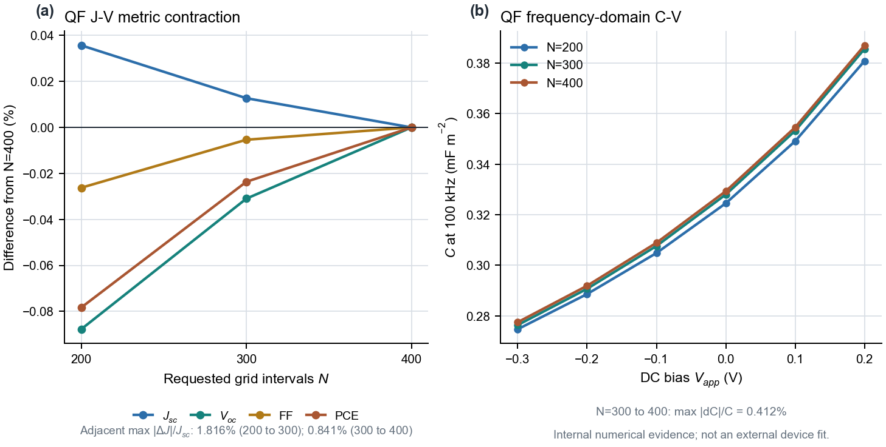
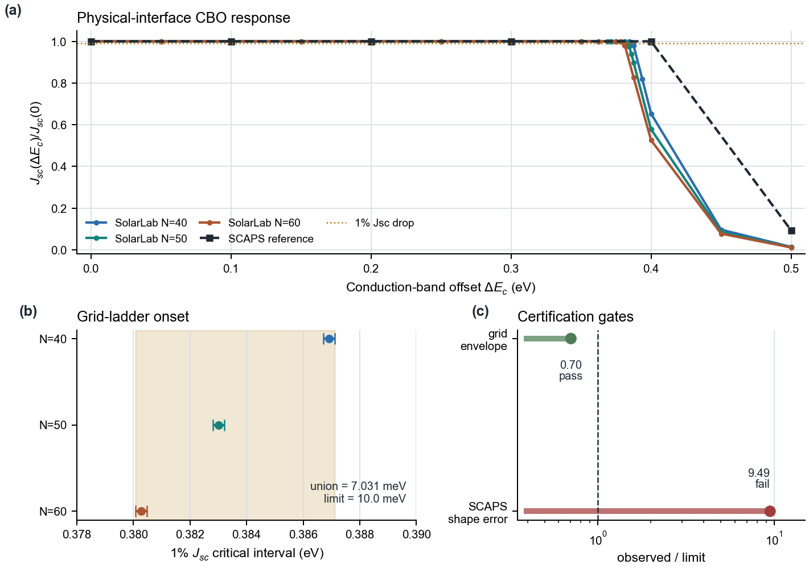
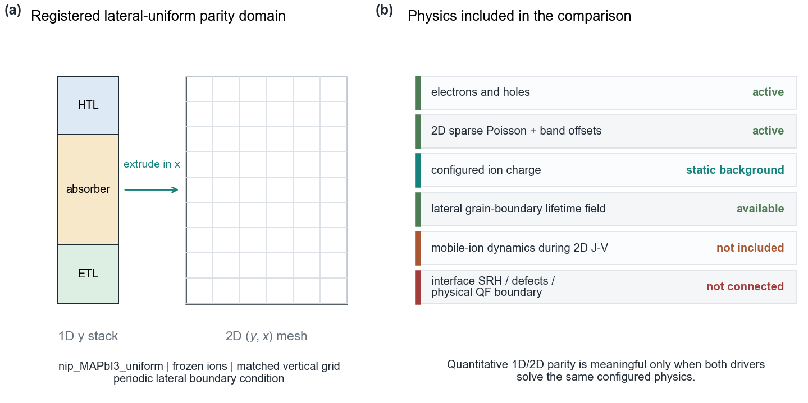
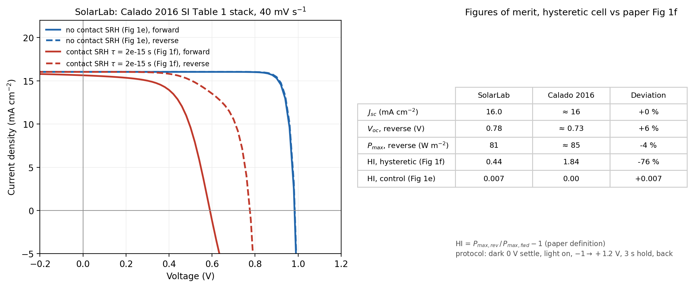
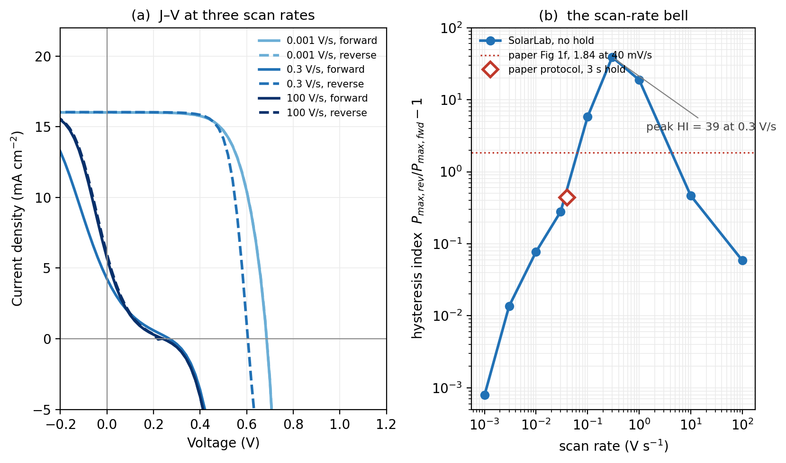

<div align="center">

# ☀️ SolarLab

**Thin-Film Solar Cell Simulator**

*1D/2D Drift-Diffusion · Poisson · Mobile Ions · Transfer-Matrix Optics*

Perovskite · CIGS · c-Si

<br>

[](https://www.python.org)
[](https://fastapi.tiangolo.com)
[](https://vitejs.dev)

<br>

Xuan-Yan Chen · Longhan Zhang · Zecheng Gan<sup>&#42;</sup> · Chang Yan<sup>&#42;</sup> · Tongyi Zhang<sup>&#42;</sup>

*The Hong Kong University of Science and Technology (Guangzhou)*

</div>

<br>

## Table of Contents

| | Section | Description |
|--:|---------|-------------|
| 1 | [Overview](#overview) | What SolarLab does |
| 2 | [Key Features](#key-features) | Capabilities at a glance |
| 3 | [Repository Layout](#repository-layout) | Directory structure |
| 4 | [Installation](#installation) | Setup instructions |
| 5 | [Running the Application](#running-the-application) | Backend + frontend startup |
| 6 | [Physical Principles & Equations](#physical-principles--equations) | Governing PDEs and physics |
| 7 | [Numerical Method](#numerical-method) | Solver architecture |
| 8 | [Validation & Model Scope](#validation--model-scope) | What current evidence does and does not certify |
| 9 | [Using the Web UI](#using-the-web-ui) | UI walkthrough |
| 10 | [Shipped Device Presets](#shipped-device-presets) | Available YAML configs |
| 11 | [Testing](#testing) | Test suite overview |
| 12 | [References](#references) | Key literature |

<br>

---

## Overview

**SolarLab** is a research-grade simulator for thin-film solar cells. The core is a one-dimensional **drift-diffusion + Poisson + mobile-ion** solver, with an experimental two-dimensional extension for lateral microstructure studies, backed by a **FastAPI** HTTP service and a **Vite / TypeScript / Plotly** single-page web application.

It reproduces the main thin-film characterisation experiments from a single device definition, grouped into four families:

| Family | Experiment | What it does |
|:-------|:-----------|:-------------|
| **Illuminated J-V** | J-V sweep | Forward + reverse scans with ionic memory preserved (hysteresis); optional current decomposition ($J_n$ / $J_p$ / $J_\text{ion}$ / $J_\text{disp}$) and spatial profiles ($\varphi$, $E$, $n$, $p$, $P$) per voltage point |
|  | Suns-V<sub>oc</sub> | Intensity sweep producing the Sinton pseudo-JV (immune to series resistance) and pseudo-FF upper bound |
| **Dark characterisation** | Dark J-V | Injection-current diode curve with auto-selected linear window → ideality factor $n$ and saturation current $J_0$ |
|  | Mott-Schottky (C-V) | Dark C-V + auto-windowed $1/C^2$ fit → built-in voltage $V_\text{bi}$ and effective dopant density $N_\text{eff}$ |
| **Spectral** | EQE / IPCE | Wavelength-resolved external quantum efficiency via monochromatic TMM; integrates against AM1.5G for $J_\text{sc}$ |
| **Transient** | Impedance spectroscopy | Lock-in extraction of $Z(f)$ with displacement current; Nyquist + Bode plots |
|  | Transient photovoltage (TPV) | Charge-conserving open-circuit light pulse with a matched unpulsed reference; a single-exponential relaxation time is reported only when identifiable |
|  | Degradation | Long-time transient with a **frozen-ion snapshot J-V** at each probe, decoupling slow ionic drift from the instantaneous electronic response |

The simulator works for perovskite cells (with mobile ions), inorganic thin films (CIGS, CdTe-style stacks), and crystalline silicon homojunctions — all through the same YAML-based device schema. A separate **2T monolithic tandem** driver performs a combined TMM over top + junction + bottom, runs independent sub-cell J-V sweeps, and series-matches at a common current grid.

The current technical reference is the **SolarLab Technical and User Manual (2026-08-11)**, distributed separately from this repository. It records the solver-specific variable sets, validation gates, and limitations that do not fit in this overview.

<p align="center">
  
</p>

<br>

---

## Key Features

### Core solver

| | Capability | Details |
|:-:|:-----------|:--------|
| 🧮 | **Drift-diffusion core** | Scharfetter-Gummel face fluxes with nonuniform control-volume continuity balances; Method-of-Lines with Radau implicit time integration |
| ⚡ | **Poisson solve** | Finite-volume operator with pre-factored LAPACK tridiagonal `dgttrf`/`dgttrs`, reusing the factor while grid and permittivity stay fixed |
| 🔬 | **Mobile ions** | Finite-site modified-PNP flux with shared-site dual-ion support; legacy whole-flux regularization retained only for frozen comparisons |
| 🏗️ | **Heterostacks** | Band offsets from $\chi$ and $E_g$; per-interface transport/recombination; signed contact potential from semiconductor work functions, explicit metals, or a legacy benchmark override |

### Physics upgrades (Phase 2–4)

| | Capability | Details |
|:-:|:-----------|:--------|
| 🌈 | **Transfer-matrix optics** | Coherent TMM for position-resolved $G(x)$ with the Poynting-vector correction so $R+T+A=1$; AM1.5G-weighted per-wavelength absorption |
| 🔥 | **Interface transport** | Default SG face with an optional thermionic cap; supported ion-free QF runs can instead use an exclusive zero-thickness interface boundary with reciprocal transport and shared interface-SRH occupancy |
| 💡 | **Photon recycling** | Yablonovitch single-pass escape probability $P_\text{esc} = \min(1, 1/(4 n^2 \alpha d))$ scales $B_\text{rad}$ per absorber (Phase 3.1) |
| 🔁 | **Self-consistent reabsorption** | Per-RHS radiative reabsorption feeds the trapped emission fraction back into $G(x)$ on absorber nodes (Phase 3.1b, FULL only) |
| 🌀 | **Field-dependent mobility** | Caughey-Thomas velocity saturation + Poole-Frenkel hopping applied per RHS from the Poisson face field (Phase 3.2, FULL only) |
| 🚪 | **Selective / Schottky contacts** | Robin-type flux $J = \pm q S (n - n_\text{eq})$ at outer contacts; $S \to \infty$ is ohmic, $S = 0$ is blocking (Phase 3.3, FULL only) |
| 🎯 | **Position-dependent traps** | Exponential or Gaussian defect profiles concentrated at transport-layer interfaces; $\tau(x) = \tau_\text{bulk} \cdot N_{t,\text{bulk}} / N_t(x)$ (Phase 4a) |
| 🌡️ | **Temperature scaling** | Varshni bandgap shift referenced to 300 K and power-law $B_\text{rad}(T) \propto (T/300)^\gamma$; self-consistent with $n_i(T)$ (Phase 4b) |
| 🧭 | **Explicit solver drivers** | Transient, direct steady-state, cancellation-safe quasi-Fermi, QF frequency-domain, and 2D drivers keep distinct variable sets and fail closed on unsupported physics |

### Tiered fidelity modes

| Tier | Physics set | Use case |
|:-----|:------------|:---------|
| **LEGACY** | No TE, no TMM, uniform traps, $T = 300$ K — classic IonMonger reproduction | Regression parity against published benchmarks |
| **FAST** | Permits build-once upgrades (TE, TMM, dual ions, trap profile, $T$-scaling, photon recycling); per-RHS hooks off | Selected by the SCAPS reference preset |
| **FULL** | Widest configured hook set, including per-RHS radiative reabsorption, $\mu(E)$, and Robin contacts | Runs that require those hooks; accuracy still depends on driver support and validation |

The tier is a feature ceiling, not an accuracy grade. The selected experiment driver still determines the unknowns, supported physics, and required certification checks.

The Python `DeviceStack` default and `resolve_mode(None)` select **FULL**. Shipped presets override this explicitly. A permitted feature activates only when its required parameters are present; selecting FULL does not supply missing material data.

### Driver Boundaries

| Path | Interpretation |
| --- | --- |
| `transient` | Time-dependent density/ion state with Poisson solved within RHS evaluations; preserves the declared voltage history |
| `steady_state` / `quasi_fermi` | Explicit DC solve, returned through the backend with forward = reverse and zero scan hysteresis |
| Frequency-domain adapters | Linearize a qualified operating state; supported charge/storage/contact combinations are adapter-specific |
| 2D default | Extrudes the electrical stack and uses frozen ionic background for the historical parity lane |
| 2D research extensions | One positive mobile-ion species and optional two-sided interface SRH have explicit Neumann-lateral topology gates; dual mobile ions are rejected |
| DAE research backbone | Separate residual/Jacobian models and backward-Euler reference integrators; these are not silently substituted into production experiment routes |

The function named `solve_equilibrium` provides a quasi-neutral starting state; it does not by itself certify full ion-relaxed equilibrium. J-V certification is also explicit: strict mode raises on a failed local certificate, while diagnostic mode returns invalid/NaN values for failed dependent points. See the [package guide](perovskite-sim/README.md) for the detailed capability contracts.

### Experiments

| | Capability | Details |
|:-:|:-----------|:--------|
| 📈 | **J-V sweep** | Forward + reverse scans with ionic memory preserved (hysteresis from physics, not post-processing); optional current decomposition and spatial-profile export |
| ☀️ | **Suns-V<sub>oc</sub>** | Intensity sweep → Sinton pseudo-JV (series-resistance-free) and pseudo-FF upper bound |
| 🌓 | **Dark J-V** | Auto-windowed linear fit on $\ln J$ vs $V$ → ideality factor $n$ and saturation current $J_0$ |
| 📊 | **Mott-Schottky** | Dark C-V with $1/C^2$ linearisation → built-in voltage $V_\text{bi}$ and effective dopant density $N_\text{eff}$ |
| 🌈 | **EQE / IPCE** | Wavelength-resolved external quantum efficiency via monochromatic TMM; AM1.5G integration yields $J_\text{sc}$ |
| 🎵 | **Impedance** | Lock-in $Z(f)$ with displacement current; Nyquist + Bode output |
| ⚡ | **Transient photovoltage** | Open-circuit light pulse with a matched control and a qualified photovoltage relaxation fit |
| 🧊 | **Frozen-ion degradation** | Snapshot J-V with both ionic species frozen, preserving their populations and backgrounds while solving the electronic steady state |
| 🔗 | **2T tandem driver** | Combined TMM over top + junction + bottom, independent sub-cell sweeps, series-matched on a common current grid |
| 🟦 | **2D J-V sweep** | Tensor-product 2D extension for lateral-uniform parity checks and microstructure / grain-boundary studies |
| 🟪 | **V<sub>oc</sub>(L<sub>g</sub>) grain sweep** | Repeats 2D J-V over grain sizes to quantify microstructure-driven open-circuit-voltage loss |

### Dimensionality

| | Capability | Details |
|:-:|:-----------|:--------|
| 📏 | **1D drift-diffusion (default)** | Supported 1D experiments use a tanh-clustered multilayer grid with the cached `MaterialArrays` hot path |
| 🟦 | **2D Stage A (lateral-uniform)** | Tensor-product (Ny × Nx) grid with sparse 5-point Poisson, vectorised 2D Scharfetter-Gummel fluxes, periodic / Neumann lateral BCs; bootstraps from the 1D illuminated steady state and freezes ions as a static Poisson background. On a laterally-uniform stack the 2D solver reproduces the 1D J-V to within sub-mV $V_\text{oc}$, $5 \times 10^{-4}$ relative $J_\text{sc}$, and $10^{-3}$ FF — pinned by `tests/regression/test_twod_validation.py`. Available as `kind='jv_2d'` from the backend and as the **J-V Sweep (2D)** entry in the workstation experiment selector. |
| 🟪 | **2D Stage B (microstructure)** | Vertical grain boundaries are defined through a YAML `microstructure:` block. The current operator uses exact control-volume overlap fractions to mix bulk and grain-boundary recombination rates, avoiding whole-node lifetime painting. The historical `nip_MAPbI3_singleGB` test fixture (one centred GB, $\tau_\text{GB}=50$ ns, width 5 nm) drops $V_\text{oc}$ by ~46 mV vs the laterally-uniform baseline — pinned to a 5–100 mV regression window in `tests/regression/test_twod_microstructure.py`. The headline `voc_grain_sweep` experiment maps $V_\text{oc}(L_g)$ over a sequence of grain sizes and is exposed as `kind='voc_grain_sweep'` from the backend / **V<sub>oc</sub>(L_g) Grain Sweep** entry in the workstation. |

### Tooling

| | Capability | Details |
|:-:|:-----------|:--------|
| 🖥️ | **Interactive web UI** | Live SSE streaming, grouped experiment dropdown, GoldenLayout dockable panes, Plotly plots, layer-builder editor |
| 🧪 | **Full test suite** | Unit, integration, and physics regression tests ($V_\text{oc}$ / $J_\text{sc}$ / FF / HI bounds; TMM $R+T+A$ conservation; 1D ↔ 2D parity gate) |

<br>

---

## Repository Layout

~~~text
SolarLab/
  docs/figures/                    Curated README and comparison figures
  perovskite-sim/
    perovskite_sim/                Python models, physics, discretization,
                                  solvers, experiments, 2D, and screening
    backend/                      FastAPI API and SSE job dispatch
    configs/                      Three shipped research YAMLs
    tests/fixtures/configs/       Historical/test-only device definitions
    reproducibility/              Schema, benchmark matrix, hashes, baselines
    docs/                         Current package capability contracts
    scripts/                      Experiments, imports, validation, plotting
    tests/                        Unit, integration, regression, validation
    notebooks/                    Exploratory workflows
    pyproject.toml                Core package and test dependencies
  web/                            Vite/TypeScript/Plotly/GoldenLayout UI
  scripts/                        Repository support utilities
  docker-compose.yml              Backend/frontend development stack
  CLAUDE.md                       Repository guidance and archive location
  README.md
~~~

The dated technical manual, historical planning records, and large generated
results are maintained outside the current source tree. The repository retains
curated figures and active package contracts; a local output directory is not
automatically part of the published evidence.

<br>

---

## Installation

### Prerequisites

- **Python 3.11+** (the package metadata requirement; focused checks below used 3.13)
- **Node.js 22.12+** with `npm`; the locked Vite 8 engine range is `^20.19.0 || >=22.12.0`
- A C compiler + BLAS/LAPACK (bundled with `numpy`/`scipy` wheels on most platforms)

### 1. Clone the repository

```bash
git clone https://github.com/ShaneLogic/SolarLab.git
cd SolarLab
```

### 2. Install the Python package

```bash
cd perovskite-sim
python -m venv .venv
source .venv/bin/activate
python -m pip install -e ".[dev]"
python -m pip install -r backend/requirements.txt
```

The editable core package installs NumPy, SciPy, PyYAML, Matplotlib, and the selected test dependencies. FastAPI/Uvicorn/Pydantic are supplied by the separate backend requirements command. Installing only `.[dev]` is not sufficient to start the HTTP service.

### 3. Install frontend dependencies

```bash
cd ../web
npm ci
cd ../perovskite-sim
```

### 4. Verify the install

```bash
# From perovskite-sim/
python -m pytest -q                                     # default non-slow suite
pytest -m validation -W error::RuntimeWarning           # literature-informed lanes
pytest -m slow -W error::RuntimeWarning                 # heavy physics suite; can exceed 1 h
python scripts/verify_reproducibility.py --json         # registry and frozen-baseline checks
```

<br>

---

## Running the Application

SolarLab runs as **two processes**: a FastAPI backend that executes the simulations, and a Vite dev server that serves the UI.

### Start the backend

From the **SolarLab root** (not `perovskite-sim/`):

```bash
uvicorn backend.main:app \
    --host 127.0.0.1 --port 8000 \
    --app-dir perovskite-sim --reload
```

Check it is alive:

```bash
curl http://127.0.0.1:8000/api/configs
```

You should get JSON listing the shipped presets.

### Start the frontend

In a second terminal:

```bash
cd web
npm run dev
```

Open **<http://127.0.0.1:5173>** in your browser. The frontend defaults to
`http://127.0.0.1:8000` and can be pointed at another backend with
`VITE_API_BASE`. CORS is enabled for the local development and preview flows.

### Run a simulation from Python (no UI)

Run from `perovskite-sim/` with the environment activated. This is a research sweep, not a minimal installation check. Its ordinary 0-to-V_max-and-back protocol differs from the original-paper comparison script.

```python
from perovskite_sim.models.config_loader import load_device_from_yaml
from perovskite_sim.experiments.jv_sweep import run_jv_sweep

stack = load_device_from_yaml("configs/calado2016_fig1f.yaml")
result = run_jv_sweep(stack, N_grid=100, n_points=61, v_rate=0.04, V_max=1.2)

print(f"PCE:  {result.metrics_fwd.PCE*100:.2f} %")
print(f"V_oc: {result.metrics_fwd.V_oc:.3f} V")
print(f"J_sc: {result.metrics_fwd.J_sc:.1f} A/m²")
print(f"FF:   {result.metrics_fwd.FF:.3f}")
print(f"Hysteresis index: {result.hysteresis_index:.3f}")
```

<br>

---

## Physical Principles & Equations

### Physical Model Overview

<p align="center">
  
</p>

<p align="center">
  
</p>

### Governing Equations

SolarLab solves the coupled **Poisson + drift-diffusion + mobile-ion** system on the default one-dimensional device axis. The 2D extension extrudes the same layer stack onto a tensor-product grid for lateral microstructure studies. State variables at every grid node are the electron density $n$, hole density $p$, and the mobile-ion density $P$.

<br>

### 1. Poisson's Equation

The electrostatic potential $\varphi(x,t)$ satisfies

$$
-\frac{\partial}{\partial x}\left(\varepsilon_0 \varepsilon_r(x)\frac{\partial \varphi}{\partial x}\right) = q\bigl(p - n + N_D(x) - N_A(x) + P - P_0(x)\bigr)
$$

with Dirichlet boundaries

$$
\varphi(0,t) = 0, \qquad \varphi(L,t) = V_{\text{bi}} - V_{\text{app}}(t).
$$

$V_{\text{bi}}$ is computed from the Fermi-level offset across the heterostack (`DeviceStack.compute_V_bi()`), accounting for $\chi$, $E_g$, doping, and $n_i$. The operator is discretized with a harmonic-mean face permittivity and pre-factored once per run (LAPACK `dgttrf`), then solved at every RHS call with a single `dgttrs` sweep.

<br>

### 2. Carrier Continuity (Drift-Diffusion)

Electrons and holes obey

$$
\frac{\partial n}{\partial t} = \frac{1}{q}\frac{\partial J_n}{\partial x} + G(x) - R(n,p,x), \qquad
\frac{\partial p}{\partial t} = -\frac{1}{q}\frac{\partial J_p}{\partial x} + G(x) - R(n,p,x)
$$

with the conventional drift-diffusion fluxes

$$
J_n = q\mu_n n E + qD_n\frac{\partial n}{\partial x}, \qquad
J_p = q\mu_p p E - qD_p\frac{\partial p}{\partial x}, \qquad E = -\frac{\partial\varphi}{\partial x}.
$$

**Scharfetter–Gummel discretization.** The flux between nodes $i$ and $i+1$ is written so it is exact for a constant-flux, exponential-profile solution of the local drift-diffusion equation:

$$
J_{n,\,i+\tfrac12} = \frac{qD_n}{\Delta x_i}\Bigl[n_{i+1}\,B(\Delta\varphi_i/V_t) - n_i\,B(-\Delta\varphi_i/V_t)\Bigr]
$$

where $B(x) = x/(e^{x}-1)$ is the Bernoulli function and $V_t = k_B T / q$. This removes the classical upwind/central-difference stability problem when $|E|\Delta x \gg V_t$.

<br>

### 3. Recombination

The net recombination rate is the sum of Shockley–Read–Hall, radiative (bimolecular), and Auger channels:

$$
R = R_{\text{SRH}} + R_{\text{rad}} + R_{\text{Auger}}
$$

$$
R_{\text{SRH}} = \frac{np - n_i^2}{\tau_p(n + n_1) + \tau_n(p + p_1)}, \qquad
R_{\text{rad}} = k_{\text{rad}}\,(np - n_i^2), \qquad
R_{\text{Auger}} = (C_n n + C_p p)(np - n_i^2).
$$

Interface recombination is applied at heterointerfaces via the per-interface surface-recombination velocities $(v_n, v_p)$ carried in `DeviceStack.interfaces`.

<br>

### 4. Mobile-Ion Migration (Finite-Site Modified PNP)

For perovskite cells, the default finite-site modified Poisson-Nernst-Planck
model applies lattice-gas crowding to chemical diffusion without multiplying
the electrostatic drift. For one positive species,

$$
F_P=-D_{\text{ion}}\left[
\frac{1}{1-P/P_{\text{lim}}}\frac{\partial P}{\partial x}
+\frac{P}{V_t}\frac{\partial \varphi}{\partial x}
\right].
$$

Dual mobile species share the occupancy
$\theta=(P_+ + P_-)/P_{\text{lim}}$ by default. The `legacy` tier retains the
superseded whole-flux steric multiplier for frozen benchmark compatibility.
Non-perovskite stacks set $D_{\text{ion}}=0$ so ionic dynamics drop out.

<br>

### 5. Optical Generation

Two optional models share the same interface.

**Beer–Lambert** (default / fallback):

$$
G_{\text{BL}}(x) =
\int_\lambda
\alpha(\lambda,x)\cdot\Phi_0(\lambda)\cdot
\exp\left[-\int_0^x \alpha(\lambda,\xi)\,d\xi\right]\,d\lambda.
$$

**Transfer-matrix (coherent thin-film) optics.** When any layer carries an `optical_material` key, `physics/optics.py` loads complex $n(\lambda)$, $k(\lambda)$ CSVs from `perovskite_sim/data/nk/`, builds the layer transfer matrices against AM1.5G, and computes the position-resolved generation rate as

$$
G_{\text{TMM}}(x,\lambda) = \frac{1}{\hbar\omega}\cdot\frac{n(x,\lambda)}{n_{\text{amb}}}\cdot\alpha(x,\lambda)\,|E(x,\lambda)|^2,
$$

integrated over the AM1.5G spectrum. The $n/n_{\text{amb}}$ prefactor is the Poynting-vector correction that guarantees $R+T+A=1$. `G_TMM(x)` is computed once during `build_material_arrays` and cached on `MaterialArrays.G_optical` — the hot path never recomputes optics.

<br>

### 6. Thermionic Emission at Heterointerfaces

The default density-variable discretization keeps one bidirectional
Scharfetter-Gummel face and may apply an empirical density-weighted thermionic
cap when a band offset exceeds 0.05 eV. The dimensionally normalized
Richardson-Dushman form is available through `te_physical_norm`, but remains
opt-in while strongly binding interface cases are still being conditioned:

$$
J_{\text{TE},n} = A^*_n T^2 \exp\left(-\frac{\Delta E_c}{k_B T}\right)\bigl[\exp(qV/k_B T) - 1\bigr],
$$

For the supported ion-free local model, `solver="quasi_fermi"` with
`interface_boundary=true` instead removes the ordinary SG face and solves
reciprocal thermionic transport and shared-occupancy interface SRH on an
exclusive zero-thickness boundary. Unsupported physics fails before Newton
starts. The current CBO campaign certifies its numerical grid contraction, not
external SCAPS agreement; see [Validation & Model Scope](#validation--model-scope).

<br>

### 7. Boundary Conditions at the Contacts

By default, each outer carrier contact is treated as ohmic: the boundary carrier densities are fixed to the thermal-equilibrium values computed from the outermost layers and the boundary-node time derivatives are pinned. In FULL mode, any configured selective-contact coefficient replaces that side/carrier pin with a Robin-type flux:

$$
J_{c,s} = \sigma_{c,s}\,qS_{c,s}(u_c - u_{c,\mathrm{eq}}),
\qquad c \in \{n,p\},\ s \in \{\mathrm{left},\mathrm{right}\},
$$

where $u_n=n$, $u_p=p$, and $\sigma_{c,s}$ is the outward-current sign for the carrier and side. The YAML schema supports either flat keys (`S_n_left`, `S_p_left`, `S_n_right`, `S_p_right`) or the readable nested form:

```yaml
device:
  mode: full
  contacts:
    left:
      S_p: 1.0e3
      S_n: 1.0e-3
    right:
      S_n: 1.0e3
      S_p: 1.0e-3
```

Missing or `null` means the default ohmic Dirichlet pin remains active for that carrier/side. A finite value activates the Robin flux; `S = 0` is blocking, while large `S` approaches the ohmic limit. The same coefficients are mapped onto the top and bottom boundaries of the 2D solver.

The Poisson contact potential is configured independently through
`built_in_potential_mode`: new devices can derive the signed value from endpoint
semiconductor work functions or from two explicit metal work functions, while
`legacy_manual` preserves a published benchmark magnitude. Positive applied
bias reduces the built-in field for either contact orientation:

$$
\varphi(0)=0,\qquad
\varphi(L)=V_{\text{bi}}^{\text{bc}}-sV_{\text{app}},
\qquad s=\operatorname{sign}(V_{\text{bi}}^{\text{bc}}).
$$

Ions are blocked at both contacts ($J_P = 0$), enforcing ionic-species conservation.

<br>

### 8. Two-Dimensional Extension

The 2D solver is an experimental extension for lateral microstructure effects, not a replacement for the default 1D workflow. It builds a tensor-product grid with lateral coordinate $x$ and vertical stack coordinate $y$, solves sparse 2D Poisson with Dirichlet contacts in $y$ and periodic lateral boundaries, and advances 2D Scharfetter-Gummel fluxes for carriers. Ions are frozen as a static Poisson background during 2D J-V runs.

2D presets live under `perovskite-sim/configs/twod/` and are auto-discovered by the backend. Current entry points are `kind='jv_2d'` for a voltage sweep and `kind='voc_grain_sweep'` for a grain-size sweep. Microstructure is supplied by a YAML `microstructure:` block containing vertical grain boundaries; the solver paints reduced SRH lifetimes into the absorber through `MaterialArrays2D`.

<br>

---

## Numerical Method

| Ingredient | Choice |
|:-----------|:-------|
| **Driver topology** | Explicit transient, direct steady-state, quasi-Fermi DC, QF frequency-domain, and 2D paths |
| **1D grid** | Tanh-clustered multilayer grid (refined near interfaces and contacts) |
| **2D grid** | Tensor-product lateral/vertical mesh for Stage A/B microstructure studies |
| **Spatial** | Exponentially fitted SG face fluxes and dual-cell continuity balances; finite-volume Poisson with harmonic-mean face permittivities |
| **Transient** | Method of Lines with `scipy.integrate.solve_ivp` and the Radau IIA 5th-order implicit method |
| **Steady state** | Direct density-log Newton or cancellation-safe quasi-Fermi Newton, selected explicitly |
| **Poisson** | LAPACK `dgttrf`/`dgttrs` tridiagonal LU, pre-factored once per run |
| **Certification** | Driver-specific residual, cell-current, all-face admittance, or lateral/vertical diagnostics |
| **Safety cap** | `max_step` capped on every `run_transient` sub-interval to prevent Radau from accepting a giant step near flat-band |

Device configuration uses **immutable frozen dataclasses** such as `MaterialParams`, `LayerSpec`, and `DeviceStack`. Update those records with `dataclasses.replace(...)`; numerical arrays and runtime caches have their own mutability rules.

The production TMM-to-solver path integrates absorbed photons over each electrical control volume, then divides by its width. The point-sampled `tmm_generation` helper is for diagnostics and should not be substituted for this photon-conserving path. The standard YAML schema uses SI lengths, densities, mobilities, and currents; energy parameters such as `chi` and `Eg` are in eV. SCAPS-style YAML has a separate loader and unit conversion contract.

<p align="center">
  
</p>

<br>

---

## Validation & Model Scope

SolarLab keeps repository capability, internal numerical acceptance, and
external physical agreement as separate claims. The machine-readable registry
and reproduction commands live under
[`perovskite-sim/reproducibility/`](perovskite-sim/reproducibility/README.md);
the full interpretation is in the
2026-08-11 manual (distributed separately).

### Historical R1 failure evidence

The V53 baseline at source `12869a4f90d6d08af2d24af902838d8a4d5c00c4`
saved 309 of the 3727 required rows, including the initial state. Its next
finite step, 309, failed the original nonlinear residual gate; the saved
prefix does not qualify the full 100 s window or admit the compensated run.
Step 183's earlier successful correction remains a separate regression.
The [bound 183/309 witness](tests/fixtures/refactor/R1FailureWitnessV1.json)
preserves both inputs and their original preparation/source identities.
The [saved-state diagnostic](scripts/benchmarks/diagnose_r1_saved_failure.py)
supports bounded reconstruction without restarting the trajectory.

<p align="center">
  
</p>

The c-Si panels are internal numerical evidence for the restricted local QF
model. They do not certify the general transient driver or fit an external
c-Si device.

<p align="center">
  
</p>

The physical-interface CBO scan passes its registered N=40/50/60 numerical
grid envelope, but the normalized SCAPS-shape error is 0.4744 against a 0.05
gate. Its result is `numerical_certified=true` and top-level
`certified=false`.

<p align="center">
  
</p>

The registered 1D/2D comparison uses matched vertical grids, periodic lateral
boundaries, frozen ions, and an interface-free preset. Mobile-ion dynamics and
the 1D interface-SRH/physical-QF machinery are outside that parity claim.

<p align="center">
  
</p>

The Calado 2016 Fig 1e/1f lane (`configs/calado2016_fig1f.yaml`, the paper's
SI Table 1 toy stack; `scripts/plot_calado_fig1f.py`, the paper's
−1 → +1.2 V / 3 s hold protocol at 40 mV s<sup>−1</sup>) is a partial
external comparison. The no-contact-SRH control loop closes (HI 0.007 vs
0.00) and the hysteretic reverse branch is quantitative (J<sub>sc</sub> 16.0
vs ≈ 16 mA cm<sup>−2</sup>, P<sub>max</sub> 81 vs ≈ 85 W m<sup>−2</sup>,
V<sub>oc</sub> 0.78 vs ≈ 0.73 V), but the forward-scan collapse is about
2× too shallow: HI 0.44 against the paper's 1.84 in its
P<sub>max,rev</sub>/P<sub>max,fwd</sub> − 1 definition. The cause is open;
the preset header records the study.

<p align="center">
  
</p>

A nine-rate ladder on the same preset (`scripts/plot_calado_fig1f_scan_rate.py`,
same protocol without the +1.2 V hold) gives the scan-rate bell: HI 0.001 at
1 mV s<sup>−1</sup>, a peak of 39 at 0.3 V s<sup>−1</sup>, and 0.06 at
100 V s<sup>−1</sup>, where ions stay frozen in the short-circuit state and
both branches collapse together. The paper's 1.84 at 40 mV s<sup>−1</sup>
falls between the 0.03 (0.28) and 0.1 V s<sup>−1</sup> (5.8) rungs, so the
residual gap reads as a ≈2× shift of the ionic time scale; it stays open.

<br>

---

## Using the Web UI

After launching the backend and frontend (see [Running the Application](#running-the-application)), open **<http://127.0.0.1:5173>**. The UI is split into three regions.

### Left Rail — Devices / Results

| Element | Description |
|:--------|:------------|
| **DEVICES** | Active device tab with simulation tier (FAST / FULL / LEGACY). Click to focus configuration. |
| **RESULTS / COMPARE** | Completed runs are archived here. Select two or more to overlay plots. |

### Center Pane — Device Configuration

| Element | Description |
|:--------|:------------|
| **Preset dropdown** | Choose a shipped or user preset. Switching reloads the stack from YAML. |
| **Reset** | Discards unsaved edits and re-loads the last saved version. |
| **Stack Visualizer** | *(Full tier)* Vertical layer column — click to edit, **+** to insert, drag to reorder, **x** to delete. |
| **Detail Editor** | Collapsible groups: Geometry, Transport, Recombination, Ions & Optics. |
| **TMM badge** | Appears when any layer has a non-empty `optical_material`. |
| **Save As** | Save edited stack to `configs/user/` or download YAML directly. |

<details>
<summary><strong>Detail Editor parameter groups</strong></summary>

- **Geometry** — thickness, grid density, role (contact / transport / absorber / substrate)
- **Transport** — $\mu_n$, $\mu_p$, $N_c$, $N_v$, $N_A$, $N_D$, $\chi$, $E_g$, $\varepsilon_r$
- **Recombination** — $\tau_n$, $\tau_p$, $k_{\text{rad}}$, $C_n$, $C_p$, $E_t$
- **Ions & Optics** — $D_{\text{ion}}$, $N_{\max}$, $P_0$, `optical_material`, `n_optical`, `incoherent` flag
- **Contacts / Advanced physics** — optional Robin contact coefficients, field mobility, and FULL-tier hooks

</details>

### Right Pane — Experiments

Experiment panes share a common pattern: parameters form -> **Run** button -> live progress bar -> Plotly plot. The workstation includes the 1D characterisation experiments plus 2D J-V and grain-size studies.

#### J-V Sweep

| Parameter | Description |
|:----------|:------------|
| $N_{\text{grid}}$ | Number of spatial nodes |
| V sample points | Number of voltage samples per scan direction |
| Scan rate (V/s) | Ionic memory effects — fast scans produce larger hysteresis |
| $V_{\max}$ | Upper voltage bound (defaults to $V_{\text{bi}}$) |
| Decompose current | Per-face breakdown into $J_n$ / $J_p$ / $J_\text{ion}$ / $J_\text{disp}$ at every voltage |
| Save spatial profiles | Snapshot $\varphi(x)$, $E(x)$, $n(x)$, $p(x)$, $P(x)$ at each voltage |

The experiment runs a **forward** scan (short-circuit to $V_{\max}$) immediately followed by a **reverse** scan, reusing the final state so the ionic population is preserved across the turn. Output: overlaid forward/reverse curves plus metric cards for $V_{\text{oc}}$, $J_{\text{sc}}$, FF, PCE, and hysteresis index. For a dark diode curve, use the dedicated **Dark J-V** experiment, which runs the same $G = 0$ sweep and adds an ideality-factor / $J_0$ fit.

The two optional output views (decomposition, spatial profiles) are mutually exclusive on a single run — pick one per sweep or re-run for the other.

#### Impedance

| Parameter | Description |
|:----------|:------------|
| Frequency sweep | $\omega_{\min}$, $\omega_{\max}$, $N_\omega$ |
| DC bias | Steady-state bias voltage |
| AC amplitude | Small-signal perturbation |

At each frequency, the solver integrates several AC cycles, then a lock-in amplifier extracts amplitude and phase. Displacement current $\varepsilon_0 \varepsilon_r \, \partial E / \partial t$ is included. Output: Nyquist plot and Bode magnitude/phase curves.

#### Degradation

| Parameter | Description |
|:----------|:------------|
| Total time | Simulation duration |
| Number of probes | Snapshot count over the simulation |
| Probe bias | Voltage for snapshot J-V |

At each probe time, the solver takes a **frozen-ion snapshot**: both positive and negative ionic diffusivities are set to zero while their spatial populations, compensating backgrounds and site capacities remain fixed. The same frozen model solves the electronic steady state and reports its $J(V)$ curve only when the residual and current-continuity checks pass. Output: PCE / $V_{\text{oc}}$ / $J_{\text{sc}}$ versus the declared aging history. This does not independently validate chemical degradation rates. See the [snapshot contract](perovskite-sim/docs/FrozenIonSnapshotContract.md).

#### Transient Photovoltage (TPV)

| Parameter | Description |
|:----------|:------------|
| $N_{\text{grid}}$ | Number of spatial nodes |
| $\delta G$ fraction | Fractional generation perturbation (e.g. 0.05 = 5% pulse) |
| Pulse duration | Duration of the light pulse [s] |
| Observation window | Total time including decay [s] |

The device is prepared at open circuit under steady illumination, then a small light pulse is applied. Terminal charge and voltage evolve together to preserve the open-circuit total-current condition. The pulse response is measured against an unpulsed trace with the same initial state, allowing slow background drift to remain visible. A single-exponential photovoltage relaxation time is reported only for an identifiable decay; otherwise `tau` is `None` (`null` in JSON) and a fit reason is retained. It is not automatically a microscopic recombination lifetime. See the [TPV contract](perovskite-sim/docs/TpvOpenCircuitContract.md).

#### 2D J-V and Grain Sweep

| Parameter | Description |
|:----------|:------------|
| `Nx`, `Ny_per_layer` | Lateral and vertical mesh density |
| Lateral length | Width of the 2D domain |
| Microstructure | Optional `grain_boundaries` block painted into absorber lifetime fields |
| Grain sizes | Sequence used by `voc_grain_sweep` to compute $V_\text{oc}(L_g)$ |

The 2D J-V pane uses the same metric semantics as the 1D J-V sweep. If the voltage window does not bracket the zero-current crossing, the UI shows `V_oc not bracketed` and keeps raw data unchanged while offering an operational-range display clip.

### Docs Tabs — Tutorial & Algorithm

The **Tutorial** pane is a guided walkthrough (Device Setup -> First Simulation -> Interpreting Results -> Advanced Topics). The **Algorithm** pane is a formal write-up of the PDEs, discretization, solver tiers, and the transfer-matrix optical model. Both are always available — no backend required.

<br>

---

## Shipped Device Presets

`perovskite-sim/configs/` currently contains **three** research YAMLs, all listed by the backend API. The frontend catalog displays `scaps_mirror_v2` and `calado2016_ion_sweep`; the older `calado2016_fig1f` remains available through the API/scripts. The current registry covers 55 configurations: 3 shipped and 52 under `tests/fixtures/configs/` (including four 2D fixtures). Fixture-only configurations are not served by the API.

| Preset | Material System | Ions | Optics | Notes |
|:-------|:----------------|:----:|:------:|:------|
| `scaps_mirror_v2` | Glass / HTL / PVK / ETL | No | TMM | SCAPS parity study, Fast mode |
| `calado2016_fig1f` | Calado 2016 Fig. 1f toy device | Yes | Beer-Lambert | Original comparison lane, Legacy mode; external agreement remains partial |
| `calado2016_ion_sweep` | Internal dense ion-sweep figure | Yes | Uniform absorber generation in the declared waveform | Frontend ion study, Full mode; internal figure regression, not original-paper reproduction |

See [Research Presets](perovskite-sim/configs/README.md) for protocols and
limitations. Older benchmark figures and records elsewhere in this README
describe their declared historical configurations. The new ion-sweep preset carries its own continuous waveform, preconditioning, and dark-turnaround settings; results must not be transferred between the two Calado-named protocols.

<br>

---

## Testing

The 2026-10-01 documentation review ran six focused modules for research-preset inventory/API round trips, SCAPS inline configuration, Calado protocol helpers, mode defaults, ionic-flux Jacobians, and solver dispatch: **77 tests passed**. This check did not rerun the full physics suite, historical grid campaigns, or external-solver comparisons quoted above.

```bash
# From perovskite-sim/: research-preset checks
python -m pytest -q tests/reproducibility/test_research_presets.py tests/unit/backend/test_scaps_inline_config.py tests/unit/experiments/test_plot_calado_fig1f.py

# Default non-slow lane (includes applicable regression/validation tests)
python -m pytest -q
```

| Suite | Scope |
|:------|:------|
| **Unit** | Per-module physics + solver coverage |
| **Integration** | End-to-end experiment runs on shipped presets |
| **Regression** | Physical sanity envelopes ($V_{\text{oc}}$, $J_{\text{sc}}$, HI bounds); BLAS pinned via `conftest.py` |

<br>

---

## Project Contact

For repository maintenance and technical questions, contact Xuan-Yan Chen at
[xchen565@connect.hkust-gz.edu.cn](mailto:xchen565@connect.hkust-gz.edu.cn).
The contributor and corresponding-author addresses below remain separately attributed.

## References

1. **Scharfetter, D. L. & Gummel, H. K.** (1969) — *Large-signal analysis of a silicon Read diode oscillator*. Foundational SG flux scheme.
2. **Courtier, N. E. et al.** (2019) — *IonMonger: a free and fast planar perovskite solar cell simulator with coupled ion vacancy and charge carrier dynamics*. J. Comput. Electron.
3. **Calado, P. et al.** — *Driftfusion: an open source code for simulating ordered semiconductor devices*. Reference MATLAB implementation used for cross-checking.
4. **Pettersson, L. A. A. et al.** (1999) — *Modeling photocurrent action spectra of photovoltaic devices based on organic thin films*. J. Appl. Phys.
5. **Burkhard, G. F. et al.** (2010) — *Accounting for interference, scattering, and electrode absorption to make accurate internal quantum efficiency measurements in organic and other thin solar cells*. Adv. Mater.
6. **Richardson, G. et al.** — Theoretical basis for ion-migration modelling in perovskite solar cells.

---

<div align="center">

**Authors**

Xuan-Yan Chen · [xchen565@connect.hkust-gz.edu.cn](mailto:xchen565@connect.hkust-gz.edu.cn)<br>
Longhan Zhang · [lzhang619@connect.hkust-gz.edu.cn](mailto:lzhang619@connect.hkust-gz.edu.cn)<br>
Zecheng Gan<sup>&#42;</sup> · [zechenggan@hkust-gz.edu.cn](mailto:zechenggan@hkust-gz.edu.cn)<br>
Chang Yan<sup>&#42;</sup> · [changyan@hkust-gz.edu.cn](mailto:changyan@hkust-gz.edu.cn)<br>
Tongyi Zhang<sup>&#42;</sup> · [mezhangt@hkust-gz.edu.cn](mailto:mezhangt@hkust-gz.edu.cn)

<sup>&#42;</sup> Corresponding authors

*The Hong Kong University of Science and Technology (Guangzhou)*

<br>

Made with 🧪 and ☕ at **HKUST Guangzhou · SolarLab**

</div>
