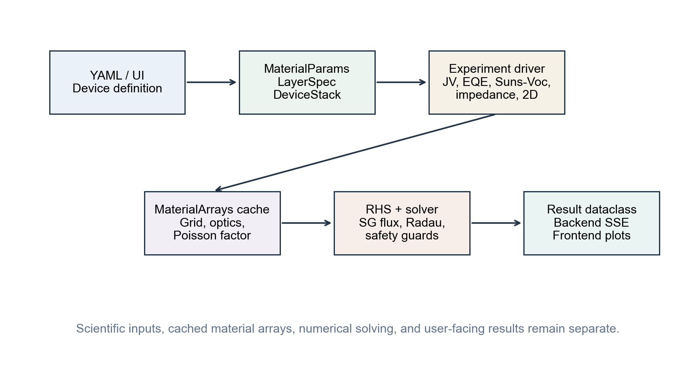
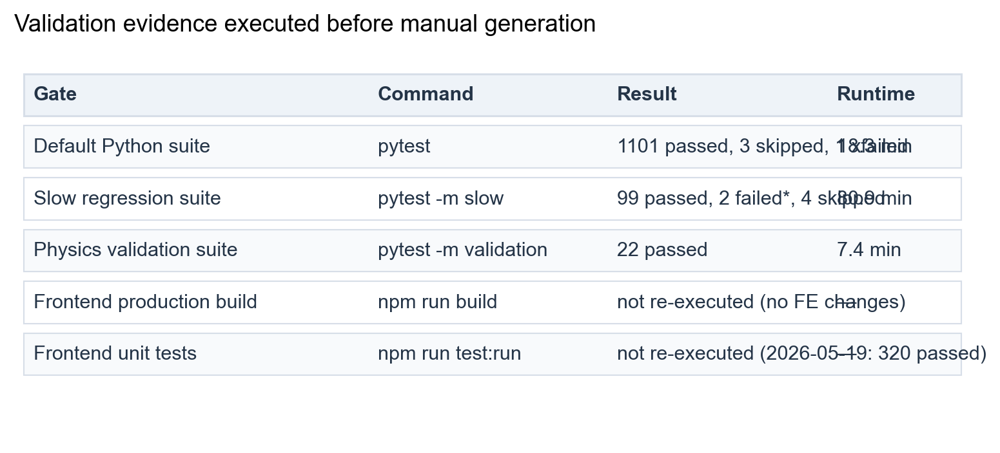
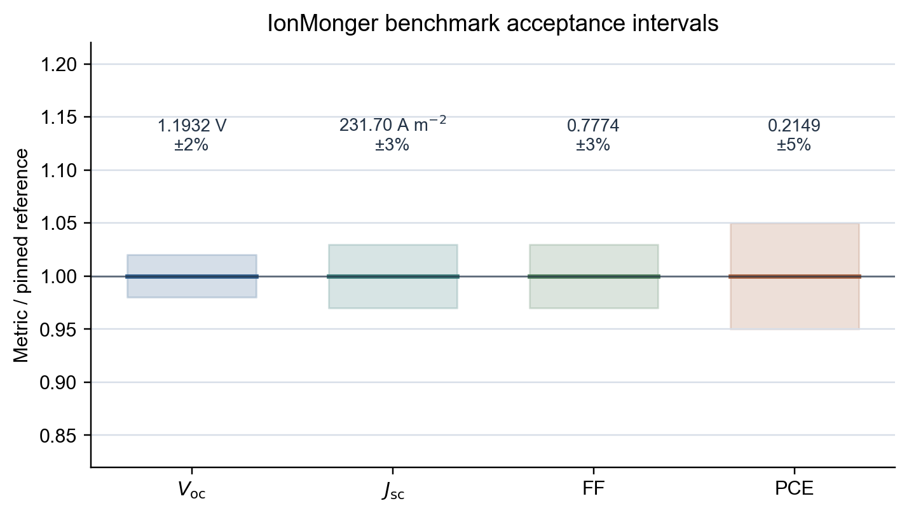
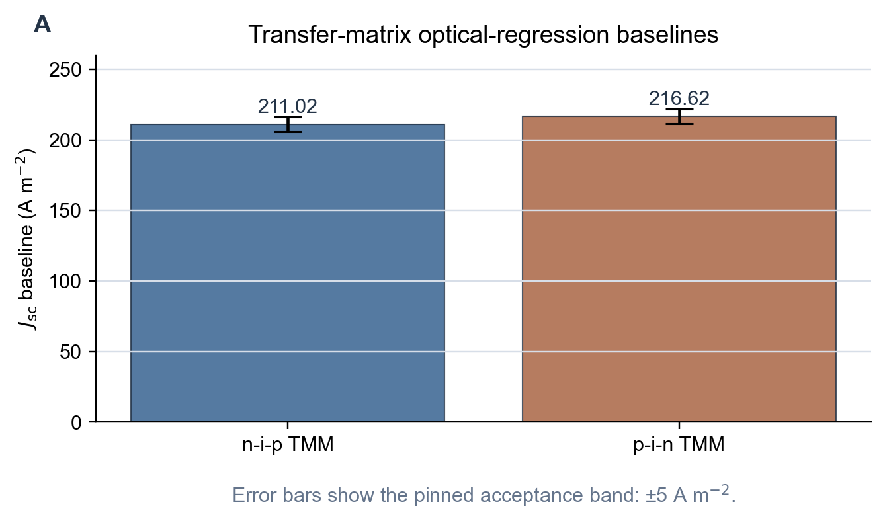
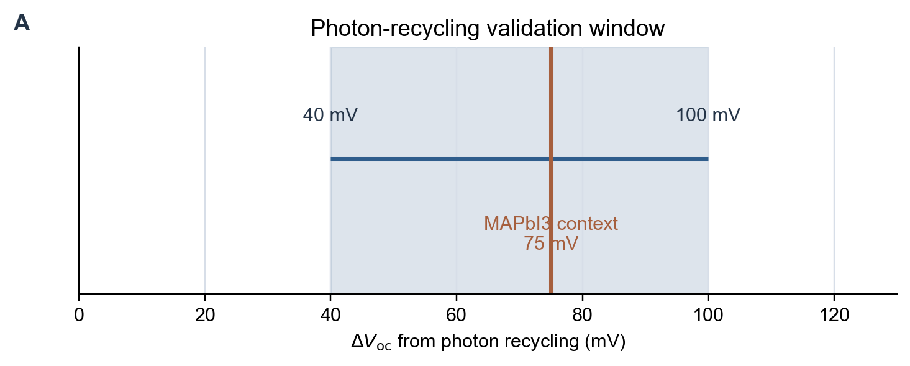
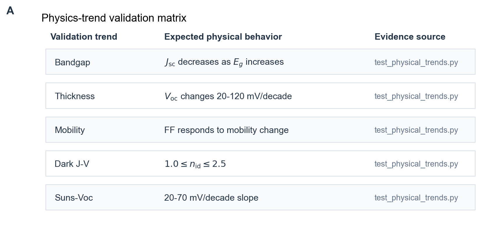
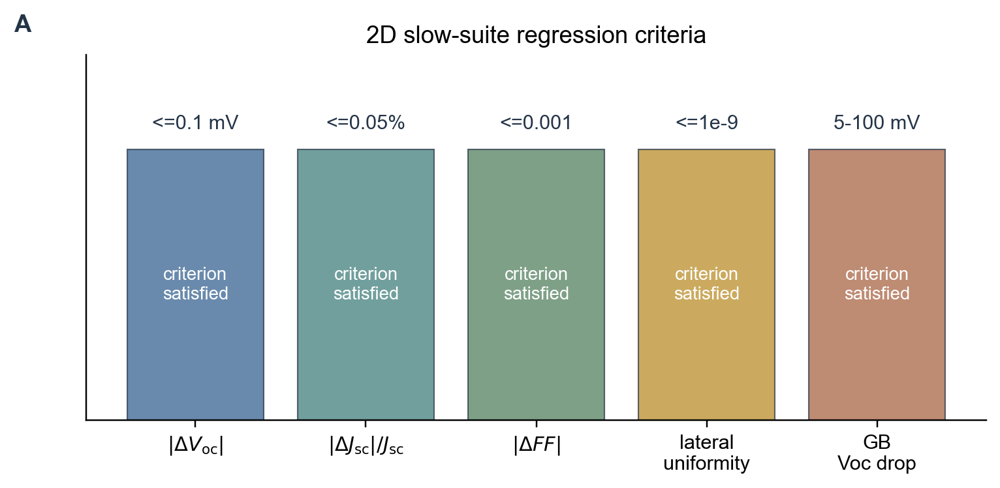

\newpage

# Executive Summary

SolarLab is a thin-film photovoltaic device simulator that couples
drift-diffusion transport, Poisson electrostatics, mobile-ion redistribution,
recombination, and optical generation within a reproducible software workflow.
The numerical core is exposed through a Python API, a FastAPI service layer,
and a TypeScript/Plotly workstation. An experimental two-dimensional extension
supports lateral microstructure and grain-boundary studies.

This manual serves two purposes:

1. It introduces the device variables, parameter conventions, and simulation
   workflow for readers who are new to SolarLab or to semiconductor device
   simulation.
2. It documents the implemented physics, numerical method, validation gates,
   assumptions, and limitations needed for technical review and reproducible
   use.

The software validation status — the unit, regression, and physics-trend
test suites, the benchmark envelopes, and the repository state they certify
— is reported in Chapter \ref{validation-and-evidence}; the corresponding
model assumptions and limitations are collected in the chapters that follow
it.

# How To Read This Manual

If you are new to device simulation, read the chapters in order through
*Device Definition*, *Governing Equations*, and *Numerical Method*. These
chapters explain the device, the variables, the equations, and the numerical
method before introducing the software workflow.

If you are already familiar with semiconductor drift-diffusion, start with:

- Chapter \ref{governing-equations} (*Governing Equations*), which defines the
  physical model in continuous form;
- Chapter \ref{numerical-method} (*Numerical Method*), which describes the
  discretization, the time integrator, and the steady-state solver;
- Chapter \ref{running-solarlab} (*Running SolarLab*), which covers the
  YAML/Python/API workflows;
- Chapter \ref{validation-and-evidence} (*Validation And Evidence*), which
  gives validation evidence and limitations.

The notation in this manual follows standard solar-cell convention:

- $V_\mathrm{oc}$: open-circuit voltage.
- $J_\mathrm{sc}$: short-circuit current density.
- $FF$: fill factor.
- $PCE$: power-conversion efficiency.
- $n$: electron density.
- $p$: hole density.
- $P$: mobile positive ion-vacancy density.
- $\phi$: electrostatic potential.
- $E$: electric field.
- $G$: optical generation rate.
- $R$: recombination rate.

All simulator inputs are SI unless explicitly stated otherwise. Length is in
meters, time in seconds, current density in $A\,m^{-2}$, density in $m^{-3}$,
mobility in $m^2 V^{-1} s^{-1}$, and diffusion coefficient in $m^2 s^{-1}$.
The electron affinity $\chi$ and band gap $E_g$ are stored in eV.

# Simulator Architecture

SolarLab should be read as a coupled model implementation rather than as a
stand-alone user interface. YAML files, the Python API, the FastAPI backend,
and the TypeScript frontend all operate on the same device schema. A parameter
edited in the browser is therefore serialized into the same scientific object
used by the solver.



The architecture preserves four technical boundaries:

- device definition is separated from experiment settings;
- material and grid arrays are cached before the time integrator runs;
- physics hooks are activated by the resolved simulation mode and by the
  presence of required parameters;
- backend and frontend layers transport result dataclasses instead of
  reimplementing solver logic.

For reproducible interpretation, each reported curve should identify the device
stack, physics tier, experiment driver, and solver configuration. Missing
metadata weakens reproducibility even when the numerical run completes
successfully.

# What SolarLab Simulates

SolarLab represents a solar cell as a sequence of material layers between two
contacts. The default coordinate follows the stack direction. Incident light
generates electron-hole pairs, while the electrostatic field and contact
selectivity drive carrier separation and extraction. In perovskite devices,
mobile ionic defects can redistribute under the same field, producing
history-dependent current-voltage response.

The default solver is one-dimensional and is appropriate for:

- J-V sweeps and hysteresis;
- dark diode curves;
- EQE and electroluminescence;
- impedance;
- transient photovoltage;
- ion-coupled degradation;
- tandem current matching;
- screening many material candidates.

SolarLab also includes an experimental two-dimensional solver. The 2D solver
extrudes the same vertical device stack laterally and is intended for:

- 1D/2D parity checks;
- vertical grain boundaries;
- lateral microstructure;
- $V_\mathrm{oc}(L_g)$ grain-size sweeps.

The 2D solver is not a replacement for the 1D workflow. Mobile ions are held as
a static Poisson background during 2D J-V runs; this is an explicit model
assumption and should be reported when interpreting 2D results.


Illumination is always incident at $x=0$, through the first listed
electrical layer (after any optical-only substrate layers). The
device-structure figure shows the layer order of the shipped `nip_MAPbI3`
preset — HTL at the illuminated front face, then absorber, then ETL — so
the coordinate direction in the figure matches the YAML layer order
exactly. Note that this ordering does not follow the common community
reading of "n-i-p" as light entering through the n-side transport layer:
in SolarLab, device orientation is defined *solely* by the YAML layer
order together with the $x=0$ illumination convention, and preset names
should be read as stack identifiers, not as a statement of which side
faces the sun. Users porting structures from the literature should verify
the intended illumination side against the layer order.


# Beginner Physics Primer

## Electrons, Holes, And Bands

In a semiconductor, electrons can move in the conduction band and holes can
move in the valence band. A solar cell works because light creates electron-hole
pairs and the device structure makes it more likely that electrons leave
through one contact while holes leave through the other.

SolarLab stores two energy parameters that are essential for heterojunctions:

- $\chi$, the electron affinity;
- $E_g$, the band gap.

Together these determine approximate conduction-band and valence-band
positions. At an interface, a change in $\chi$ or $E_g$ creates band
offsets. Band offsets are important because they can block one carrier type
while allowing the other carrier type to pass.

## Generation And Recombination

Optical generation $G(x)$ is the rate at which absorbed photons create
electron-hole pairs per unit volume. Recombination $R(n,p)$ is the rate at
which electrons and holes annihilate. A good solar cell has high generation and
carrier collection, but low recombination.

SolarLab includes several recombination channels:

- Shockley-Read-Hall (SRH) trap-assisted recombination;
- radiative recombination;
- Auger recombination;
- interface recombination through surface recombination velocities;
- optional trap-density profiles near interfaces.

## Mobile Ions And Hysteresis

Perovskite cells can contain mobile ionic defects. These defects move much more
slowly than electronic carriers. During a voltage scan, the ion profile may not
reach equilibrium at each voltage. This creates J-V hysteresis. SolarLab treats
this as a physical transient, not as a post-processing correction.

In the state vector, the default mobile ion variable is $P$, the positive
vacancy density. A second negative species can be configured through
`D_ion_neg`, `P0_neg`, and `P_lim_neg`.

# Device Definition

## Core Data Flow

The simulator data flow is:

```text
YAML or inline device dictionary
-> MaterialParams + LayerSpec + DeviceStack
-> experiment driver
-> MaterialArrays cache
-> result dataclass
```

The main dataclasses are:

- `MaterialParams`: physical parameters for one material.
- `LayerSpec`: layer name, role, thickness, and material parameters.
- `DeviceStack`: full multilayer stack and global device settings.

## Layer Roles

Layer roles used by the frontend and YAML schema are:

| Role | Meaning |
|---|---|
| `substrate` | optical-only layer, excluded from electrical drift-diffusion |
| `front_contact` | front electrode or transparent conductor |
| `ETL` | electron transport layer |
| `absorber` | active photovoltaic absorber |
| `HTL` | hole transport layer |
| `back_contact` | rear electrode |

Substrate layers must form a contiguous prefix of the stack. They participate
in transfer-matrix optics but do not appear in the drift-diffusion grid.

## Main Material Parameters

| Field | Meaning | Unit |
|---|---|---|
| `eps_r` | relative permittivity | dimensionless |
| `mu_n`, `mu_p` | electron and hole mobilities | $m^2 V^{-1} s^{-1}$ |
| `D_ion` | positive ion diffusion coefficient | $m^2 s^{-1}$ |
| `P_lim` | positive ion steric limit | $m^{-3}$ |
| `P0` | initial positive ion density | $m^{-3}$ |
| `ni` | intrinsic carrier density | $m^{-3}$ |
| `tau_n`, `tau_p` | SRH lifetimes | $s$ |
| `n1`, `p1` | SRH trap reference densities | $m^{-3}$ |
| `B_rad` | radiative recombination coefficient | $m^3 s^{-1}$ |
| `C_n`, `C_p` | Auger coefficients | $m^6 s^{-1}$ |
| `alpha` | Beer-Lambert absorption coefficient | $m^{-1}$ |
| `N_A`, `N_D` | acceptor and donor densities | $m^{-3}$ |
| `chi` | electron affinity | eV |
| `Eg` | band gap | eV |
| `optical_material` | key into `data/nk/*.csv` | string |
| `incoherent` | incoherent TMM layer flag | boolean |

Additional optional parameters cover negative ions, temperature scaling,
field-dependent mobility, trap profiles, and optical fallbacks.

## Parameter Dictionary

This section is intentionally detailed because input specification is often the
dominant source of error in device simulation. SolarLab cannot infer whether a
parameter comes from measurement, literature, fitting, or exploratory
screening. Each field should therefore be treated as a documented scientific
assumption.

### Electrical And Transport Fields

\begingroup\footnotesize\setlength{\tabcolsep}{3.5pt}\renewcommand{\arraystretch}{1.18}
\begin{longtable}{@{}>{\raggedright\arraybackslash}p{0.20\linewidth}>{\raggedleft\arraybackslash}p{0.16\linewidth}>{\raggedright\arraybackslash}p{0.25\linewidth}>{\raggedright\arraybackslash}p{0.31\linewidth}@{}}
\toprule
Field & Unit & Physical role & Beginner guidance \\
\midrule
\endhead
\path{eps_r} & 1 & relative dielectric constant in Poisson's equation & Larger values screen charge and reduce field gradients. Use layer-specific literature values rather than a single generic perovskite value. \\
\path{mu_n} & \(m^2 V^{-1} s^{-1}\) & low-field electron mobility & Controls electron extraction and transport resistance. Remember that \(1\,cm^2 V^{-1}s^{-1}=10^{-4}\,m^2 V^{-1}s^{-1}\). \\
\path{mu_p} & \(m^2 V^{-1} s^{-1}\) & low-field hole mobility & Same unit conversion convention as \path{mu_n}. Low mobility typically affects FF before producing a large change in \(V_\mathrm{oc}\). \\
\path{N_A} & \(m^{-3}\) & ionized acceptor density & Represents p-type doping. Values reported in \(cm^{-3}\) must be multiplied by \(10^6\). \\
\path{N_D} & \(m^{-3}\) & ionized donor density & Represents n-type doping. Use compensated doping only when it is part of the intended physical model. \\
\path{ni} & \(m^{-3}\) & intrinsic carrier density & Appears in mass action and SRH terms. It should be consistent with the effective band gap and temperature when doing parameter studies. \\
\path{chi} & eV & electron affinity & Sets approximate conduction-band alignment. Inconsistent \(\chi\) values can introduce artificial transport barriers. \\
\path{Eg} & eV & band gap & Sets band offsets and thermodynamic interpretation. Beer-Lambert optics do not automatically shift spectral absorption when \path{Eg} changes. \\
\bottomrule
\end{longtable}
\endgroup

### Ion And Hysteresis Fields

\begingroup\footnotesize\setlength{\tabcolsep}{3.5pt}\renewcommand{\arraystretch}{1.18}
\begin{longtable}{@{}>{\raggedright\arraybackslash}p{0.20\linewidth}>{\raggedleft\arraybackslash}p{0.16\linewidth}>{\raggedright\arraybackslash}p{0.25\linewidth}>{\raggedright\arraybackslash}p{0.31\linewidth}@{}}
\toprule
Field & Unit & Physical role & Beginner guidance \\
\midrule
\endhead
\path{D_ion} & \(m^2 s^{-1}\) & positive mobile-ion diffusion coefficient & Set to zero when mobile ions are excluded from the model. Nonzero values can produce scan-rate dependence. \\
\path{P0} & \(m^{-3}\) & initial positive ion density & Represents the equilibrium mobile-vacancy population before redistribution. \\
\path{P_lim} & \(m^{-3}\) & steric upper density for positive ions & Limits ion accumulation through a finite-site-density approximation. The value should be consistent with the assumed mobile-site density. \\
\path{D_ion_neg} & \(m^2 s^{-1}\) & negative mobile-ion diffusion coefficient & Enables a second mobile species. Leave zero for the default single-ion model. \\
\path{P0_neg} & \(m^{-3}\) & initial negative ion density & Use only when the negative species is part of the physical hypothesis. \\
\path{P_lim_neg} & \(m^{-3}\) & steric upper density for negative ions & Same interpretation as \path{P_lim}. \\
\path{E_a_ion} & eV & Arrhenius activation energy for ion diffusion & Used for temperature-dependent ion mobility. Fitted or literature-derived values should be reported with provenance. \\
\bottomrule
\end{longtable}
\endgroup

### Recombination And Trap Fields

\begingroup\footnotesize\setlength{\tabcolsep}{3.5pt}\renewcommand{\arraystretch}{1.18}
\begin{longtable}{@{}>{\raggedright\arraybackslash}p{0.20\linewidth}>{\raggedleft\arraybackslash}p{0.16\linewidth}>{\raggedright\arraybackslash}p{0.25\linewidth}>{\raggedright\arraybackslash}p{0.31\linewidth}@{}}
\toprule
Field & Unit & Physical role & Beginner guidance \\
\midrule
\endhead
\path{tau_n} & s & electron SRH lifetime & Shorter lifetime increases trap-assisted recombination. It is often an effective fitted parameter. \\
\path{tau_p} & s & hole SRH lifetime & Interpret with \path{tau_n}; asymmetry can model carrier-selective trap response. \\
\path{n1} & \(m^{-3}\) & SRH electron reference density & Encodes the effective trap-energy position and should be changed consistently with the trap model. \\
\path{p1} & \(m^{-3}\) & SRH hole reference density & Companion to \path{n1}. \\
\path{B_rad} & \(m^3 s^{-1}\) & radiative recombination coefficient & Central to radiative-limit and photon-recycling studies. \\
\path{C_n} & \(m^6 s^{-1}\) & electron Auger coefficient & Most relevant when high carrier densities are expected. \\
\path{C_p} & \(m^6 s^{-1}\) & hole Auger coefficient & Same caution as \path{C_n}. \\
\path{trap_N_t_interface} & \(m^{-3}\) & interface-near trap density & Activates spatial trap profiles when supplied with decay information. \\
\path{trap_N_t_bulk} & \(m^{-3}\) & bulk trap density & The asymptotic trap density away from the interface. \\
\path{trap_decay_length} & m & decay length or Gaussian width & Must be physically resolvable by the grid. \\
\path{trap_profile_shape} & string & \path{exponential} or \path{gaussian} trap profile & Select the profile shape that corresponds to the assumed defect distribution. \\
\bottomrule
\end{longtable}
\endgroup

### Optical Fields

\begingroup\footnotesize\setlength{\tabcolsep}{3.5pt}\renewcommand{\arraystretch}{1.18}
\begin{longtable}{@{}>{\raggedright\arraybackslash}p{0.20\linewidth}>{\raggedleft\arraybackslash}p{0.16\linewidth}>{\raggedright\arraybackslash}p{0.25\linewidth}>{\raggedright\arraybackslash}p{0.31\linewidth}@{}}
\toprule
Field & Unit & Physical role & Beginner guidance \\
\midrule
\endhead
\path{alpha} & \(m^{-1}\) & scalar Beer-Lambert absorption coefficient & Suitable for simplified optical studies. It is not wavelength-resolved. \\
\path{optical_material} & string & key into tabulated \(n,k\) data & Required for TMM, EQE, and EL. The key must exist in \path{perovskite_sim/data/nk}. \\
\path{n_optical} & 1 & constant refractive-index fallback & Useful for approximate optical calculations but not a substitute for measured \(n,k\). \\
\path{incoherent} & boolean & thick-layer incoherent TMM treatment & Intended for the first thick substrate. The current TMM path does not support arbitrary incoherent layers mid-stack. \\
\bottomrule
\end{longtable}
\endgroup

### Temperature And Field-Dependent Mobility Fields

\begingroup\footnotesize\setlength{\tabcolsep}{3.5pt}\renewcommand{\arraystretch}{1.18}
\begin{longtable}{@{}>{\raggedright\arraybackslash}p{0.20\linewidth}>{\raggedleft\arraybackslash}p{0.16\linewidth}>{\raggedright\arraybackslash}p{0.25\linewidth}>{\raggedright\arraybackslash}p{0.31\linewidth}@{}}
\toprule
Field & Unit & Physical role & Beginner guidance \\
\midrule
\endhead
\path{Nc300} & \(m^{-3}\) & conduction-band density of states at 300 K & Optional temperature-scaling input. Use only when the temperature model is calibrated. \\
\path{Nv300} & \(m^{-3}\) & valence-band density of states at 300 K & Companion to \path{Nc300}. \\
\path{mu_T_gamma} & 1 & mobility power-law temperature exponent & Default keeps a common scattering-style trend. Document any changed value. \\
\path{B_rad_T_gamma} & 1 & radiative coefficient temperature exponent & Default zero preserves legacy behavior. \\
\path{varshni_alpha} & eV K\(^{-1}\) & Varshni band-gap coefficient & Zero disables band-gap temperature shift. \\
\path{varshni_beta} & K & Varshni temperature parameter & Used with \path{varshni_alpha}. \\
\path{v_sat_n} & \(m\,s^{-1}\) & electron velocity-saturation limit & Zero disables Caughey-Thomas saturation for electrons. \\
\path{v_sat_p} & \(m\,s^{-1}\) & hole velocity-saturation limit & Zero disables Caughey-Thomas saturation for holes. \\
\path{ct_beta_n} & 1 & electron Caughey-Thomas exponent & Controls sharpness of velocity saturation. \\
\path{ct_beta_p} & 1 & hole Caughey-Thomas exponent & Same role for holes. \\
\path{pf_gamma_n} & \((V/m)^{-1/2}\) & electron Poole-Frenkel mobility coefficient & Zero disables field-enhanced hopping for electrons. \\
\path{pf_gamma_p} & \((V/m)^{-1/2}\) & hole Poole-Frenkel mobility coefficient & Zero disables field-enhanced hopping for holes. \\
\bottomrule
\end{longtable}
\endgroup

### Device-Level Fields

\begingroup\footnotesize\setlength{\tabcolsep}{3.5pt}\renewcommand{\arraystretch}{1.18}
\begin{longtable}{@{}>{\raggedright\arraybackslash}p{0.20\linewidth}>{\raggedleft\arraybackslash}p{0.16\linewidth}>{\raggedright\arraybackslash}p{0.25\linewidth}>{\raggedright\arraybackslash}p{0.31\linewidth}@{}}
\toprule
Field & Unit & Physical role & Beginner guidance \\
\midrule
\endhead
\path{V_bi} & V & built-in voltage in Poisson boundary condition & This is not always identical to the derived heterostack Fermi-level separation. \\
\path{Phi} & \(m^{-2}s^{-1}\) & incident photon flux for Beer-Lambert generation & For spectral experiments use TMM data rather than only changing \path{Phi}. \\
\path{T} & K & device temperature & Affects thermal voltage and enabled temperature-dependent hooks. \\
\path{mode} & string & \path{legacy}, \path{fast}, or \path{full} physics tier & The mode is a ceiling; hooks still need required parameters. \\
\path{interfaces} & \(m\,s^{-1}\) pairs & interface recombination velocities & One pair per internal electrical interface, ordered from the front contact toward the rear contact. \\
\path{S_n_left} & \(m\,s^{-1}\) & left electron contact velocity & \path{None} gives ohmic default. \path{0} is blocking. Large values approach ohmic extraction. \\
\path{S_p_left} & \(m\,s^{-1}\) & left hole contact velocity & Same convention as \path{S_n_left}. \\
\path{S_n_right} & \(m\,s^{-1}\) & right electron contact velocity & Same convention as \path{S_n_left}. \\
\path{S_p_right} & \(m\,s^{-1}\) & right hole contact velocity & Same convention as \path{S_n_left}. \\
\path{microstructure} & object & 2D grain-boundary specification & Used by 2D drivers; ignored by standard 1D paths. \\
\bottomrule
\end{longtable}
\endgroup

## Global Device Parameters

`DeviceStack` stores:

\begingroup\footnotesize\setlength{\tabcolsep}{3.5pt}\renewcommand{\arraystretch}{1.18}
\begin{longtable}{@{}>{\raggedright\arraybackslash}p{0.34\linewidth}>{\raggedright\arraybackslash}p{0.58\linewidth}@{}}
\toprule
Field & Meaning \\
\midrule
\endhead
\path{V_bi} & built-in voltage used in the Poisson boundary condition \\
\path{Phi} & incident photon flux for Beer-Lambert generation \\
\path{interfaces} & interface recombination velocities \((v_n,v_p)\) \\
\path{T} & device temperature in K \\
\path{mode} & \path{legacy}, \path{fast}, or \path{full} \\
\path{S_n_left}, \path{S_p_left}, \path{S_n_right}, \path{S_p_right} & selective-contact velocities \\
\path{microstructure} & optional 2D grain-boundary block \\
\bottomrule
\end{longtable}
\endgroup

## Built-In Potential

SolarLab has two related built-in potentials:

1. `stack.V_bi`: the value read from YAML and used in the Poisson boundary
   condition.
2. `stack.compute_V_bi()`: a derived effective built-in potential computed from
   Fermi-level differences across the electrical stack.

This distinction matters. Some legacy and benchmark configurations use a
manual $V_\mathrm{bi}$ convention. Heterostacks with $\chi$ and $E_g$
also have band-alignment information that can imply a different effective
Fermi-level separation.

The Poisson boundary is:

$$
\phi(0)=\phi_\mathrm{left}, \qquad
\phi(L)=\phi_\mathrm{left}+V_\mathrm{bi}-V_\mathrm{app}.
$$

The effective built-in potential is used for defaults such as the automatic
upper voltage in J-V sweeps.

## YAML Example

```yaml
device:
  V_bi: 1.1
  Phi: 2.5e21
  T: 300.0
  mode: full
  contacts:
    left:
      S_p: 1.0e3
      S_n: 1.0e-3
    right:
      S_n: 1.0e3
      S_p: 1.0e-3

layers:
  - name: HTL
    role: HTL
    thickness: 2.0e-7
    eps_r: 3.0
    mu_n: 1.0e-8
    mu_p: 1.0e-6
    ni: 1.0e9
    N_A: 1.0e24
    N_D: 0.0
    D_ion: 0.0
    P_lim: 1.0e27
    P0: 0.0
    tau_n: 1.0e-6
    tau_p: 1.0e-6
    n1: 1.0e9
    p1: 1.0e9
    B_rad: 0.0
    C_n: 0.0
    C_p: 0.0
    alpha: 0.0
    chi: 2.2
    Eg: 3.0
```

YAML 1.1 can parse bare scientific notation such as `1e-9` as a string.
SolarLab coerces numeric-looking strings to floats, but writing values as
`1.0e-9` is clearer and safer.

# Governing Equations {#governing-equations}

This chapter states the governing equations in dimensional SI form. The model
belongs to the class of coupled Poisson/drift-diffusion (van Roosbroeck)
systems, extended by Nernst-Planck transport for mobile ionic defects,
heterojunction band alignment, and wavelength-resolved optical generation.
The implementation evaluates discretized node and face arrays (Chapter
\ref{numerical-method}), but the continuous form stated here clarifies the
model assumptions and the physical meaning of each state variable.

Throughout, $q$ is the elementary charge, $k_B$ Boltzmann's constant, $T$ the
lattice temperature, and $V_T = k_B T/q$ the thermal voltage. Carrier
statistics are Maxwell-Boltzmann (non-degenerate); Fermi-Dirac corrections
are outside the present scope and matter only for degenerately doped layers.

## Electrostatics: The Poisson Equation

The electrostatic potential $\phi(x,t)$ is obtained from the quasistatic
Poisson equation

\begin{equation}
\label{eq:poisson}
\frac{\partial}{\partial x}
\left(
\varepsilon_0 \varepsilon_r
\frac{\partial \phi}{\partial x}
\right)
= -\rho ,
\end{equation}

with the space-charge density assembled from every charged species in the
model:

\begin{equation}
\label{eq:charge-density}
\rho
=
q\left[
p - n + \left(P - P_0\right) - \left(P^- - P^-_0\right)
+ N_D - N_A
\right].
\end{equation}

The mobile-ion contributions are measured relative to their neutral background
densities $P_0$ and $P^-_0$: an undisturbed vacancy population together with
its immobile counter-charge is electrically neutral, so only the
*redistribution* of ions contributes net space charge. The negative-species
term is present only when a second mobile species is configured
(dual-ion mode).

The quasistatic approximation asserts that the potential responds
instantaneously to the charge configuration — Eq. \ref{eq:poisson} is Gauss's
law $\nabla\cdot(\varepsilon_0\varepsilon_r \mathbf{E}) = \rho$ with
$E = -\partial\phi/\partial x$, solved at every instant of the transient.
Retardation, magnetic effects, and electromagnetic wave propagation are
excluded from the electrical solve (the optical field is treated separately by
the transfer-matrix machinery of the *Optical Generation* section).

The discretization is finite-volume with a harmonic-mean face permittivity:

\begin{equation}
\label{eq:harmonic-eps}
\varepsilon_{i+1/2}
=
\frac{2\varepsilon_i\varepsilon_{i+1}}
{\varepsilon_i+\varepsilon_{i+1}} .
\end{equation}

The harmonic mean is the exact series-capacitor composition of two dielectric
half-cells and therefore preserves the continuity of the normal dielectric
displacement $D = \varepsilon_0\varepsilon_r E$ across an abrupt material
interface. Arithmetic (nodal) interpolation would instead equate the electric
*fields* on both sides of the interface, concentrating the voltage drop in the
wrong layer.

Assumptions and limits:

- electrostatics is quasistatic;
- magnetic effects and wave propagation in the electrical solve are ignored;
- layer interfaces are abrupt on the scale of the grid;
- $\rho$ is built from the configured mobile species, carriers, and dopants,
  with dopants assumed fully ionized and immobile.

## Carrier Transport: Continuity And Drift-Diffusion

The electron and hole densities obey the continuity equations

\begin{equation}
\label{eq:electron-continuity}
\frac{\partial n}{\partial t}
=
\frac{1}{q}\frac{\partial J_n}{\partial x}
+G-R ,
\end{equation}

\begin{equation}
\label{eq:hole-continuity}
\frac{\partial p}{\partial t}
=
-\frac{1}{q}\frac{\partial J_p}{\partial x}
+G-R ,
\end{equation}

closed by the drift-diffusion constitutive relations

\begin{equation}
\label{eq:dd-currents}
J_n = q\mu_n n E + qD_n\frac{\partial n}{\partial x},
\qquad
J_p = q\mu_p p E - qD_p\frac{\partial p}{\partial x},
\end{equation}

with the Einstein relation $D = \mu V_T$ linking diffusivity and mobility.
The Einstein relation expresses local thermal equilibrium between the carrier
gas and the lattice; it is exact for non-degenerate (Boltzmann) statistics.

An equivalent and physically transparent form writes each current as a
quasi-Fermi-level gradient,

\begin{equation}
\label{eq:qfl-currents}
J_n = \mu_n\, n\, \frac{\partial E_{Fn}}{\partial x},
\qquad
J_p = \mu_p\, p\, \frac{\partial E_{Fp}}{\partial x},
\end{equation}

where, under Boltzmann statistics,
$n = N_C \exp[-(E_C - E_{Fn})/k_BT]$ and
$p = N_V \exp[-(E_{Fp} - E_V)/k_BT]$.
Equations \ref{eq:dd-currents} and \ref{eq:qfl-currents} are the same model;
the quasi-Fermi form makes explicit that a flat quasi-Fermi level implies
zero current *for that carrier* — the thermodynamic-equilibrium condition.
At open circuit only the net terminal current is constrained to zero:
internal electron and hole currents remain individually non-zero and
convert into each other through generation and recombination, so the
quasi-Fermi levels need not be flat everywhere in an operating device.

### Heterojunction Band Alignment

Band edges are referenced to the local vacuum level through the electron
affinity $\chi$ and the band gap $E_g$:

$$
E_C/q = -(\phi + \chi),
\qquad
E_V/q = -(\phi + \chi + E_g),
$$

with $\chi$ and $E_g$ expressed in volts (numerically equal to their eV
values). In heterojunction stacks SolarLab therefore drives the carrier
fluxes with *band-effective* potentials,

\begin{equation}
\label{eq:band-corrected-potentials}
\phi_n=\phi+\chi, \qquad
\phi_p=\phi+\chi+E_g ,
\end{equation}

so that electrons respond to gradients of the conduction band edge and holes
to gradients of the valence band edge. An abrupt change in $\chi$ or $E_g$
between layers then produces Anderson-rule band offsets
($\Delta E_C$ from the affinity step, $\Delta E_V$ from the combined
affinity-plus-gap step) inside the same numerical flux formulation, with no
special-case interface treatment in the discretization.

### Effective-Density-of-States Correction

For a heterostructure with unequal effective densities of states, the
band-effective potentials of Eq. \ref{eq:band-corrected-potentials} are
incomplete. Under Boltzmann statistics the carrier density couples to the
quasi-Fermi level through the local $N_C$ or $N_V$, so the exact
drift potentials carry an additional logarithmic term:

\begin{equation}
\label{eq:dos-potentials}
\phi_n = \phi + \chi + V_T\ln\!\frac{N_C}{N_C^{\mathrm{ref}}},
\qquad
\phi_p = \phi + \chi + E_g - V_T\ln\!\frac{N_V}{N_V^{\mathrm{ref}}} .
\end{equation}

Omitting these terms imposes a spurious quasi-Fermi-level discontinuity of
$k_BT\,\ln(N_{C,1}/N_{C,2})$ (and the $N_V$ analogue) at every interface with
a density-of-states contrast — on a representative
HTL/perovskite/ETL stack the accumulated error exceeds 100 mV of
open-circuit voltage. SolarLab therefore folds the corrections of
Eq. \ref{eq:dos-potentials} into the cached per-layer $\chi$/$E_g$ arrays at
build time, using the absorber as the reference layer (only cross-junction
*differences* matter). The fold applies to transport and thermionic emission
only; purely statistical quantities ($n_i$, the SRH references $n_1$/$p_1$,
and the contact equilibrium densities) are deliberately left unchanged. The
correction is active by default whenever per-layer `Nc300`/`Nv300` data are
supplied, and is disabled in the `legacy` tier, which reproduces the
IonMonger convention without DOS-folded transport.

Assumptions and limits:

- carriers are described by drift-diffusion transport, not ballistic
  transport;
- carrier statistics are non-degenerate (Maxwell-Boltzmann); degenerately
  doped layers would require Fermi-Dirac corrections that are out of scope;
- the model is most natural when local quasi-equilibrium is a reasonable
  approximation;
- strongly quantum-confined structures, tunneling-dominated contacts, and hot
  carrier effects require additional modeling beyond this implementation.

## Heterointerface Thermionic Emission And Tunnelling

The drift-diffusion picture assumes that the band edges vary smoothly on the
scale of a grid cell. At an abrupt heterojunction the band offset is instead
resolved within a *single* cell, and the exponential-fitting flux
discretization (Chapter \ref{numerical-method}) then systematically
overestimates the current across the discontinuity. SolarLab therefore bounds
the drift-diffusion face flux by an interface-limited thermionic-emission
(TE) flux of Richardson-Dushman form at every face where the conduction- or
valence-band offset exceeds 50 meV:

\begin{equation}
\label{eq:te-flux}
J_{\mathrm{TE}}
\;\propto\;
A^{*}T^{2}
\left[
n_{L}\, e^{-\max(\Delta E,\,0)/V_T}
-
n_{R}\, e^{-\max(-\Delta E,\,0)/V_T}
\right],
\end{equation}

where $\Delta E$ is the band-edge step across the face, $n_L$ and $n_R$ are
the adjacent carrier densities, and $A^{*}$ is a per-face Richardson constant
(default: the free-electron value
$1.2017\times10^{6}\,A\,m^{-2}K^{-2}$, overridable per layer). Only the
*uphill* term carries the Boltzmann barrier penalty; a downhill offset leaves
the emission term unpenalized, so carriers flowing down a band step are not
artificially blocked.

Two honest qualifications apply. First, the density-weighted form of
Eq. \ref{eq:te-flux} is an *empirical interface-limited bound*, not the
dimensional Richardson-Dushman current: $A^{*}T^{2}$ is already a current
density, so multiplying by an absolute carrier density leaves the bound's
magnitude tied to the SI unit system rather than to a physical
reservoir normalization (a strictly normalized form would use $n/N_C$ or a
thermal-velocity coefficient $q\,v_{th}\,n$; this is a documented
formulation limitation, see Chapter 17). Second, the two-leg bracket itself
vanishes at thermodynamic equilibrium only when the adjacent layers share
the same effective density of states or when the density-of-states-folded
potentials of Eq. \ref{eq:dos-potentials} are active. System-level
equilibrium is nevertheless preserved unconditionally by the *cap
construction*: at equilibrium the drift-diffusion flux is exactly zero, and
the smaller-magnitude selection below therefore returns zero regardless of
the value of $J_{\mathrm{TE}}$.

The TE flux acts as a *cap*: at each flagged face the solver takes the
smaller-magnitude of the drift-diffusion flux and $J_{\mathrm{TE}}$, so the
interface-limited current can only reduce, never enhance, the
drift-diffusion prediction. (The steady-state Newton driver replaces the hard
minimum with a smooth sigmoid blend of adjustable width to restore
differentiability; see Chapter \ref{numerical-method}.)

### Thermionic-Field-Emission Tunnelling

Pure thermionic emission transports carriers *over* the barrier only. An
optional intra-band tunnelling channel augments it with transport *through*
the top of a band spike, following the Padovani-Stratton
thermionic-field-emission theory. The characteristic tunnelling energy is

\begin{equation}
\label{eq:tfe-e00}
E_{00} = \frac{\hbar}{2}\sqrt{\frac{N_{\mathrm{if}}}{m^{*}\varepsilon_s}},
\qquad
E_{0} = E_{00}\coth\!\left(\frac{E_{00}}{V_T}\right),
\end{equation}

where $E_{00}$ is expressed in eV (the prefactor $\hbar/2$, without the
charge factor, yields volts directly; the implementation computes the
joule value $(q\hbar/2)\sqrt{N_{\mathrm{if}}/(m^{*}\varepsilon_s)}$ and
divides by $q$, which is the same number), so the ratio $E_{00}/V_T$ in the
$\coth$ is dimensionally consistent. $N_{\mathrm{if}}$ is the net doping of
the lighter-doped (depletion) side of the junction, $m^{*}$ the effective
tunnelling mass (default $0.2\,m_e$), and $\varepsilon_s$ the semiconductor
permittivity. The
tunnelling-transparent fraction of the barrier,
$\delta_{\mathrm{tun}} = |\Delta E|\,(1 - V_T/E_0)$, clamped to
$[0, |\Delta E|)$, defines a static enhancement factor

\begin{equation}
\label{eq:tfe-gamma}
\Gamma = \exp\!\left(\frac{\delta_{\mathrm{tun}}}{V_T}\right) \geq 1,
\end{equation}

which is folded into the per-face Richardson constants
($A^{*}_{\mathrm{eff}} = \Gamma A^{*}$) at build time. Because the same
$\Gamma$ scales *both* legs of Eq. \ref{eq:te-flux}, equilibrium detailed
balance is preserved to machine precision, and because the factor is static
(doping-derived, no dependence on the evolving field) it cannot perturb the
stability of the time integration. The channel is opt-in and captures the
doping-direction trend of tunnelling-assisted interface transport; the
bias-dependent flattening of a spike under forward bias would require a
field-dependent $E_{00}(F)$ evaluated per step, which is deliberately not
implemented.

Assumptions and limits:

- TE capping applies only at faces whose band offset exceeds 50 meV; smaller
  offsets are handled by the drift-diffusion flux alone;
- the tunnelling enhancement is static and doping-derived; an
  intrinsic-absorber interface ($N_{\mathrm{if}}\!\to\!0$) gives
  $E_{00}\!\to\!0$ and hence $\Gamma\!\to\!1$ (no enhancement);
- the `legacy` tier disables thermionic emission entirely (IonMonger has no
  TE), and with it the tunnelling channel by construction.

## Ion Migration

Mobile ionic defects — in halide perovskites, predominantly halide vacancies
acting as an effective positive species — are transported by a
Nernst-Planck equation of the same drift-diffusion form as the electronic
carriers. The positive vacancy density $P$ satisfies the conservation law

\begin{equation}
\label{eq:ion-continuity}
\frac{\partial P}{\partial t}
=
-\frac{\partial F_P}{\partial x},
\end{equation}

with the flux (for a $+1$ charge, using the Einstein relation for the ionic
mobility)

\begin{equation}
\label{eq:ion-flux}
F_P
=
-\,s(P)\, D_I
\left(
\frac{\partial P}{\partial x}
+\frac{P}{V_T}\frac{\partial \phi}{\partial x}
\right).
\end{equation}

There is no generation or recombination term: the total number of mobile ions
in the device is conserved. Consistently, the contacts are ion-blocking,

\begin{equation}
\label{eq:ion-zero-flux}
F_P(0)=F_P(L)=0,
\end{equation}

so that $\int_0^L P\,dx$ is an exact invariant of the dynamics — ions
redistribute internally but never leave through the electrodes.

The prefactor $s(P)$ is a steric (excluded-volume) crowding correction
motivated by modified Poisson-Nernst-Planck / lattice-gas theories:

\begin{equation}
\label{eq:steric}
s(P)
=
\frac{1}
{\max(1-P/P_\mathrm{lim},\,10^{-6})}.
\end{equation}

As the local occupancy $P$ approaches the finite site density
$P_\mathrm{lim}$, the effective chemical potential of the ion gas diverges
and the restoring flux is sharply enhanced, which bounds interfacial ion
accumulation at the physically available site density instead of allowing
the unphysical unbounded pile-up of the ideal-solution model. (In the
discretization, $P$ in Eq. \ref{eq:steric} is evaluated as the average of
the two face-adjacent nodal densities; the $10^{-6}$ floor guards the
division at full saturation.)

A formulation caveat: SolarLab applies $s(P)$ to the *entire* flux of
Eq. \ref{eq:ion-flux} — diffusion and drift alike — whereas the strict
lattice-gas chemical-potential derivation enhances only the
concentration-gradient term, and a multi-species lattice gas couples the
species through a *shared* site fraction $1-(P_+ + P_-)/P_\mathrm{lim}$
rather than independent per-species factors. The implemented form should
therefore be read as an empirical crowding regularization with the correct
saturation limit, not as the literal modified-PNP flux of the cited theory
(documented formulation limitation, Chapter 17).

Because ionic diffusivities ($D_I \sim 10^{-16}\,m^2 s^{-1}$) are many
orders of magnitude below carrier diffusivities, ionic redistribution
introduces a slow time scale that coexists with nanosecond electronic
relaxation. The governing relaxation is the drift-assisted screening of the
built-in field across the interfacial, Debye-scale charge layers —
typically milliseconds to seconds at perovskite ion mobilities — rather
than diffusion over the full device length, which would be slower still.
This stiff two-time-scale structure is the physical origin of
scan-rate-dependent J-V hysteresis, and it is what the implicit time
integration of Chapter \ref{numerical-method} is designed to handle.

Additional model features:

- a second, negatively charged mobile species is optional and obeys the same
  equations with the drift sign reversed;
- ionic diffusivity is Arrhenius-activated in temperature through the
  per-layer activation energy `E_a_ion` when temperature scaling is enabled;
- non-ionic layers simply set $D_I = 0$; the ion equations still integrate
  but contribute zero flux.

Assumptions and limits:

- the default mobile species is a positive vacancy-like species;
- negative mobile species are optional and must be explicitly configured;
- contacts are ion-blocking in the implemented boundary condition;
- the 2D J-V solver treats ions as a frozen Poisson background.

## Recombination

All bulk recombination channels share the mass-action driving term
$np - n_i^2$, which vanishes at thermodynamic equilibrium and guarantees that
no channel generates or destroys carriers in the dark equilibrium state.

### Shockley-Read-Hall (Trap-Assisted) Recombination

\begin{equation}
\label{eq:srh}
R_\mathrm{SRH}
=
\frac{np-n_i^2}
{\tau_p(n+n_1)+\tau_n(p+p_1)} .
\end{equation}

The reference densities $n_1$ and $p_1$ encode the trap energy level $E_t$
through the Boltzmann relations

$$
n_1 = N_C\, e^{-(E_C-E_t)/k_BT},
\qquad
p_1 = N_V\, e^{-(E_t-E_V)/k_BT},
\qquad
n_1 p_1 = n_i^2 .
$$

Midgap traps ($n_1, p_1 \ll n, p$) maximize the rate; the asymmetric
lifetimes $\tau_n \neq \tau_p$ model carrier-selective capture. In SolarLab
the SRH parameters are *effective* quantities per layer unless trap-energy
provenance is supplied.

### Radiative Recombination And Photon Recycling

Band-to-band radiative recombination is bimolecular:

\begin{equation}
\label{eq:radiative}
R_\mathrm{rad}=B_\mathrm{rad}(np-n_i^2).
\end{equation}

In a high-refractive-index absorber most internally emitted photons are
trapped by total internal reflection and reabsorbed, regenerating carriers —
photon recycling. Following Yablonovitch's statistical ray optics, the
single-pass escape probability of an internally emitted photon is

\begin{equation}
\label{eq:p-esc}
P_\mathrm{esc}
=
\min\!\left(1,\ \frac{1}{4\, n_r^2\, \alpha(\lambda_g)\, d}\right),
\end{equation}

evaluated at the band-edge wavelength $\lambda_g = hc/E_g$ from the
absorber's tabulated $n,k$ data, with $d$ the absorber thickness. Only the
escaping fraction is a true loss. SolarLab implements this at two levels of
self-consistency:

1. **Net-coefficient form** (photon recycling on): the absorber's
   $B_\mathrm{rad}$ is rescaled by $P_\mathrm{esc}$ once at build time.
   Exact whenever the $np$ product is spatially uniform across the absorber
   (the open-circuit regime where the $V_\mathrm{oc}$ boost is measured).
2. **Self-consistent reabsorption** (full tier): $B_\mathrm{rad}$ keeps its
   intrinsic value as a sink, and at every solver evaluation the total *net*
   emission $\int B_\mathrm{rad}\,(np - n_i^2)\, dx$ over the absorber is
   redistributed as a uniform generation source
   $G_\mathrm{rad} = (1-P_\mathrm{esc})\, \big[\textstyle\int
   B\,(np-n_i^2)\, dx\big]/d$. The net-emission integrand makes the
   recycled source vanish at mass-action equilibrium together with the
   sink, so the channel preserves detailed balance. This closes the
   recycling loop and retains the *global* coupling when $np$ is
   non-uniform (strong injection, near-contact gradients, tandem
   sub-cells); it reduces to form 1 in the uniform limit. It is, however, a
   *spatially averaged* approximation: the redistribution is uniform over
   the absorber, with no spatial or spectral reabsorption kernel (emission
   position, propagation direction, wavelength-dependent absorption depth,
   and parasitic reabsorption are not resolved).

On the canonical radiative-limit configuration the recycling boost falls
within the 40–100 mV regression acceptance window adopted for that
configuration (motivated by reported MAPbI3 recycling effects, e.g.
Pazos-Outón et al.); the recycling gain is device- and parameter-specific
— internal radiative efficiency, parasitic absorption, and out-coupling
all shift it — so the window is a regression gate for the canonical
preset, not a universal MAPbI3 constant.

### Auger Recombination

\begin{equation}
\label{eq:auger}
R_\mathrm{Auger}
=(C_n n+C_p p)(np-n_i^2),
\end{equation}

the three-particle channel that dominates at high carrier density (heavily
doped layers, concentrator conditions, band-offset accumulation spikes).

The total bulk rate is:

\begin{equation}
\label{eq:total-recombination}
R=R_\mathrm{SRH}+R_\mathrm{rad}+R_\mathrm{Auger}.
\end{equation}

### Interface Recombination

Each internal electrical interface carries an areal SRH channel
parameterized by surface recombination velocities $(v_n, v_p)$:

\begin{equation}
\label{eq:interface-srh}
R_s
=
\frac{n_s\, p_s - n_{i,\mathrm{eff}}^2}
{\dfrac{n_s+n_1}{v_p} + \dfrac{p_s+p_1}{v_n}}
\qquad [m^{-2}s^{-1}],
\end{equation}

converted to a volumetric sink at the interface node by dividing by the local
dual-cell width. Three details matter for heterojunctions:

- **Cross-carrier sampling.** At a defect-bearing heterointerface the
  electron density is sampled on the transport-layer side and the hole
  density on the absorber side of the junction — the carrier populations
  that actually accumulate under cliff-type band offsets, following the
  polycrystalline-heterojunction treatment of Pauwels and Vanhoutte. This
  reproduces the characteristic cliff/spike asymmetry of interface-limited
  $V_\mathrm{oc}$.
- **Detailed balance.** The reference $n_{i,\mathrm{eff}}^2$ is the *product
  of the adjacent layers' equilibrium densities* ($n_{\mathrm{eq},R}\,
  p_{\mathrm{eq},L}$), not $n_{i,L}\, n_{i,R}$: with a heavily doped
  transport layer the equilibrium cross product exceeds the intrinsic
  product by many orders of magnitude, and a naive intrinsic reference would
  make the interface a spurious generator at dark equilibrium.
- **Non-negativity clamp (model-specific safeguard, defect-scoped).** At
  interfaces carrying a *declared defect* — where the cross-carrier
  approximation installs a bulk-asymptotic reference
  $n_{i,\mathrm{eff}}^2$ that can exceed the true interface-plane product
  by orders of magnitude — the implementation clamps $R_s \geq 0$ to
  suppress the resulting spurious generation (measured tens of A/m$^2$ at
  illuminated short circuit). This clamp is *not* a general physical
  property: a real interface defect does generate carriers when
  $n_s p_s < n_{i,\mathrm{eff}}^2$, the origin of depletion-region
  generation current and reverse dark current. Interfaces *without* a
  declared defect use the local mass-action reference and are deliberately
  left unclamped, so physical depletion generation is retained there
  (revision of 2026-07-23; the earlier global clamp additionally parked
  the transient trajectory on the clamp's non-differentiable corner and
  degraded ion-coupled sweep performance by two orders of magnitude). The
  accepted residual cost is suppressed reverse-bias generation at
  declared-defect interfaces; an occupancy-consistent interface-state
  treatment that removes the need for the clamp is the preferred long-term
  resolution.

Optional refinements (default off, used for SCAPS cross-validation) evaluate
the rate on Boltzmann-projected *interface-plane* densities, or solve a local
supply-limited flux balance for the true plane densities, in which the plane
carries the reduced interface gap
$E_{g,s} = \min(E_C) - \max(E_V)$ across the junction — the mechanism behind
the interface-gap rule of thumb
$V_\mathrm{oc} \lesssim (E_g - |\Delta E_C|)/q$.

A related optional correction (`het_recomb_despike`, a fraction
$f \in [0,1]$) addresses a discretization artifact: an abrupt valence-band
offset produces a Boltzmann accumulation *spike* of majority carriers on the
single interface node, and because $R_\mathrm{Auger} \propto p^2 n$, the bulk
Auger channel over-counts an interface loss that the areal channel of
Eq. \ref{eq:interface-srh} already represents. The correction blends the
junction-node densities toward the geometric mean of their neighbours *for
the bulk-recombination evaluation only* — transport fluxes are untouched.

Assumptions and limits:

- SRH parameters are effective trap parameters unless trap-energy provenance is
  supplied;
- radiative and Auger coefficients should be layer-appropriate;
- interface recombination is localized numerically near the interface, so grid
  resolution matters when very large surface velocities are used.

## Optical Generation

SolarLab supports two optical models of increasing fidelity.

### Beer-Lambert Absorption

The scalar model uses a single absorption coefficient per layer:

\begin{equation}
\label{eq:beer-lambert}
G(x)
=
\Phi \alpha(x)
\exp\left[
-\int_0^x \alpha(x')\,dx'
\right].
\end{equation}

It captures exponential attenuation of a monochromatic-equivalent photon flux
$\Phi$ but no interference, reflection, or spectral structure.

### Transfer-Matrix Optics

For wavelength-resolved generation, SolarLab implements the coherent
transfer-matrix method (TMM) for multilayer thin films at normal incidence,
following Pettersson et al. and Burkhard et al. Each layer is described by
its complex refractive index $\tilde n(\lambda) = n + ik$ from tabulated
$n,k$ data. For every wavelength, $2\times2$ *interface* matrices built from
the Fresnel coefficients

$$
r_{ab} = \frac{\tilde n_a - \tilde n_b}{\tilde n_a + \tilde n_b},
\qquad
t_{ab} = \frac{2\tilde n_a}{\tilde n_a + \tilde n_b},
$$

alternate with *propagation* matrices carrying the complex phase
$\delta_j = 2\pi \tilde n_j d_j/\lambda$ through each layer of thickness
$d_j$. The assembled system matrix yields the stack reflectance and the
forward/backward field amplitudes at every depth, from which the normalized
internal intensity $|E(x,\lambda)|^2/|E_0|^2$ follows. The local spectral
absorption rate is

\begin{equation}
\label{eq:tmm-absorption}
A(x,\lambda)
=
\frac{4\pi\, n(\lambda)\, k(\lambda)}{\lambda\, n_\mathrm{amb}}
\,\frac{|E(x,\lambda)|^2}{|E_0|^2}
\qquad [m^{-1}],
\end{equation}

where the $n/n_\mathrm{amb}$ factor converts field energy density to the
Poynting-vector (energy-flux) normalization; this is the normalization under
which the computed reflectance, transmittance, and layer-resolved absorptance
satisfy $R+T+A=1$, which the regression suite checks explicitly. The
generation profile is the spectral integral against the incident AM1.5G
photon flux,

\begin{equation}
\label{eq:tmm-generation}
G(x)
=
\int A(x,\lambda)\,\Phi_\mathrm{AM1.5G}(\lambda)\,d\lambda ,
\end{equation}

evaluated over 300–1000 nm by default, assuming unit internal quantum
efficiency of photogeneration, and cached once before the transient solve.

A millimetre-scale glass substrate is far thicker than the coherence length
of sunlight, so treating it coherently would produce unphysical interference
fringes. The first layer of the stack may therefore be flagged *incoherent*:
it contributes a phase-free power-form Fresnel reflection and Beer-Lambert
bulk attenuation, and hands the transmitted intensity to the coherent
sub-stack beneath it.

EQE and electroluminescence require this wavelength-resolved machinery
(monochromatic TMM generation plus a short-circuit drift-diffusion solve per
wavelength); Beer-Lambert-only stacks do not contain sufficient spectral
information for those experiments.

Assumptions and limits:

- Beer-Lambert optics are fast and useful for trends, but cannot represent
  interference, reflection, or wavelength-dependent collection;
- the TMM assumes planar layers, normal incidence, and coherent propagation
  (except the optional incoherent first substrate);
- TMM quality is limited by the provenance and wavelength coverage of the
  supplied optical constants;
- synthetic or placeholder optical constants should be treated as workflow
  demonstrations, not material-specific evidence.

## Field-Dependent Mobility

Two empirical high-field mobility models can modify the low-field mobilities,
composed multiplicatively and evaluated per face from the Poisson-solved
electric field at every solver evaluation. The Caughey-Thomas form imposes
velocity saturation,

\begin{equation}
\label{eq:caughey-thomas}
\mu_\mathrm{CT}(E)
=
\mu_0\left[1+\left(\frac{\mu_0 |E|}{v_\mathrm{sat}}\right)^{\beta}
\right]^{-1/\beta},
\end{equation}

with $\beta = 2$ (the Canali form, typical for electrons) and $\beta = 1$
(the Thornber form, typical for holes) as conventional exponents. The
Poole-Frenkel form describes field-assisted barrier lowering in disordered or
organic transport layers,

\begin{equation}
\label{eq:poole-frenkel}
\mu_\mathrm{PF}(E)
=
\mu_0 \exp\!\left(\gamma_\mathrm{PF}\sqrt{|E|}\right),
\end{equation}

with $\gamma_\mathrm{PF} \sim 3\times10^{-4}\,(V/m)^{-1/2}$ representative of
spiro-OMeTAD. Both hooks are opt-in per layer ($v_\mathrm{sat} = 0$ and
$\gamma_\mathrm{PF} = 0$ disable them) and, because they must be re-evaluated
from the instantaneous field, they are active only in the `full` tier.

## Temperature Dependence

When temperature scaling is enabled, the device temperature $T$ enters the
model self-consistently. The thermal voltage $V_T = k_BT/q$ rescales every
Einstein relation; carrier mobilities follow the standard scattering-style
power law $\mu(T) = \mu_{300}\,(T/300\,K)^{\gamma_\mu}$; the radiative
coefficient follows $B_\mathrm{rad}(T) = B_{300}\,(T/300\,K)^{\gamma_B}$;
and ionic diffusivity is Arrhenius-activated through the per-layer
activation energy `E_a_ion`.

The band gap follows a Varshni shift *referenced to 300 K*, so that the
configured $E_g$ retains its meaning as the room-temperature gap:

\begin{equation}
\label{eq:varshni}
E_g(T)
=
E_g^{300}
-\alpha\left[
\frac{T^2}{T+\beta}-\frac{T_0^2}{T_0+\beta}
\right],
\qquad T_0 = 300\,K .
\end{equation}

Conventional semiconductors (silicon: $\alpha \approx 4.73\times10^{-4}$
eV/K, $\beta \approx 636$ K) narrow on heating; halide perovskites show the
opposite sign and widen with temperature, reproduced by a negative
$\alpha$. The intrinsic density $n_i(T)$ is recomputed self-consistently
with the shifted gap (and with the 300 K effective densities of states when
supplied), so mass action and the SRH driving terms remain thermodynamically
consistent at every temperature.

All temperature hooks are gated by the temperature-scaling flag; the
`legacy` tier pins the model at 300 K regardless of the configured $T$.

## Spatial Trap Profiles

Grain-boundary and interface-adjacent defects concentrate near the transport
layers. A per-layer trap-density profile with exponentially decaying edge
enhancement,

\begin{equation}
\label{eq:trap-profile}
N_t(x)
=
N_t^\mathrm{bulk}
+\left(N_t^\mathrm{if}-N_t^\mathrm{bulk}\right)
\left(e^{-x/L_d}+e^{-(d-x)/L_d}\right),
\end{equation}

(or a Gaussian variant with faster tail decay for defect slabs of
well-defined width) is mapped onto the local SRH lifetimes through the
inverse-proportionality of the SRH lifetime to trap density,

$$
\tau(x)
=
\tau_\mathrm{bulk}\,
\frac{N_t^\mathrm{bulk}}{\max\!\big(N_t(x),\,N_t^\mathrm{bulk}\big)} ,
$$

where the denominator floor caps the lifetime at $\tau_\mathrm{bulk}$: an
edge-*passivation* profile ($N_t^\mathrm{if} < N_t^\mathrm{bulk}$) is
deliberately clamped to the bulk lifetime rather than extrapolated to
lifetimes above $\tau_\mathrm{bulk}$, so the profile can only ever add
recombination. The two exponentials are summed rather than maximized so
thin layers with overlapping tails saturate smoothly at
$N_t^\mathrm{if}$.

## Band-Gap Grading

Compositionally graded absorbers (e.g. Ga-graded CIGS) are modelled with the
SCAPS material-interpolation law of Burgelman and Marlein: a graded layer is
a mixture of two endpoint materials A (front face) and B (back face) with a
composition profile $y(x)$ that may be linear, parabolic, or an exponential
notch. The graded gap includes an optional bowing term,

\begin{equation}
\label{eq:grading-eg}
E_g(y) = (1-y)\,E_g^{A} + y\,E_g^{B} - b\, y\,(1-y),
\end{equation}

while the electron affinity interpolates linearly (Vegard's rule). The
statistical quantities are anchored to the front face,

$$
n_i^2(x) = n_{i,\mathrm{front}}^2
\exp\!\left[-\frac{E_g(x)-E_g^\mathrm{front}}{V_T}\right],
$$

so no per-node density-of-states data are required (the DOS prefactors
cancel in the ratio), and the SRH references $n_1, p_1$ are graded so that
$n_1 p_1 = n_i^2(x)$ holds node by node. Independent grading of $\chi$ and
$E_g$ controls the conduction- and valence-band profiles separately, which
is how back-surface fields are configured. The transform is applied once at
build time; a graded layer automatically refines its mesh so that a steep
notch is resolved over several cells. Documented limitation: the *optical*
constants are not graded — a graded absorber's absorption edge does not
shift spatially, so $J_\mathrm{sc}$ reflects the electrical effect of
grading under uniform optics only.

# Boundary And Initial Conditions

## Potential

The potential is Dirichlet at both contacts:

$$
\phi(0)=\phi_\mathrm{left},
\qquad
\phi(L)=\phi_\mathrm{left}+V_\mathrm{bi}-V_\mathrm{app}.
$$

Forward bias reduces the built-in field. By default the boundary value uses
the configured `V_bi` (the IonMonger convention, in which $V_\mathrm{bi}$ is
a free parameter representing the degenerate-doping limit). With the
optional *flat-band-inspired* contact convention, the boundary instead uses
the derived flat-band work-function difference `compute_V_bi()`, so the
contact potential is fixed by the band alignment rather than by an input
parameter. In one dimension only the work-function *difference* is
physical, and this difference reproduces SCAPS's flat-band built-in
potential exactly on the reference configuration; the convention is
nevertheless not a full reproduction of the SCAPS contact model, which
recomputes per-contact work functions with temperature and can include
charge from deep defects in the contact-adjacent layers — neither is
modelled here.

## Carrier Contacts

By default, carrier densities at contacts are ohmic pins derived from local
charge neutrality and mass action:

$$
np=n_i^2, \qquad n-p=N_D-N_A.
$$

The implementation evaluates the numerically stable two-branch closed form,

$$
n_\mathrm{eq} = \eta+\sqrt{\eta^2+n_i^2},
\quad
p_\mathrm{eq} = \frac{n_i^2}{n_\mathrm{eq}}
\qquad
\left(\eta = \tfrac{1}{2}(N_D-N_A) \geq 0\right),
$$

and the mirrored branch for p-type material, which avoids catastrophic
cancellation at heavy doping. An ohmic (Dirichlet) pin represents an ideal
contact with infinite surface exchange velocity: the contact acts as an
inexhaustible carrier reservoir at the dark doping equilibrium.

In `full` mode, selected contacts can instead use a finite-kinetics Robin
flux boundary condition:

$$
J=\pm qS(u-u_\mathrm{eq}),
$$

where $u$ is $n$ or $p$, $u_\mathrm{eq}$ its contact equilibrium value, and
$S$ a surface recombination/extraction velocity. $S=0$ is a perfectly
blocking (Neumann) contact, finite $S$ lets the boundary density evolve with
a relaxation time $\sim \Delta x/S$, and $S\to\infty$ recovers the ohmic
limit. Selective contacts are modelled by choosing a large $S$ for the
extracted carrier and a small $S$ for the blocked carrier. For
Schottky-type contacts the equilibrium reference can be taken as the
thermionic reservoir density at the barrier,
$n_\mathrm{eq} = N_C\, e^{-\phi_B/V_T}$ (and the $N_V$ analogue for holes),
which makes the contact carrier supply work-function-limited rather than
doping-limited.

## Ion Boundaries

Both positive and negative mobile ions use zero-flux boundaries. This
reflects the physical assumption that ions redistribute inside the device
but do not leave through the contacts; it also makes the total ion content
an exact conserved quantity of the simulation.

## Initial States

The dark equilibrium state starts from charge neutrality and mass action.
The illuminated state is obtained by integrating the transient equations
under illumination at the starting voltage until the coupled
electron/hole/ion system reaches its light-soaked quasi-steady state.

For J-V, impedance, and degradation, this light-soaked initial state matters
because ion and carrier memory affect the measurement: the same voltage
grid scanned from a different pre-conditioning state produces a different
transient current — this is the hysteresis mechanism, not an artifact.

# Physics Tiers

SolarLab uses three fidelity modes:

| Mode | Active physics | Typical use |
|---|---|---|
| `legacy` | disables upgraded hooks | historical benchmark reproduction |
| `fast` | build-once upgrades, no expensive per-RHS hooks | screening |
| `full` | every configured hook | high-fidelity single runs |

The distinction between `fast` and `full` is architectural: *build-once*
physics is folded into the cached material arrays before the time integrator
starts, while *per-evaluation* physics must be recomputed from the evolving
state inside every right-hand-side call (Chapter \ref{numerical-method}).
The flag matrix is:

| Physics hook | `legacy` | `fast` | `full` | Evaluation |
|---|---|---|---|---|
| Band offsets + thermionic emission | off | on | on | build-once |
| Transfer-matrix optics | off | on | on | build-once |
| Dual mobile-ion species | off | on | on | build-once |
| Spatial trap profiles | off | on | on | build-once |
| Temperature scaling | off | on | on | build-once |
| Photon recycling (net coefficient) | off | on | on | build-once |
| Self-consistent radiative reabsorption | off | off | on | per-evaluation |
| Field-dependent mobility | off | off | on | per-evaluation |
| Selective/Robin contacts | off | off | on | per-evaluation |

`legacy` disables every upgraded hook and is regression-tested against
pinned IonMonger benchmark configurations and metrics (a specific
configuration, sweep protocol, and metric envelope — see Chapter
\ref{validation-and-evidence} — not a blanket equation-level reproduction
claim across IonMonger's full parameter space).

One documented exception crosses the tier matrix: the device-level
`flat_band_contacts` option activates the finite-kinetics Robin contact
path on all four carrier/side channels on *every* tier, because the
flat-band contact convention is defined by finite surface-exchange
kinetics. The `off/off/on` row for selective contacts describes the
explicit user-supplied `S_*` fields only.

The tier is a ceiling, not a command to fabricate missing data — a hook
activates only when the configuration supplies the parameters it needs. For
example:

- TMM requires `optical_material`.
- Field-dependent mobility requires nonzero `v_sat_*` or `pf_gamma_*`.
- Selective contacts require finite `S_*` values.
- Radiative reabsorption requires TMM/photon-recycling support.

This "enable-if-configured" pattern makes the tier strings safe to set on any
preset: flags whose prerequisites are absent stay silent instead of forcing
physics the stack cannot support.

# Numerical Method {#numerical-method}


The solver discretizes the governing equations of Chapter
\ref{governing-equations} on the device grid and then advances the coupled
state in time. The important point for users is that a J-V point is not a
closed-form diode equation; it is the terminal current read from a relaxed
drift-diffusion state at a specified applied voltage.

## Spatial Grid

The 1D solver builds a multilayer grid over the electrical layers only;
substrate layers are excluded from the electrical grid but retained for TMM
optics. Within each layer of thickness $L$ the $N+1$ nodes follow a
hyperbolic-tangent stretching,

\begin{equation}
\label{eq:tanh-grid}
x(\xi)
=
\frac{L}{2}\left[1+\frac{\tanh(a\,\xi)}{\tanh a}\right],
\qquad \xi \in [-1, 1],\ a = 3,
\end{equation}

which clusters nodes toward both layer boundaries. This resolves the
space-charge regions and interface carrier gradients — where densities vary over
Debye-length scales — without wasting nodes in the quasi-neutral interior.
Layer grids are concatenated with duplicate interface points removed, and a
compositionally graded layer is automatically refined by an integer
multiplier so a steep band-gap notch spans several cells.

## Method Of Lines And State Vector

The PDEs are discretized in space first, producing a coupled system of
ordinary differential equations in time — the method-of-lines approach. The
packed state vector contains the nodal values

$$
\mathbf{y}=(n,\,p,\,P\,[,P^-]\,[,\mathbf{s}_\mathrm{if}]),
$$

with the optional negative-ion block in dual-ion mode and an optional
trailing block of interface-plane carrier states used by the steady-state
SCAPS-comparison machinery. The electrostatic potential is *not* a dynamical
unknown: Eq. \ref{eq:poisson} is elliptic and is re-solved exactly, from the
instantaneous charge configuration, inside every right-hand-side (RHS)
evaluation. This eliminates any splitting error between electrostatics and
transport at the cost of one linear solve per evaluation, which the
prefactored Poisson path below makes essentially free.

## Scharfetter-Gummel Flux Discretization

Central differencing of the drift-diffusion current
(Eq. \ref{eq:dd-currents}) becomes unstable when the potential drop per cell
exceeds a few $V_T$ — the standard failure of naive discretizations in
depletion regions. The Scharfetter-Gummel (SG) scheme instead solves the
constitutive relation *exactly* on each cell under the assumptions of
constant current and constant field between adjacent nodes; the resulting
face flux is the optimal exponential fit,

\begin{equation}
\label{eq:sg-electron}
J_{n,i+1/2}
=
\frac{qD_n}{\Delta x}
\left[
B(\xi)\,n_{i+1}-B(-\xi)\,n_i
\right],
\qquad
\xi = \frac{\phi_{n,i+1}-\phi_{n,i}}{V_T},
\end{equation}

\begin{equation}
\label{eq:sg-hole}
J_{p,i+1/2}
=
\frac{qD_p}{\Delta x}
\left[
B(\xi)\,p_i-B(-\xi)\,p_{i+1}
\right],
\qquad
\xi = \frac{\phi_{p,i+1}-\phi_{p,i}}{V_T},
\end{equation}

with the Bernoulli function

\begin{equation}
\label{eq:bernoulli}
B(\xi)=\frac{\xi}{e^{\xi}-1}.
\end{equation}

The scheme reduces to central differencing in the diffusion limit
($|\xi| \ll 1$) and to pure upwinding in the drift limit
($|\xi| \gg 1$), remaining positivity-preserving and stable at arbitrarily
large cell Peclet numbers (Scharfetter and Gummel 1969; Selberherr 1984).
Three implementation details matter:

- the drift argument $\xi$ is built from the *band-effective* potentials
  $\phi_n$, $\phi_p$ of Eqs.
  \ref{eq:band-corrected-potentials}–\ref{eq:dos-potentials}, so
  heterojunction offsets and density-of-states contrasts enter the flux
  without any special-case interface treatment;
- $B(\xi)$ is evaluated in three numerically safe branches: a Taylor series
  for $|\xi|<10^{-8}$ (removing the $0/0$ singularity), the analytic zero
  limit for $\xi > 700$ (preventing floating-point overflow of $e^{\xi}$),
  and the `expm1` form elsewhere (preserving precision near zero);
- face diffusivities use the harmonic mean of the adjacent nodal values,
  the composition consistent with flux continuity across a material
  discontinuity (it also preserves exact zeros, so an ion-blocking layer
  boundary carries strictly zero ionic flux).

The divergence of the face fluxes is taken over dual-grid (finite-volume)
cells, so the semi-discrete continuity equations conserve charge exactly on
the non-uniform mesh. The same SG form, with the drift sign set by the ionic
charge and the steric factor of Eq. \ref{eq:steric} folded into the face
diffusivity, discretizes the ion flux of Eq. \ref{eq:ion-flux}.

## Poisson Fast Path

The finite-volume Poisson operator is tridiagonal. Its LU factorization
depends only on the grid and the permittivity profile — both constant for the
lifetime of an experiment — so it is computed once (LAPACK `dgttrf`) and
cached; every subsequent RHS evaluation performs a single $O(N)$
back-substitution (`dgttrs`) with the Dirichlet boundary values absorbed
into the right-hand side. This is roughly forty times faster than a
general sparse solve and is the reason the per-experiment material cache
must be built *outside* the time-step loop.

The same build-once philosophy applies to all static coefficient fields:
per-node and per-face material arrays, band-edge and density-of-states
folds, trap-profile lifetime maps, grading profiles, tunnelling-enhanced
Richardson constants, and the TMM generation profile are all assembled once
into an immutable cache. Only three hooks are inherently state-dependent and
re-evaluated per RHS call — field-dependent mobility, self-consistent
radiative reabsorption, and Robin contact fluxes — which is exactly the set
excluded from the `fast` tier.

## Right-Hand-Side Assembly

Each RHS evaluation proceeds in a fixed order:

1. apply contact conditions to the carrier arrays (ohmic Dirichlet pins, or
   free boundary densities on Robin sides);
2. assemble the space charge $\rho$ (Eq. \ref{eq:charge-density});
3. solve Poisson for $\phi$ via the prefactored path;
4. form the generation profile $G(x)$ (cached TMM or Beer-Lambert; plus the
   reabsorption source when self-consistent photon recycling is active);
5. recompute face diffusivities from the face field if field-dependent
   mobility is active;
6. evaluate SG fluxes, apply the thermionic-emission cap at flagged
   heterointerface faces, and take flux divergences with $G-R$;
7. subtract interface recombination at interface nodes;
8. evaluate ion continuity (and the negative species in dual-ion mode);
9. enforce the boundary treatment (zero time-derivative on Dirichlet-pinned
   entries; Robin fluxes otherwise), and verify all derivatives are finite.

## Time Integration And Robustness

The semi-discrete system is stiff: electronic relaxation (nanoseconds),
dielectric relaxation, and ionic migration (milliseconds-seconds) coexist in
one state vector. SolarLab integrates it with SciPy's Radau IIA method — a
fifth-order, L-stable, fully implicit Runge-Kutta scheme appropriate for
stiff differential systems (Hairer and Wanner 1996) — with BDF as a
fallback. Stability of the implicit iteration, not accuracy, sets the
practical step size, and a layered set of safeguards keeps difficult J-V
steps bounded:

- **Step-size ceiling near flat band.** Close to $V_\mathrm{app} \approx
  V_\mathrm{bi}$ the Jacobian is nearly singular and Radau's local-error
  estimator can under-report the truncation error, accepting one giant step
  onto a wrong branch of the implicit equations (visible as an isolated
  non-physical J-V spike). Every voltage step therefore caps the internal
  step at $1/20$ of the settle interval.
- **Evaluation budget.** A per-step ceiling on RHS evaluations converts a
  non-contracting implicit iteration (which would otherwise spin without
  wall-time bound) into a recoverable failure.
- **Bisection in time.** A failed settle interval is halved and re-chained,
  up to $2^{10}$ sub-intervals.
- **Frozen-source retry.** The self-consistent reabsorption source couples
  all absorber nodes through a non-local integral; at the diode-injection
  knee this can prevent Newton contraction inside Radau. The failed step is
  retried with the reabsorption source frozen at its entry-state value —
  a lag bounded by one settle interval, well below the regression tolerance.
- **Method fallback.** A step that exhausts bisection is attempted once with
  BDF, which occasionally converges where Radau's error estimator stalls.
- **Finite-value guard.** Any NaN/Inf in the assembled derivatives raises
  immediately rather than letting the integrator accept corrupted state.

## Direct Steady-State Solver

The transient integrator is the reference engine for ion-coupled dynamics,
but steady-state comparisons (e.g. against ion-free steady-state simulators
such as SCAPS) and artifact-free open-circuit voltages benefit from solving
$F(\mathbf{y}) = 0$ directly on the *same* discretized RHS — one physics
implementation, two drivers. The steady-state driver freezes the ion profile
from its seed state and applies a damped Newton method with:

- **Logarithmic unknowns** $z = (\ln n, \ln p)$, which enforce positivity by
  construction and equidistribute sensitivity across densities spanning
  twenty orders of magnitude;
- **Peak-density residual scaling**: residuals are normalized by the global
  peak density rather than the local one, because at dark depletion nodes
  the local-relative rate floors at double-precision cancellation noise and
  no tolerance could ever be met; on the peak-density scale that noise sits
  near $10^{-10}$ while a genuine imbalance registers at order unity, and
  the tolerance translates into a terminal-current error bound of
  $\sim 10^{-8}\,A\,m^{-2}$;
- **Finite-difference Jacobian with chord reuse**: the dense Jacobian is
  built by forward differences and its LU factorization is reused across
  chord iterations, rebuilt only when a stale factor loses contraction —
  the dominant cost saving on warm-started continuation solves;
- **Backtracking line search** on the residual 2-norm, with the Newton step
  capped in log space;
- **Smoothed thermionic-emission cap**: the hard magnitude-minimum of the TE
  cap is non-differentiable exactly where it binds; the steady-state driver
  (and only it) replaces it with a narrow sigmoid blend so Newton retains a
  usable derivative;
- **Quasi-Fermi-preserving Poisson relaxation**: before Newton starts (and
  after every transient assist), a nonlinear Poisson solve with
  Boltzmann-responding carriers at frozen quasi-Fermi levels performs the
  dielectric relaxation analytically. This step is unconditionally
  well-posed and removes the seconds-slow relaxation mode that otherwise
  dominates the Jacobian conditioning in near-insulating layers;
- **Certified fallbacks**: where the TE-cap kink makes Newton stall at an
  already-physically-converged state, the best iterate is accepted under an
  explicit residual bound; where Newton cannot finish at all, escalating
  Radau settles compute the point and are *certified* against the same
  residual scale — no silent fallback exists, and an uncertifiable point
  raises an error.

Steady-state J-V curves are computed by voltage continuation with
warm-started seeds and automatic voltage-step bisection; the open-circuit
voltage can additionally be located by direct bisection on the steady-state
$J(V)$ zero crossing, eliminating sweep-grid interpolation error. Measured
agreement between the two drivers on the reference configuration is within
5 mV in $V_\mathrm{oc}$ and 1% in $J_\mathrm{sc}$. Two deep-tail regimes
fail honestly by design: near-insulating contact doping produces no $J = 0$
crossing below the scan ceiling (a physical absence the transient confirms),
and deeply collapsed conduction-band-offset junctions are pathological for
any algebraic Newton method and are handled by the transient engine only.

## Operator Splitting For Slow Ion Dynamics

Long-time experiments (degradation) use an operator-splitting step matched
to the two-time-scale structure: the ion subsystem is advanced over a
macroscopic interval with the carrier densities frozen (Poisson re-solved
inside the ion RHS so the ions always see a self-consistent field), and the
carriers are then re-equilibrated by a short full-system transient of order
one carrier lifetime. Snapshot J-V measurements inside degradation freeze
the ion profile entirely, so each snapshot reports the instantaneous
electronic response of the current ionic configuration.

## Terminal Current Evaluation

The reported current density combines conduction, ionic, and displacement
contributions at mesh faces:

$$
J = J_n + J_p + J_\mathrm{ion} + \varepsilon_0\varepsilon_r
\frac{\partial E}{\partial t}.
$$

Transient sweeps read the contact-adjacent face, where the displacement term
is part of the physical external-circuit current. Steady-state probes
(Suns-$V_\mathrm{oc}$, EQE) instead take the *median* across interior faces:
charge conservation makes $J(x)$ uniform at steady state, so any face is
formally correct, but residual ionic and displacement transients concentrate
at the boundary faces and the median is robust to those outliers. Metrics
extraction interpolates $J_\mathrm{sc}$ at $V = 0$ and $V_\mathrm{oc}$ at the
first positive-to-negative zero crossing, computes FF and PCE from the
maximum-power point over the operating quadrant, and reports an explicit
`voc_bracketed` flag instead of fabricating metrics when the sweep window
misses the crossing. The hysteresis index compares scan directions as

$$
\mathrm{HI}
=
\frac{PCE_\mathrm{rev}-PCE_\mathrm{fwd}}{PCE_\mathrm{rev}} .
$$

## Two-Dimensional Extension

The experimental 2D solver reuses the same physics on a tensor-product grid:
the tanh-clustered stack axis crossed with a uniform lateral axis. The 2D
Poisson operator is a five-point finite-volume stencil with harmonic-mean
face permittivities, factorized once with a sparse LU and reused per
evaluation; the carrier fluxes are vectorized 2D SG forms with the same
band-effective potentials, and the thermionic-emission cap applies on
vertical (stack-direction) heterointerface faces. Mobile ions are held as a
static Poisson background extruded from the 1D solution — the documented 2D
model assumption. Lateral boundaries are periodic or zero-flux. The 2D
solver is regression-gated against 1D in the lateral-uniform limit to
$|\Delta V_\mathrm{oc}| \leq 0.1$ mV, relative $\Delta J_\mathrm{sc} \leq
5\times10^{-4}$, and $|\Delta FF| \leq 10^{-3}$.

## Numerical Safety

Important safety mechanisms include:

- finite-value guards in the RHS;
- harmonic face permittivity;
- stable Bernoulli-function branches;
- the thermionic-emission cap at abrupt heterointerfaces;
- step-size ceilings, evaluation budgets, and bisection/fallback logic in
  every voltage-stepping experiment;
- TMM transfer-matrix determinant guard;
- median-current steady-state readout;
- explicit `voc_bracketed` flags when a J-V sweep misses the zero crossing;
- fail-loud steady-state convergence (no silent fallback).

For publication work, numerical settings are part of the method. Report the
grid size, voltage spacing, settling time or scan rate, tolerances when
modified, and whether the run used `legacy`, `fast`, or `full` mode.

# Running SolarLab {#running-solarlab}

## Installation

From `perovskite-sim/`:

```bash
pip install -e ".[dev]"
```

For the frontend:

```bash
cd frontend
npm install
```

## Backend

From the SolarLab root:

```bash
uvicorn backend.main:app \
  --host 127.0.0.1 --port 8000 \
  --app-dir perovskite-sim --reload
```

Do not run `uvicorn main:app` from inside `backend/`; the backend imports are
written around `--app-dir perovskite-sim`.

## Frontend

```bash
cd perovskite-sim/frontend
npm run dev
```

Then open:

```text
http://127.0.0.1:5173
```

## Python API

```python
from perovskite_sim.models.config_loader import load_device_from_yaml
from perovskite_sim.experiments.jv_sweep import run_jv_sweep

stack = load_device_from_yaml("configs/nip_MAPbI3.yaml")
result = run_jv_sweep(stack, N_grid=80, n_points=40, v_rate=1.0)

print(result.metrics_fwd.V_oc)
print(result.metrics_fwd.J_sc)
print(result.metrics_fwd.FF)
print(result.metrics_fwd.PCE)
```

## Worked Example 1: Baseline J-V Sweep

This example runs a standard n-i-p MAPbI3 J-V sweep and reports the principal
photovoltaic metrics.

```bash
cd perovskite-sim
python - <<'PY'
from perovskite_sim.models.config_loader import load_device_from_yaml
from perovskite_sim.experiments.jv_sweep import run_jv_sweep

stack = load_device_from_yaml("configs/nip_MAPbI3.yaml")
result = run_jv_sweep(stack, N_grid=80, n_points=40, v_rate=1.0)
m = result.metrics_fwd
print(f"Voc = {m.V_oc:.4f} V")
print(f"Jsc = {m.J_sc:.2f} A/m^2")
print(f"FF  = {m.FF:.3f}")
print(f"PCE = {100*m.PCE:.2f} %")
print(f"Voc bracketed: {m.voc_bracketed}")
PY
```

Metric interpretation:

- $J_\mathrm{sc}$ is the current density near zero applied voltage.
- $V_\mathrm{oc}$ is interpolated where the terminal current crosses zero.
- FF and PCE are meaningful only when `voc_bracketed` is true.
- Forward and reverse metrics can differ when mobile ions retain scan history.

## Worked Example 2: Absorber Thickness Study

This example varies absorber thickness while leaving the rest of the stack
unchanged, allowing optical collection and recombination trends to be compared
under controlled assumptions.

```python
from dataclasses import replace
from perovskite_sim.models.config_loader import load_device_from_yaml
from perovskite_sim.experiments.jv_sweep import run_jv_sweep

base = load_device_from_yaml("configs/nip_MAPbI3.yaml")
absorber_index = next(i for i, layer in enumerate(base.layers)
                      if layer.role == "absorber")

for thickness_nm in (200, 400, 700, 1000):
    layers = list(base.layers)
    layers[absorber_index] = replace(
        layers[absorber_index],
        thickness=thickness_nm * 1e-9,
    )
    stack = replace(base, layers=tuple(layers))
    result = run_jv_sweep(stack, N_grid=80, n_points=30, v_rate=2.0)
    m = result.metrics_fwd
    print(thickness_nm, m.V_oc, m.J_sc, m.FF, m.PCE)
```

Expected interpretation:

- Larger absorbers can absorb more light, but can also increase
  recombination or transport loss.
- If $J_\mathrm{sc}$ does not change under Beer-Lambert optics, check
  whether `alpha` and `Phi` are physically configured.
- If FF collapses, inspect spatial profiles and contact selectivity before
  concluding that the absorber is intrinsically poor.

## Worked Example 3: Enabling TMM Optics

This example compares scalar Beer-Lambert generation with wavelength-resolved
transfer-matrix generation.

```python
from perovskite_sim.models.config_loader import load_device_from_yaml
from perovskite_sim.experiments.jv_sweep import run_jv_sweep

for config in ("configs/nip_MAPbI3.yaml", "configs/nip_MAPbI3_tmm.yaml"):
    stack = load_device_from_yaml(config)
    result = run_jv_sweep(stack, N_grid=60, n_points=21)
    print(config, result.metrics_fwd.J_sc)
```

Expected interpretation:

- TMM includes interference, reflection, parasitic absorption, and spectral
  weighting.
- TMM results are only as credible as the `optical_material` data and AM1.5G
  spectrum used.
- EQE and EL should use TMM-enabled configurations, not Beer-Lambert-only
  presets.

# Backend API

Configuration endpoints:

| Method | Path | Purpose |
|---|---|---|
| `GET` | `/api/configs` | list shipped and user presets |
| `GET` | `/api/configs/{name}` | load one preset |
| `POST` | `/api/configs/user` | save a user-edited stack |
| `GET` | `/api/layer-templates` | layer template library |
| `GET` | `/api/optical-materials` | available TMM optical keys |

Preferred experiment interface:

| Method | Path | Purpose |
|---|---|---|
| `POST` | `/api/jobs` | submit `{kind, config_path|device, params}` |
| `GET` | `/api/jobs/{id}/events` | stream progress/result/error/done events |

Supported job kinds:

```text
jv, current_decomp, spatial, dark_jv, suns_voc, voc_t,
eqe, el, impedance, tpv, degradation, tandem,
mott_schottky, jv_2d, voc_grain_sweep
```

The frontend primarily uses streaming jobs. Long-running experiments should
report progress through callbacks that the backend converts to SSE frames.

# Experiment Manual

## J-V Sweep

The J-V sweep runs forward and reverse voltage scans while preserving state
history. This state-preserving scan is the implemented representation of
hysteresis in an ion-coupled perovskite cell.

Outputs:

- `V_fwd`, `J_fwd`;
- `V_rev`, `J_rev`;
- `metrics_fwd`, `metrics_rev`;
- `hysteresis_index`.

Metrics:

$$
FF=\frac{P_\mathrm{mpp}}{V_\mathrm{oc}J_\mathrm{sc}}.
$$

$$
PCE=\frac{P_\mathrm{mpp}}{P_\mathrm{in}},
\qquad
P_\mathrm{in} = 1000\,W\,m^{-2}\ \text{by default (AM1.5G, 1 sun)}.
$$

The metric extractor accepts an explicit `P_in`; runs that change the
illumination intensity or spectrum (e.g. through `Phi` or intensity
sweeps) must supply the actual incident power density, or the reported
efficiency refers to the 1-sun denominator rather than the simulated
illumination.

If the sweep never crosses $J=0$, `voc_bracketed=false`. In that case
$V_\mathrm{oc}$, FF, and PCE are sentinel values and the user should increase
`V_max`.

The J-V job additionally accepts a solver selector: the default
`transient` driver is the state-preserving Radau sweep described above,
while `steady_state` routes the same device through the ion-frozen direct
Newton driver of Chapter \ref{numerical-method}, returning a single
hysteresis-free steady-state curve. The steady-state driver is the
appropriate choice when comparing against ion-free steady-state simulators.

## Current Decomposition

Current decomposition separates:

- electron current $J_n$;
- hole current $J_p$;
- ion current $J_\mathrm{ion}$;
- displacement current $J_\mathrm{disp}$;
- total current.

This separation helps identify whether a transient is dominated by electronic,
ionic, or capacitive response.

## Spatial Profiles

Spatial-profile runs save snapshots of:

- $x$;
- $\phi$;
- $E$;
- $n$;
- $p$;
- $P$;
- $\rho$;
- applied voltage.

These profiles are essential for interpreting unusual J-V behavior. For
example, a high $V_\mathrm{oc}$ with poor FF may indicate selective-contact
or recombination issues rather than poor optical generation.

## Dark J-V

Dark J-V fits the diode equation:

$$
J=J_0\left[\exp\left(\frac{V}{n_\mathrm{id}V_T}\right)-1\right].
$$

The output includes ideality factor $n_\mathrm{id}$, saturation current
$J_0$, and the fitted voltage window.

## Suns-$V_\mathrm{oc}$

Suns-$V_\mathrm{oc}$ varies illumination intensity and extracts $V_\mathrm{oc}$ at each
level. It constructs a pseudo-JV curve:

$$
J_\mathrm{pseudo}(X)
=J_{\mathrm{sc,ref}}-J_\mathrm{sc}(X),
\qquad
V_\mathrm{pseudo}(X)=V_\mathrm{oc}(X).
$$

The pseudo-JV representation is less affected by series resistance than a
standard terminal J-V sweep.

## $V_\mathrm{oc}(T)$

The temperature sweep estimates recombination activation energy by fitting
$V_\mathrm{oc}$ versus temperature:

$$
V_\mathrm{oc}(T)
\approx
\frac{E_A}{q}
-
\frac{kT}{q}
\ln\left(\frac{J_{00}}{J_\mathrm{sc}}\right).
$$

The intercept at $T=0$ is reported as $E_A$ in eV.

When comparing $V_\mathrm{oc}(T)$ against other simulators, note that the
temperature models are generally not equivalent: SolarLab applies
$E_g(T)$, $\mu(T)$, $B_\mathrm{rad}(T)$, $n_i(T)$, and Arrhenius ion
scaling automatically when temperature scaling is enabled, whereas
reference tools (e.g. SCAPS) treat only a subset of quantities as
temperature-dependent by default and expect the rest to be supplied per
temperature. Align every temperature-dependent parameter explicitly before
drawing cross-simulator conclusions.

## EQE / IPCE

EQE is:

$$
\mathrm{EQE}(\lambda)
=
\frac{|J(\lambda)-J_\mathrm{dark}|}
{q\Phi_\mathrm{inc}(\lambda)}.
$$

SolarLab computes monochromatic TMM generation, solves the drift-diffusion
problem at short circuit, subtracts a dark baseline current $J_\mathrm{dark}$
(the device settled at $V=0$ with $G=0$, which cancels any residual ionic
drift that has not fully damped), and integrates against AM1.5G for
$J_\mathrm{sc}$. The incremental $\Delta J$ definition matches the standard
measurement convention; note that the baseline state is the settled dark
short-circuit state — bias-light protocols are not modelled. This
experiment requires `optical_material`.

## Electroluminescence

EL uses the Rau reciprocity relation, whose general form is

$$
\Phi_\mathrm{EL}(\lambda,V)
=
\mathrm{EQE}_\mathrm{PV}(\lambda)\,
\phi_\mathrm{bb}(\lambda,T)
\left[\exp\left(\frac{qV}{kT}\right)-1\right],
$$

where $\mathrm{EQE}_\mathrm{PV}$ is the external photovoltaic quantum
efficiency (absorption *and* collection). SolarLab evaluates the
absorber-absorptance upper bound of this relation,

$$
\Phi_\mathrm{EL}(\lambda)
\approx
A_\mathrm{abs}(\lambda)
\phi_\mathrm{bb}(\lambda,T)
\exp\left(\frac{qV_\mathrm{inj}}{kT}\right),
$$

which assumes near-unity carrier collection
($\mathrm{EQE}_\mathrm{PV} \approx A_\mathrm{abs}$), a flat
quasi-Fermi-level splitting equal to $qV_\mathrm{inj}$ across the
absorber, and injection well above thermal
($e^{qV/kT} \gg 1$, so the $-1$ is dropped). Reciprocity itself further
assumes transport that is linear in the excess carrier density and only
weakly dependent on the operating point.

The blackbody photon flux is:

$$
\phi_\mathrm{bb}(\lambda,T)
=
\frac{2\pi c/\lambda^4}
{\exp(hc/\lambda kT)-1}.
$$

The non-radiative voltage loss is:

$$
\Delta V_\mathrm{nr}
=
-V_T\ln(\mathrm{EQE}_\mathrm{EL}),
$$

where $\mathrm{EQE}_\mathrm{EL}$ is the external electroluminescence
quantum efficiency (emitted radiative flux over injected carrier flux)
evaluated at the injection point corresponding to open circuit. The
relation quantifies the $V_\mathrm{oc}$ deficit relative to the radiative
limit under the reciprocity assumptions above; it is not an unconditional
identity at arbitrary injection. This experiment also requires TMM optical
data.

## Impedance

Impedance applies a small sinusoidal voltage perturbation around a DC bias,
integrates a few AC cycles of the full nonlinear transient at each frequency,
and extracts the amplitude and phase of the current response by lock-in
demodulation (sine/cosine multiplication followed by low-pass filtering). The
displacement current $\varepsilon_0\varepsilon_r\,\partial E/\partial t$ is
included, so the capacitive branch is physical rather than post-processed.
The result is $Z(f)$ in $\Omega\, m^2$, suitable for Nyquist and Bode plots.

This is a *time-domain, small-amplitude, full-nonlinear-model* method — it
is not a linearized small-signal AC solver of the kind SCAPS implements, and
results from the two approaches are comparable only in the truly linear
small-signal regime. Because the ionic and electronic subsystems respond on
different time scales, the spectrum can resolve both relaxations without an
equivalent-circuit assumption, provided the selected frequency window spans
both time constants and the per-frequency integration reaches a periodic
steady state; too few settling cycles or an excessive perturbation
amplitude degrade the extracted spectrum.

## Mott-Schottky

Mott-Schottky wraps dark impedance at a fixed frequency and fits:

$$
\frac{1}{C^2}=aV+b.
$$

Then:

$$
V_\mathrm{bi}^\mathrm{app}=-\frac{b}{a},
\qquad
N_\mathrm{eff}^\mathrm{app}
=
-\frac{2}{q\varepsilon_s\varepsilon_0 a}.
$$

Both extracted quantities are *apparent* values: the textbook
interpretation assumes a one-sided abrupt junction, uniform doping, a known
permittivity, a cleanly separable depletion capacitance, and traps/ions
that do not respond at the measurement frequency. In thin-film perovskites
the geometric capacitance, injection capacitance, interface states, and
ionic response can each produce a near-linear $1/C^2$ slope of their own,
so for thin fully depleted absorbers the analysis can over-interpret
non-depletion response. Report the fit frequency, bias window, and phase
alongside the fitted values, and do not report the slopes automatically as
physical dopant densities.

## Transient Photovoltage

TPV applies a small generation pulse at open circuit. SolarLab enforces the
open-circuit condition by adjusting $V_\mathrm{app}$ so that terminal
current remains near zero at each reported time. The voltage decay is fitted as:

$$
V(t)
\approx
V_\mathrm{oc}
+\Delta V_0\exp(-t/\tau).
$$

## Degradation

The degradation experiment is a long-time ion-coupled damage proxy. It
advances the ion/carrier system under bias and periodically performs snapshot
J-V measurements. During each snapshot, ions are frozen while carriers relax,
separating slow ionic redistribution from the instantaneous electronic
response.

## Tandem J-V

The tandem driver:

1. runs one combined TMM optical calculation over the full tandem stack;
2. runs independent top and bottom sub-cell J-V sweeps with fixed generation;
3. series-matches at a common current;
4. sums the sub-cell voltages.

This is a SolarLab-native workflow (reference steady-state simulators such
as SCAPS handle multi-junction devices by external scripting rather than a
built-in driver, so no cross-simulator parity is implied). The current
driver neglects luminescent coupling between sub-cells, tunnel-junction
resistance, and any electrical inter-cell coupling beyond ideal series
current matching.

Some tandem optical constants are documented as placeholder/stub data. These
must be replaced before claiming publication-grade material-specific tandem
predictions.

## 2D J-V

The 2D J-V driver uses a tensor-product grid. It is validated against 1D in the
lateral-uniform limit and can add absorber grain boundaries with reduced SRH
lifetimes. Ions are frozen as static Poisson background in 2D.

## $V_\mathrm{oc}(L_g)$ Grain Sweep

The grain sweep repeats 2D J-V simulations over grain sizes $L_g$ and reports
$V_\mathrm{oc}$, $J_\mathrm{sc}$, and FF as functions of grain size. It is
intended to quantify microstructure-driven voltage loss within the frozen-ion
2D approximation.

# Shipped Presets

Representative shipped presets:

| Preset | Purpose |
|---|---|
| `nip_MAPbI3.yaml` | n-i-p MAPbI3, Beer-Lambert optics |
| `nip_MAPbI3_tmm.yaml` | n-i-p MAPbI3 with TMM optics |
| `pin_MAPbI3.yaml` | p-i-n MAPbI3, Beer-Lambert optics |
| `pin_MAPbI3_tmm.yaml` | p-i-n MAPbI3 with TMM optics |
| `ionmonger_benchmark.yaml` | Courtier/IonMonger-style benchmark |
| `driftfusion_benchmark.yaml` | Driftfusion-inspired benchmark |
| `cigs_baseline.yaml` | CIGS-like inorganic thin-film stack |
| `cSi_homojunction.yaml` | crystalline silicon homojunction |
| `radiative_limit.yaml` | photon-recycling and radiative-limit checks |
| `selective_contacts_demo.yaml` | Robin/selective-contact demonstration |
| `field_mobility_demo.yaml` | field-dependent mobility demonstration |
| `tandem_lin2019.yaml` | 2T tandem workflow demonstration |
| `twod/nip_MAPbI3_uniform.yaml` | 2D lateral-uniform parity preset |
| `twod/nip_MAPbI3_singleGB.yaml` | 2D single grain-boundary preset |
| `twod/bcx_combined_demo.yaml` | combined 2D advanced-physics demo |

Preset values are simulation inputs, not universal material constants. For
publication studies, users should document the source of every parameter they
change or use.

# Troubleshooting And Diagnostics

## `voc_bracketed=false`

Meaning: the J-V sweep did not find a current zero crossing inside the sampled
voltage range.

Likely causes:

- `V_max` is too low;
- the voltage grid is too coarse near open circuit;
- the device is numerically unstable near flat band;
- contact or recombination settings produce an unusual current sign.

Recommended response:

1. Increase `V_max`.
2. Increase `n_points` or add a finer voltage region near the expected
   $V_\mathrm{oc}$.
3. Inspect spatial profiles near the highest voltage.
4. Do not report FF or PCE from an unbracketed result.

## Sentinel Or Zero FF/PCE

Zero FF or zero PCE does not always mean a physically dead solar cell. In
SolarLab it can also mean the metric extraction refused to infer a maximum
power point because $V_\mathrm{oc}$ was not bracketed. Always check
`voc_bracketed` first.

## TMM Or EQE Fails Because Optical Data Are Missing

EQE and EL require at least one layer with `optical_material`. If a stack only
uses scalar `alpha`, it can run Beer-Lambert J-V but not wavelength-resolved
experiments. Use a `*_tmm.yaml` preset or add verified $n,k$ data.

## YAML Values Look Numeric But Behave Strangely

YAML 1.1 can parse bare scientific notation such as `1e-9` as a string.
SolarLab coerces numeric-looking fields in the config loader, but users should
write `1.0e-9` for clarity and to avoid surprises in external tools.

## Slow Or Stiff Runs

Thick absorbers, high fields, sharp interfaces, and ion-coupled transients can
make Radau solves slow. Use a coarse grid while developing the configuration,
then rerun final cases at publication settings. For CIGS or crystalline
silicon, transient J-V may be much slower than equilibrium-style checks.

## Unphysical Band Barriers

Large or inconsistent jumps in `chi` and `Eg` can create artificial
heterojunction barriers. If a device has unexpectedly poor FF or current,
plot the band diagram, check the transport-layer band offsets, and verify the
contact velocities.

## 2D Results Differ From 1D

For a lateral-uniform 2D stack, differences from 1D should be small when ions
are frozen consistently and the grids are comparable. If the difference is
large, check:

- whether 1D ions were allowed to move while 2D ions were frozen;
- lateral boundary condition;
- `Nx`, `Ny_per_layer`, and the settling time (`settle_t`);
- whether a microstructure block was unintentionally active.

## Frontend Job Appears To Hang

Long-running experiments use server-sent events. If the UI does not update,
check that the backend was started from the SolarLab root with
`--app-dir perovskite-sim`, then verify `/api/jobs/{id}/events` is reachable.

# Validation And Evidence {#validation-and-evidence}

The Python evidence pass for this manual was executed on 2026-07-23 at
commit `35e2f51` of the SolarLab repository (primary simulator tree
`perovskite-sim/`), the same revision the manual text describes; an earlier
full pass (2026-05-19, commit `43c81d7`) is superseded. The evidence should
be read as
implementation evidence — internal consistency of the equations, numerical
coupling, backend/frontend interfaces, and benchmark envelopes at that
repository state — not as a guarantee of predictive accuracy for arbitrary
material stacks.

The evidence in this chapter divides into three layers of increasing
strength: (1) *unit/integration correctness* — the equations and interfaces
compute what they claim; (2) *regression stability* — pinned baselines and
acceptance envelopes that detect silent numerical drift; and (3) *external
validation* — comparison against independent simulators or experiments.
The figures below belong to layers 1 and 2 (they are generated from test
thresholds and pinned baselines, not from independent data); layer-3
evidence is currently limited to the pinned IonMonger-style benchmark
envelope and the SCAPS-comparison campaigns documented separately.



\begingroup\footnotesize\setlength{\tabcolsep}{3.5pt}\renewcommand{\arraystretch}{1.18}
\begin{longtable}{@{}>{\raggedright\arraybackslash}p{0.24\linewidth}>{\raggedright\arraybackslash}p{0.18\linewidth}>{\raggedright\arraybackslash}p{0.31\linewidth}>{\raggedright\arraybackslash}p{0.19\linewidth}@{}}
\toprule
Gate & Command & Result & Time \\
\midrule
\endhead
Python default suite & \path{pytest} & 1101 passed, 3 skipped, 1 xfailed & 1098 s \\
Python slow suite & \texttt{pytest -m slow} & 99 passed, 2 failed (pre-existing, see below), 4 skipped & 4856 s \\
Python validation suite & \texttt{pytest -m validation} & 22 passed & 443 s \\
Frontend build & \texttt{npm run build} & not re-executed (no frontend changes in this revision; last certified 2026-05-19) & --- \\
Frontend unit tests & \texttt{npm run test:run} & not re-executed (last certified 2026-05-19: 320 passed) & --- \\
\bottomrule
\end{longtable}
\endgroup

The passing suites cover:

- core Poisson, recombination, ion, optics, contact, temperature, and trap
  modules;
- J-V, dark J-V, Suns-$V_\mathrm{oc}$, EQE, EL, impedance, Mott-Schottky, TPV,
  degradation, tandem, and 2D workflows;
- backend API and SSE job dispatch;
- frontend result rendering and validation UI;
- IonMonger and Driftfusion-inspired benchmark envelopes;
- TMM Jsc baselines;
- photon-recycling voltage boost;
- 1D/2D lateral-uniform parity;
- 2D microstructure regression;
- physical trends for bandgap, thickness, mobility, dark ideality, and
  Suns-$V_\mathrm{oc}$ slope.

## Validation Figures

The figures below summarize the validation evidence and slow-suite reference
envelopes. They are derived from the tests and evidence files listed in the
traceability matrix, rather than from independent simulation runs. The script
used to generate them is `docs/manual/generate_manual_figures.py`.



The IonMonger benchmark gate uses `configs/ionmonger_benchmark.yaml` with
`N_grid=40`, `n_points=20`, and `v_rate=5.0`. The plotted interval is the
allowed tolerance around the pinned reverse-scan reference metrics:
$V_\mathrm{oc}=1.1932\,V$, $J_\mathrm{sc}=231.70\,A\,m^{-2}$, $FF=0.7774$,
and $PCE=0.2149$.



The TMM baseline gate constrains the n-i-p and p-i-n short-circuit currents to
remain within the pinned optical-regression tolerance. This protects the
transfer-matrix implementation from silent drift while allowing small numerical
variation.



The photon-recycling regression requires the radiative-limit $V_\mathrm{oc}$
boost to remain inside the 40--100 mV literature window encoded by the test.
The plotted marker gives the approximate MAPbI3 context value used for the
regression.



The validation suite checks qualitative semiconductor-physics trends: current
decreases with increasing band gap, mobility affects FF, dark J-V returns an
ideality factor in the expected range, and Suns-$V_\mathrm{oc}$ produces a physically
plausible slope.



The 2D slow-suite gates compare the lateral-uniform 2D solver against the 1D
reference and verify that a single grain boundary produces a bounded voltage
penalty rather than an uncontrolled numerical artifact.

## Validation Traceability Matrix

\begingroup\footnotesize\setlength{\tabcolsep}{3.5pt}\renewcommand{\arraystretch}{1.18}
\begin{longtable}{@{}>{\raggedright\arraybackslash}p{0.24\linewidth}>{\raggedright\arraybackslash}p{0.32\linewidth}>{\raggedright\arraybackslash}p{0.36\linewidth}@{}}
\toprule
Evidence item & Source test or file & What it defends \\
\midrule
\endhead
Default Python suite & \path{pytest} & broad unit/integration coverage for solver, models, backend, and experiments \\
Slow Python suite & \texttt{pytest -m slow} & expensive regression baselines, TMM, 2D parity, microstructure, benchmark envelopes \\
Validation suite & \texttt{pytest -m validation} & expected semiconductor-physics trends \\
IonMonger metric envelope & \path{perovskite-sim/tests/integration/test_voc_benchmark.py} & benchmark-scale J-V metrics and hysteresis bounds \\
TMM \(J_\mathrm{sc}\) baselines & \path{perovskite-sim/tests/regression/test_tmm_baseline.py} & optical-stack regression stability \\
Photon-recycling boost & \path{perovskite-sim/tests/regression/test_photon_recycling_voc.py} & radiative-limit voltage boost sanity \\
2D parity & \path{perovskite-sim/tests/regression/test_twod_validation.py} & lateral-uniform 2D consistency with 1D \\
Grain-boundary voltage loss & \path{perovskite-sim/tests/regression/test_twod_microstructure.py} & bounded microstructure-induced voltage penalty \\
Frontend production build & \texttt{npm run build} & TypeScript/Vite production surface \\
Frontend unit tests & \texttt{npm run test:run} & UI result rendering, validation, progress, and workstation state \\
\bottomrule
\end{longtable}
\endgroup

Two slow-suite tests fail at the certified commit; both failures pre-date
the 2026-07 revision (verified by running the identical tests at the
2026-07-22 baseline commit, which fails identically) and are tracked as
open issues rather than hidden:

- `test_grading_cigs_notch.py::test_cigs_back_grading_raises_voc_without_`
  `jsc_collapse` — the graded-CIGS regression sweep hits a coupled-solver
  non-convergence at $V_\mathrm{app} = 0.4$ V (solver robustness issue on
  that configuration, not a physics-assertion failure);
- `test_autoloop_boulder.py::test_boulder_sweep_real` — an autoloop
  integration test whose expected gap proposal
  (`trend:Nd_ETL:V_oc`) no longer exists after the interface-channel
  calibration improved that trend; the test expectation is stale.

Observed warnings:

- `pytest_asyncio` future-default warning for fixture loop scope;
- `np.trapz` deprecation warnings in compatibility and conservation tests.

None of these warnings are simulator correctness failures, but they should
be tracked before a formal software release.

# Limitations And Best Practices

## Model Assumptions

SolarLab is a numerical research simulator. Predictive accuracy for a material
stack requires physically justified inputs and a validation envelope that
covers the intended regime.

## Known Formulation Limitations

Four model-formulation limitations are documented rather than hidden; each
is flagged at its point of use in Chapter \ref{governing-equations}:

- the thermionic-emission bound is density-weighted and therefore an
  empirical interface-limited cap, not the dimensionally normalized
  Richardson-Dushman current (its equilibrium safety comes from the cap
  construction, not from the bracket itself);
- the ionic steric factor multiplies the full flux (drift and diffusion)
  and is applied per species, an empirical crowding regularization rather
  than the strict shared-site lattice-gas flux;
- the interface-SRH non-negativity clamp — scoped since 2026-07-23 to
  declared-defect interfaces only — suppresses physical depletion-region
  generation at those interfaces as the accepted cost of the cross-carrier
  approximation (defect-free interfaces retain physical generation);
- the photon-recycling redistribution is spatially uniform, with no
  spatial or spectral reabsorption kernel.

Revising the first two changes calibrated heterojunction and ion-transport
results and therefore requires a dedicated re-baselining campaign, not a
drive-by correction.

## Data And Optical Limits

TMM, EQE, and EL depend on tabulated $n,k$ data. `load_nk` does not silently
extrapolate outside the source wavelength range. Placeholder optical constants
support workflow testing, but they do not support material-specific
publication claims.

## Numerical Limits

If a J-V sweep does not bracket $V_\mathrm{oc}$, increase `V_max` or refine
the voltage grid near the expected zero crossing. Sentinel zero FF or PCE
should not be interpreted as physical failure until `voc_bracketed` has been
checked.

Mott-Schottky fits can be unreliable for fully depleted thin absorbers.

Thick CIGS and crystalline silicon absorbers can be slow in transient mode.

## 2D Limits

The 2D solver freezes ions. It is suitable for lateral parity and
microstructure studies under that approximation, but not for full dynamic ion
migration in two dimensions.

## Reporting Checklist

A reproducible SolarLab study should report:

- commit hash;
- device YAML or full parameter table;
- physics tier;
- grid settings;
- solver tolerances;
- optical data source;
- validation command results;
- whether $V_\mathrm{oc}$ was bracketed;
- known limitations relevant to the chosen experiment.

## Publication Boundary Statement

A SolarLab figure is publication-ready only when all of the following are
true:

- the device stack and all changed parameters are reported;
- optical constants and material parameters have provenance;
- the chosen physics tier is justified;
- the grid and solver settings are sufficient for the conclusion;
- validation gates relevant to the claimed regime have passed;
- limitations such as frozen 2D ions, placeholder optical data, or screening
  smoke settings are stated explicitly.

If any item is missing, the result may still be useful for debugging or
hypothesis screening, but it should not be described as a calibrated
material-specific prediction.

# SolarScale Screening Bridge

SolarLab can consume readiness-gated material records from SolarScale. This is
a workflow layer, not the core solver.

Safe mappings include:

- dielectric constant to `eps_r`;
- electron and hole mobility to `mu_n` and `mu_p` after unit conversion;
- ion diffusion to `D_ion`;
- ion activation energy to `E_a_ion`;
- electron affinity (`electron_affinity_ev`) to the absorber `chi` — with
  the caution that this parameter directly sets the band alignment at both
  heterojunctions, so its provenance and uncertainty must accompany any
  screening result that depends on it.

Device-only unknowns should be swept rather than guessed:

- absorber thickness;
- SRH lifetime;
- trap density;
- interface recombination velocity;
- contact band alignment.

Smoke J-V results in screening workflows validate the process. They are not
publication-grade device predictions unless production settings, provenance,
and validation are also supplied.

# References

1. D. L. Scharfetter and H. K. Gummel, "Large-signal analysis of a silicon
   Read diode oscillator," *IEEE Transactions on Electron Devices* **16**,
   64--77 (1969). doi:10.1109/T-ED.1969.16566.
2. W. Shockley and W. T. Read, "Statistics of the recombinations of holes and
   electrons," *Physical Review* **87**, 835--842 (1952). doi:10.1103/PhysRev.87.835.
3. R. N. Hall, "Electron-hole recombination in germanium," *Physical Review*
   **87**, 387 (1952). doi:10.1103/PhysRev.87.387.
4. N. E. Courtier, J. M. Cave, J. M. Foster, A. B. Walker, and G. Richardson,
   "IonMonger: a free and fast planar perovskite solar cell simulator with
   coupled ion vacancy and charge carrier dynamics," *Journal of
   Computational Electronics* **18**, 1435--1449 (2019).
5. P. Calado, I. Gelmetti, B. Hilton, M. Azzouzi, J. Nelson, and
   P. R. F. Barnes, "Driftfusion: an open source code for simulating ordered
   semiconductor devices with mixed ionic-electronic conducting materials in
   one dimension," *Journal of Computational Electronics* **21**, 960--991
   (2022). doi:10.1007/s10825-021-01827-z.
6. M. Burgelman, P. Nollet, and S. Degrave, "Modelling polycrystalline
   semiconductor solar cells," *Thin Solid Films* **361--362**, 527--532
   (2000). doi:10.1016/S0040-6090(99)00825-1.
7. U. Rau, "Reciprocity relation between photovoltaic quantum efficiency and
   electroluminescent emission of solar cells," *Physical Review B* **76**,
   085303 (2007). doi:10.1103/PhysRevB.76.085303.
8. L. A. A. Pettersson, L. S. Roman, and O. Inganas, "Modeling photocurrent
   action spectra of photovoltaic devices based on organic thin films,"
   *Journal of Applied Physics* **86**, 487--496 (1999). doi:10.1063/1.370757.
9. E. Yablonovitch, "Statistical ray optics," *Journal of the Optical Society
   of America* **72**, 899--907 (1982). doi:10.1364/JOSA.72.000899.
10. D. M. Caughey and R. E. Thomas, "Carrier mobilities in silicon empirically
    related to doping and field," *Proceedings of the IEEE* **55**, 2192--2193
    (1967). doi:10.1109/PROC.1967.6123.
11. J. Frenkel, "On pre-breakdown phenomena in insulators and electronic
    semiconductors," *Physical Review* **54**, 647--648 (1938).
    doi:10.1103/PhysRev.54.647.
12. M. A. Green, "Solar cell fill factors: General graph and empirical
    expressions," *Solid-State Electronics* **24**, 788--789 (1981).
    doi:10.1016/0038-1101(81)90062-9.
13. J. Nelson, *The Physics of Solar Cells* (Imperial College Press, London,
    2003).
14. P. Würfel, *Physics of Solar Cells: From Principles to New Concepts*
    (Wiley-VCH, Weinheim, 2005).
15. H. J. Snaith, "Perovskites: The emergence of a new era for low-cost,
    high-efficiency solar cells," *Journal of Physical Chemistry Letters*
    **4**, 3623--3630 (2013). doi:10.1021/jz4020162.
16. L. M. Pazos-Outón et al., "Photon recycling in lead iodide perovskite
    solar cells," *Science* **351**, 1430--1433 (2016).
17. S. Selberherr, *Analysis and Simulation of Semiconductor Devices*
    (Springer, Vienna, 1984).
18. E. Hairer and G. Wanner, *Solving Ordinary Differential Equations II:
    Stiff and Differential-Algebraic Problems*, 2nd ed. (Springer, Berlin,
    1996).
19. G. F. Burkhard, E. T. Hoke, and M. D. McGehee, "Accounting for
    interference, scattering, and electrode absorption to make accurate
    internal quantum efficiency measurements in organic and other thin solar
    cells," *Advanced Materials* **22**, 3293--3297 (2010).
    doi:10.1002/adma.201000883.
20. F. A. Padovani and R. Stratton, "Field and thermionic-field emission in
    Schottky barriers," *Solid-State Electronics* **9**, 695--707 (1966).
    doi:10.1016/0038-1101(66)90097-9.
21. Y. P. Varshni, "Temperature dependence of the energy gap in
    semiconductors," *Physica* **34**, 149--154 (1967).
    doi:10.1016/0031-8914(67)90062-6.
22. M. S. Kilic, M. Z. Bazant, and A. Ajdari, "Steric effects in the dynamics
    of electrolytes at large applied voltages. II. Modified
    Poisson-Nernst-Planck equations," *Physical Review E* **75**, 021503 (2007).
    doi:10.1103/PhysRevE.75.021503.
23. H. Pauwels and G. Vanhoutte, "The influence of interface state and energy
    barriers on the efficiency of heterojunction solar cells," *Journal of
    Physics D: Applied Physics* **11**, 649--667 (1978).
    doi:10.1088/0022-3727/11/5/009.
24. M. Burgelman and J. Marlein, "Analysis of graded band gap solar cells
    with SCAPS," *Proceedings of the 23rd European Photovoltaic Solar Energy
    Conference*, 2151--2155 (2008).

# Appendix A: Manual Source Trail

The manual was drafted from:

- `docs/solarlab_manual_source_dossier.md`
- `docs/manual/valEvidence260723.md` (current evidence pass)
- `docs/manual/valEvidence260519.md` (superseded 2026-05-19 pass)
- `perovskite-sim/AGENTS.md`
- `README.md`
- `perovskite-sim/README.md`
- `perovskite-sim/backend/README.md`
- `perovskite-sim/perovskite_sim/models/`
- `perovskite-sim/perovskite_sim/physics/`
- `perovskite-sim/perovskite_sim/solver/`
- `perovskite-sim/perovskite_sim/experiments/`
- `perovskite-sim/perovskite_sim/twod/`
- `perovskite-sim/backend/main.py`
- `perovskite-sim/frontend/src/types.ts`

This PDF is intended to be defensible as a project manual. For a journal
supplement, add parameter provenance for every material value and verify the
full bibliography format against the target journal style.

# Appendix B: Figure Source Trail

\begingroup\footnotesize\setlength{\tabcolsep}{3.5pt}\renewcommand{\arraystretch}{1.18}
\begin{longtable}{@{}>{\raggedright\arraybackslash}p{0.24\linewidth}>{\raggedright\arraybackslash}p{0.32\linewidth}>{\raggedright\arraybackslash}p{0.36\linewidth}@{}}
\toprule
Figure & Source & Reproducibility note \\
\midrule
\endhead
Architecture flow & \path{docs/manual/generate_manual_figures.py} & Diagrammatic summary of repo architecture described in \path{perovskite-sim/AGENTS.md}. \\
Validation gate summary & \path{docs/manual/valEvidence260723.md} & Uses pass counts and runtimes from the completed 2026-07-23 validation pass. \\
IonMonger reference metrics & \path{perovskite-sim/tests/integration/test_voc_benchmark.py} & Shows pinned benchmark metrics and tolerances, not a new simulation run. \\
TMM \(J_\mathrm{sc}\) baselines & \path{perovskite-sim/tests/regression/test_tmm_baseline.py} & Shows pinned n-i-p and p-i-n TMM baselines with ±5 \(A\,m^{-2}\) tolerance. \\
Photon-recycling window & \path{perovskite-sim/tests/regression/test_photon_recycling_voc.py} & Shows the acceptance window used by the slow regression gate. \\
Physics trend matrix & \path{perovskite-sim/tests/validation/test_physical_trends.py} & Summarizes physical trend assertions represented by the validation suite. \\
2D validation summary & \path{perovskite-sim/tests/regression/test_twod_validation.py}, \path{perovskite-sim/tests/regression/test_twod_microstructure.py} & Summarizes parity and grain-boundary gates represented by the slow suite. \\
\bottomrule
\end{longtable}
\endgroup

# Appendix C: Quick Glossary

| Term | Meaning |
|---|---|
| AM1.5G | Standard terrestrial solar spectrum used for photovoltaic testing. |
| Beer-Lambert | Scalar absorption law using an absorption coefficient $\alpha$. |
| Bernoulli function | $B(\xi)=\xi/(e^{\xi}-1)$; the weighting function of the Scharfetter-Gummel flux. |
| Detailed balance | Requirement that every generation/recombination channel vanishes exactly at thermodynamic equilibrium. |
| Displacement current | Capacitive current $\varepsilon_0\varepsilon_r\,\partial E/\partial t$ included in the terminal current. |
| Drift-diffusion | Continuum transport model combining diffusion from concentration gradients and drift from electric fields. |
| FF | Fill factor, the ratio between maximum power and $V_\mathrm{oc}J_\mathrm{sc}$. |
| Hysteresis | Difference between forward and reverse J-V scans caused by state memory, often ionic in perovskites. |
| Ideality factor | Slope parameter $n_\mathrm{id}$ of the dark diode characteristic. |
| Method of lines | Numerical method that discretizes space first and integrates the resulting ODE system in time. |
| PCE | Power-conversion efficiency. |
| Photon recycling | Reabsorption of internally emitted photons, reducing the net radiative loss. |
| Quasi-Fermi level | Electrochemical potential of one carrier population out of equilibrium; flat quasi-Fermi levels mean zero current. |
| Radau IIA | L-stable fully implicit Runge-Kutta method used for the stiff time integration. |
| Richardson constant | Prefactor $A^{*}$ of the thermionic-emission flux across a band offset. |
| SG flux | Scharfetter-Gummel flux discretization, used for stable drift-dominated carrier transport. |
| SRH | Shockley-Read-Hall trap-assisted recombination. |
| Steric limit | Finite site density $P_\mathrm{lim}$ bounding mobile-ion accumulation. |
| Thermionic emission | Interface-limited carrier transport over a heterojunction band offset. |
| TMM | Transfer-matrix method for wavelength-resolved multilayer optics. |
| $J_\mathrm{sc}$ | Short-circuit current density. |
| $V_\mathrm{oc}$ | Open-circuit voltage. |
