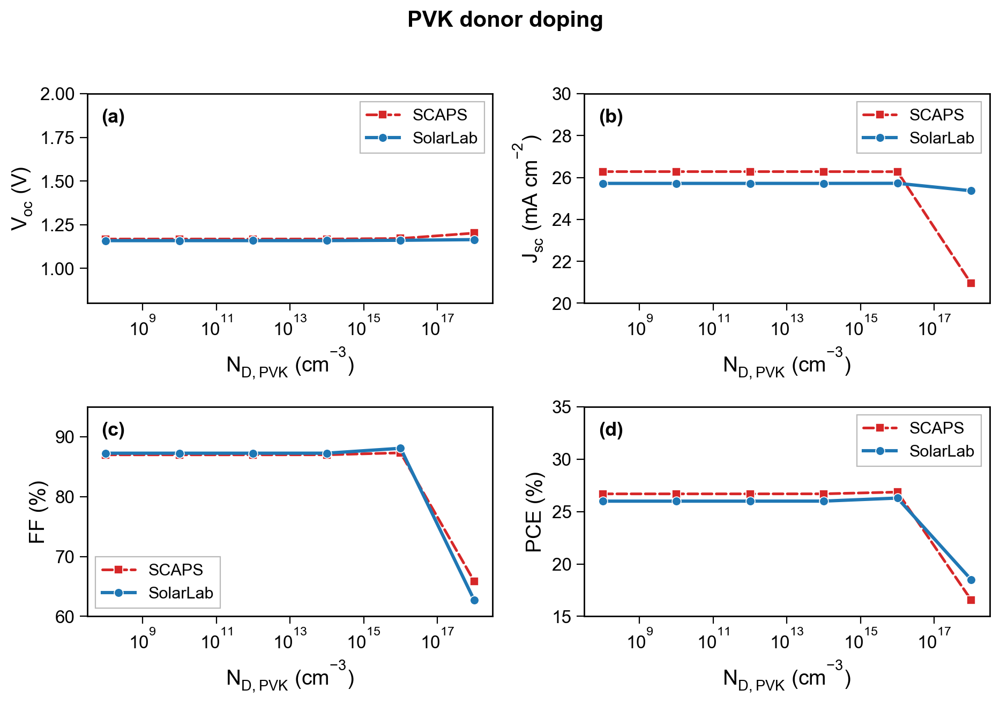
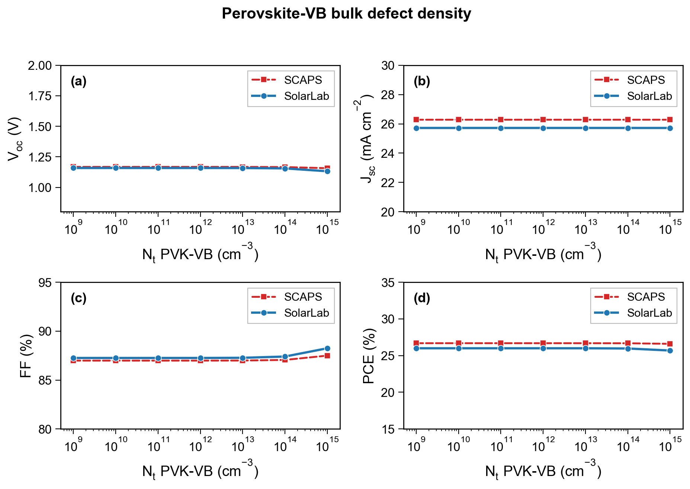
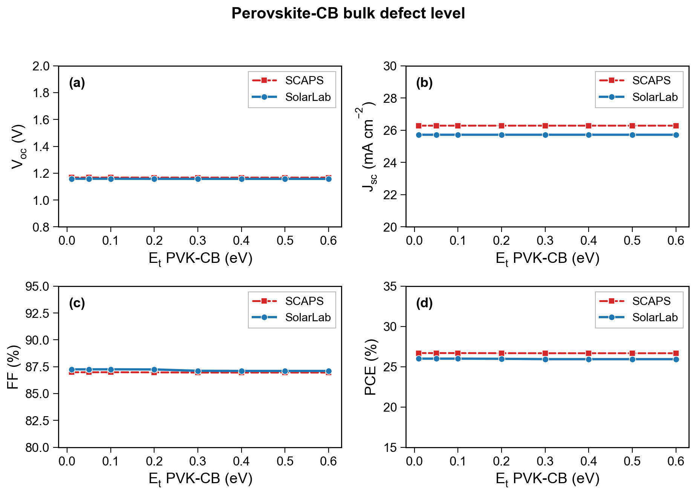
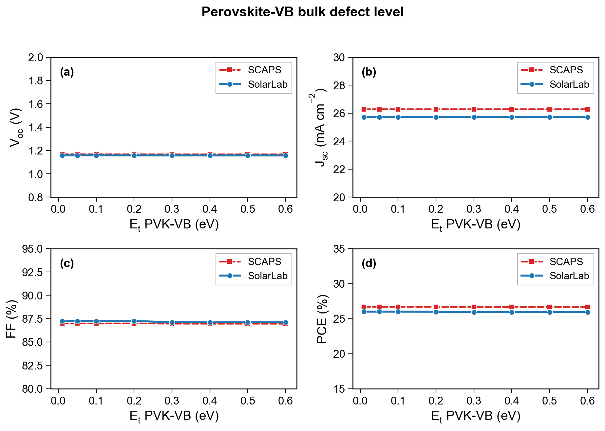
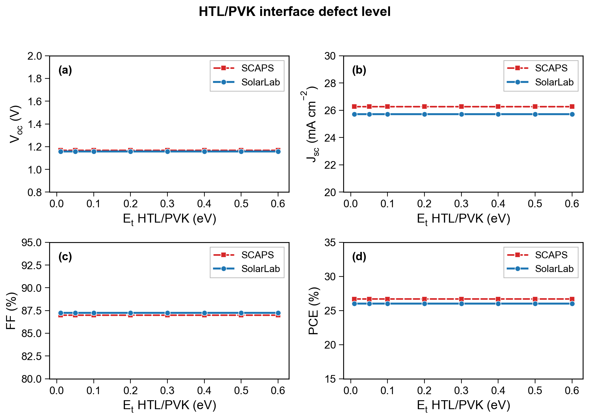
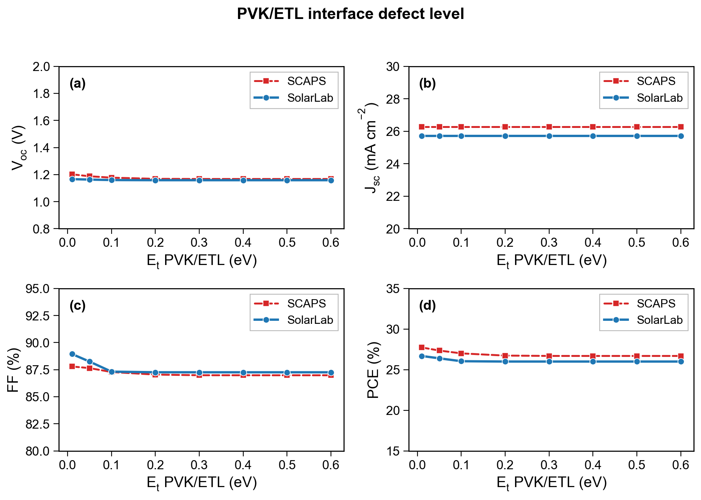

## Abstract

We compare the SolarLab one-dimensional drift--diffusion simulator against the
SCAPS-1D reference solver across eleven single-variable parameter sweeps of the
same $n$--$i$--$p$ perovskite device (`scaps_mirror_v2`: spiro-OMeTAD / MAPbI$_3$
/ TiO$_2$). Each figure overlays the two solvers on the four figures of merit
($V_{oc}$, $J_{sc}$, FF, PCE); the SolarLab curve is its transient
drift--diffusion solution with the calibrated SCAPS-emulation de-spike fraction
($f = 0.53$). The analysis is deliberately restricted to two questions: *which
physical model* governs each sweep, and *how the numerical algorithm* of each
solver shapes the result. We find that the two codes agree on the trend
direction of ten of the eleven sweeps and on the four base figures of merit to within a
few percent (the one exception, the HTL/PVK interface-defect-density sweep, is
flat in the transient against a small \~5 mV SCAPS response --- a
discretisation limitation, cause iv below); every residual is attributable to one of five
identified model or algorithm differences: (i) the optical model (SolarLab's
coherent transfer-matrix optics versus SCAPS's scalar-absorption treatment),
which sets a flat \~2\% $J_{sc}$ offset; (ii) the contact boundary condition
(the ideal ohmic Dirichlet pin versus a finite-recombination flat-band metal
contact), which governs the weakly-doped-contact regime; (iii) the
heterointerface transport treatment (thermionic-emission-capped Scharfetter--Gummel
flux versus SCAPS's interface model), which sets the conduction-band-offset spike
threshold; (iv) the sampling of interface recombination at bulk grid nodes rather
than on the interface plane, which under-resolves one interface-defect response in
the transient; and (v) the solution algorithm itself (SolarLab's time-dependent
method-of-lines integration to steady state versus SCAPS's Gummel-iterated
steady-state solve), which determines whether the open-circuit voltage is
bracketed at all in near-degenerate regimes.

## 1. Introduction

A device simulator earns trust in two stages. The first, reported separately, is
an *internal* verification that the solver obeys the conservation laws and
boundary conditions of drift--diffusion on a single operating point. The second,
reported here, is an *external* comparison against an independent, widely-used
reference solver (SCAPS-1D) across a broad parametric envelope, so that the two
codes are forced to agree not on one number but on the *response* of the device
to eleven independent physical perturbations: the electron-transport-layer (ETL)
conduction-band offset, the ETL and absorber doping, and the density and energy
level of bulk and interface defects.

Two solvers can agree on a terminal figure of merit while disagreeing on the
physics that produced it, and can disagree on a terminal figure of merit while
implementing identical physics, purely because their numerical methods sample the
solution differently. We therefore read every sweep through two lenses --- the
physical model and the numerical algorithm --- and attribute each agreement or
deviation to a specific, named cause. Section 2 states the physical models of the
two codes and where they differ; Section 3 does the same for the numerical
algorithms; Section 4 presents the eleven sweeps and interprets each; Section 5
consolidates the attribution; Section 6 concludes.

## 2. Physical models

### 2.1 Governing equations

Both codes solve the same electrostatics and carrier transport: Poisson's
equation for the electrostatic potential coupled to the electron and hole
continuity equations with drift--diffusion (Scharfetter--Gummel) fluxes,

$$ \nabla\!\cdot\!(\varepsilon\nabla\varphi) = -q\,(p - n + N_D^+ - N_A^-), $$
$$ \frac{\partial n}{\partial t} = \frac{1}{q}\nabla\!\cdot\! \mathbf{J}_n + G - R, \qquad
   \frac{\partial p}{\partial t} = -\frac{1}{q}\nabla\!\cdot\! \mathbf{J}_p + G - R. $$

SCAPS is an ion-free steady-state solver, so the parity quantities are defined at
the ion-free steady state. SolarLab additionally carries mobile ionic species;
for this comparison the ions are frozen at their illuminated-equilibrium profile
so that both codes solve the same electronic problem. This is a methodological
choice, not a model difference: it removes the one degree of freedom SCAPS does
not possess.

### 2.2 Carrier statistics and recombination

Both codes use Boltzmann statistics for the non-degenerate perovskite absorber.
Recombination is the sum of Shockley--Read--Hall (SRH, bulk and interface),
radiative, and Auger channels. SolarLab evaluates the effective density-of-states
band-potential correction ($V_T\ln N_{C}$ / $V_T\ln N_{V}$) in the
Scharfetter--Gummel drift term, which restores the $kT\ln(\text{DOS ratio})$
quasi-Fermi-level steps at the DOS-contrast heterojunctions; without it the base
$V_{oc}$ is depressed by \~137 mV. With the correction the base $V_{oc}$
matches SCAPS. One deliberate SCAPS-emulation adjustment is retained: the
heterointerface bulk-recombination *de-spike* fraction $f = 0.53$, which blends
the single-node band-offset carrier spike toward the geometric mean of its
neighbours in the bulk Auger/radiative rate only (the transport flux is
untouched). This compensates a partial double-count of the same interface loss by
the bulk-Auger and interface-SRH channels --- an artifact of resolving a sharp
band offset on a single grid node --- and lands the base $V_{oc}$ on the SCAPS
value. It is a bulk-rate scalar and therefore shifts absolute levels, not sweep
directions.

### 2.3 Heterointerface transport

At a band offset exceeding \~0.05 eV the raw Scharfetter--Gummel flux
over-estimates the current that can cross a discontinuity resolved in one grid
spacing. SolarLab caps the flux at the Richardson--Dushman thermionic-emission
(TE) limit; SCAPS applies its own interface treatment. This is the dominant
control on the *positive* conduction-band-offset (spike) response of Section 4.1:
a positive spike is a barrier to electron extraction, and the height at which it
kills current collection is set by how each code models the interface. Intra-band
tunnelling through the spike --- exposed by SCAPS as an option --- is available in
SolarLab as a static, flag-gated enhancement but is left off here, matching the
reference configuration.

### 2.4 Contacts

This is the largest model difference. SolarLab's default is the IonMonger-style
*ideal ohmic pin*: the carrier densities at the outer contacts are Dirichlet-pinned
to the dark-doping equilibrium, $n_R = N_{D,\text{ETL}}$ at the cathode. SCAPS
models the contacts as *flat-band metals* with a fixed work function and a finite
surface-recombination velocity. At normal contact doping the two conventions
agree to within a few millivolts. They diverge only when a contact layer is
weakly doped: the doping-tied pin then supplies a vanishing carrier reservoir and
starves the contact, whereas the metal work function supplies carriers
independently of the semiconductor doping. SolarLab reproduces the SCAPS
convention with a *work-function reservoir floor*,

$$ n_R = \max\!\big(N_{D}\text{-eq},\; N_C\,e^{-\phi_B/V_T}\big), $$

(the majority carrier chosen by the contact doping sign), which is dormant at
normal doping --- hence bit-identical on every sweep that holds the contacts at
their base doping --- and active only in the weakly-doped-contact tail. It is the
decisive model element in the ETL-doping sweep of Section 4.2.

### 2.5 Optics

SolarLab computes the position-resolved generation $G(x)$ from a coherent
thin-film transfer-matrix method (TMM) over the full glass/transport/absorber
stack, with the Poynting-vector correction enforcing $R + T + A = 1$. SCAPS uses
a scalar absorption profile. The two optical models produce a small, *flat*
$J_{sc}$ offset (\~0.6 mA cm$^{-2}$, \~2\%) that is independent of every
electrical sweep parameter --- exactly the signature of an optics-only difference.
Because this offset is constant, the $J_{sc}$ panels of Figures 2--11 are drawn on
a $[20, 30]$ mA cm$^{-2}$ axis so the two flat lines and their small gap are
resolved; Figure 1 alone keeps the full axis because its $J_{sc}$ genuinely
collapses to zero at a large spike.

## 3. Numerical algorithms

### 3.1 SolarLab: transient method of lines

SolarLab discretises space with Scharfetter--Gummel finite elements on a
tanh-clustered multilayer grid and integrates in time with an implicit stiff
integrator (`scipy` Radau), reusing the previous bias point as the initial
condition so that each figure of merit is read from a settled steady state. The
open-circuit voltage is obtained by bracketing the zero-crossing of the terminal
current on a forward voltage sweep. A companion direct steady-state Newton driver
exists and is used for cross-validation; the curves here are the transient
solution.

### 3.2 SCAPS: Gummel-iterated steady state

SCAPS solves the coupled system directly at steady state by Gummel iteration
(decoupled Poisson / continuity updates iterated to self-consistency) with a
Newton inner solve, at each bias point. There is no time axis and no ionic degree
of freedom.

### 3.3 Consequences for the comparison

The algorithmic difference matters in exactly one place: whether $V_{oc}$ is
*bracketed*. Where the device has a well-defined open-circuit crossing, the
transient and the steady-state solve agree to within a few millivolts (verified
independently). Where the crossing is marginal or degenerate --- a near-insulating
contact, or a spike so large that $J_{sc}\to 0$ --- the transient sweep may fail to
find a physical crossing and report either no $V_{oc}$ or a super-bandgap
pseudo-crossing. Such points are *physical absences*, not solver errors: the two
drivers agree that no crossing exists, and the degenerate points are excluded from
the comparison. This is the mechanism behind the low-doping tail of Section 4.2
(resolved by the contact model of Section 2.4) and the dead-cell tail of
Section 4.1.

## 4. Results: eleven parametric sweeps

Each figure overlays SCAPS (red) and SolarLab ($f = 0.53$, blue) on
$V_{oc}$/$J_{sc}$/FF/PCE. Ten of the eleven sweeps agree on trend direction; the exception (HTL/PVK
interface defect density, §4.5) is where the transient is flat.

### 4.1 ETL/PVK conduction-band offset

![ETL/PVK conduction-band offset $\Delta E_C$. Negative $\Delta E_C$ (a cliff) lowers $V_{oc}$ in both codes; the flat plateau is band-offset-limited. The positive spike is a barrier to electron extraction: $J_{sc}$/FF/PCE collapse while $V_{oc}$ stays flat, confirming the spike blocks *collection*, not the open-circuit voltage. SolarLab's thermionic-emission-capped flux places the collapse threshold at $\Delta E_C \approx +0.7$ eV versus SCAPS's $+0.5$ eV --- an interface-transport-model offset (Section 2.3). $J_{sc}$ is shown on the full axis because it genuinely reaches zero.](../figures/scaps_solarlab_compare/sweep_CHI_ETL.png){width=95%}

### 4.2 ETL donor doping

{width=95%}

### 4.3 Perovskite donor doping

{width=95%}

### 4.4 Perovskite bulk defect density

{width=95%}

{width=95%}

### 4.5 Interface defect density

![HTL/PVK interface defect density --- the one directional exception. The transient evaluates interface SRH from the carrier densities at the adjacent *bulk* grid nodes, where the band-offset carrier pileup dominates and masks the defect-density dependence, so the SolarLab $V_{oc}$ is flat; SCAPS (and SolarLab's steady-state interface-plane driver) evaluate on the interface plane and resolve the small (\~5 mV) response. A discretisation limitation of the transient path (cause iv), not a physics disagreement.](../figures/scaps_solarlab_compare/sweep_Nt_HTL_PVK.png){width=95%}

{width=95%}

### 4.6 Defect energy level

{width=95%}

{width=95%}

{width=95%}

{width=95%}

## 5. Discussion: attribution of the residuals

Every residual disagreement in Section 4 maps to one of four named causes, and to
either the physical model or the numerical algorithm:

\begin{center}
\begin{tabular}{lll}
\toprule
Residual & Cause & Class \\
\midrule
Flat \~2\% $J_{sc}$ deficit (all sweeps) & Coherent TMM vs scalar-$\alpha$ optics & Model (2.5) \\
Low-$N_{D,\text{ETL}}$ $V_{oc}$ below SCAPS & Work-function reservoir arm steepness & Model (2.4) \\
CBO spike collapse at $+0.7$ vs $+0.5$ eV & TE-capped SG flux vs SCAPS interface & Model (2.3) \\
HTL/PVK interface $N_t$ flat (\~5 mV) & Interface SRH sampled at bulk nodes & Model/Alg.\ (2.2) \\
Missing / degenerate $V_{oc}$ points & Transient bracketing of a marginal crossing & Algorithm (3.3) \\
Base $V_{oc}$ (matched) & Effective-DOS fold + de-spike $f=0.53$ & Model (2.2) \\
\bottomrule
\end{tabular}
\end{center}

Two points are worth emphasising. First, none of the residuals is a *numerical
error*: the one algorithmic effect (bracketing) produces physically-correct
absences that the independent steady-state driver confirms, and everywhere a
crossing exists the two SolarLab drivers agree to within a few millivolts.
Second, the model residuals are all *localised* --- the optical offset is a
constant, the contact residual lives only in the weakly-doped tail, and the spike
threshold differs only at large positive offset --- so the two codes implement the
same physics wherever that physics is well-conditioned.

## 6. Conclusion

Across eleven parametric sweeps SolarLab reproduces the SCAPS-1D trends in
direction in ten of the eleven sweeps and in magnitude to within a few percent on the base figures
of merit. The disagreements are not numerical noise but the fingerprints of four
specific, understood model or algorithm choices --- the optical method, the
contact boundary condition, the heterointerface flux limit, and the transient
versus steady-state solution strategy. Each has been isolated to a single sweep
regime and, where it is a model choice, is exposed as a configurable option in
SolarLab. The comparison establishes that the two codes share the same
drift--diffusion physics and differ only in well-characterised, boundary-layer
details.
