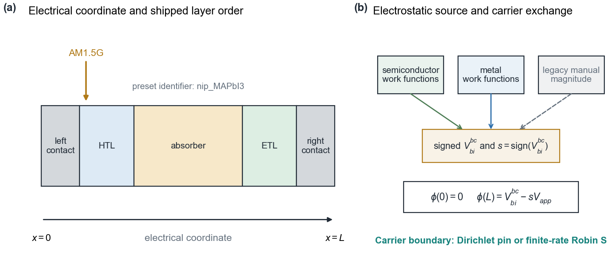
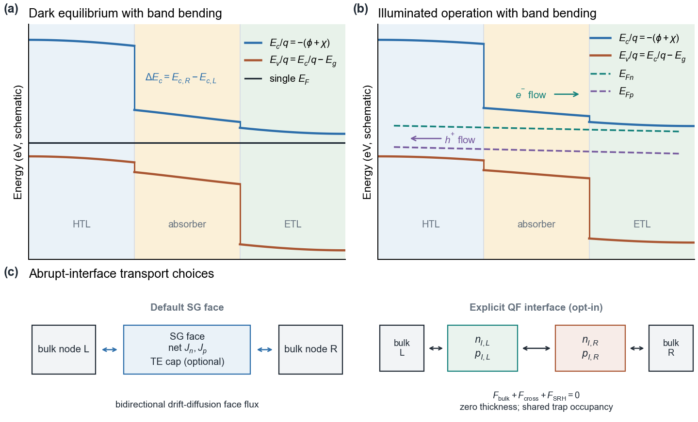
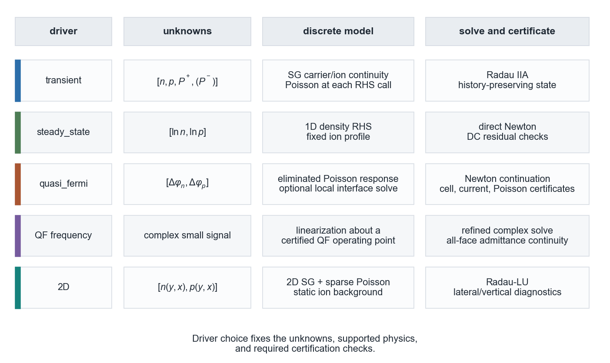
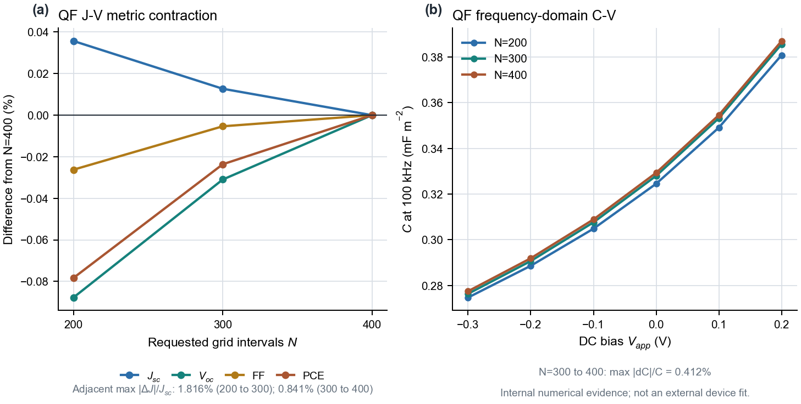
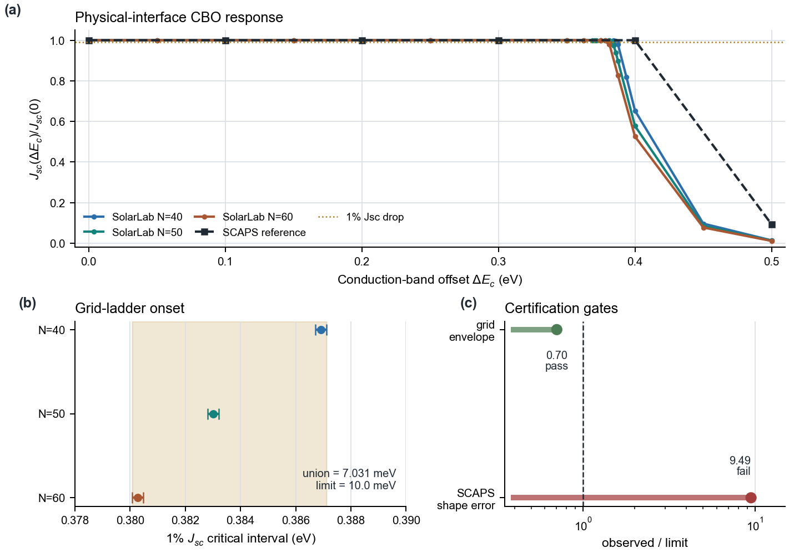
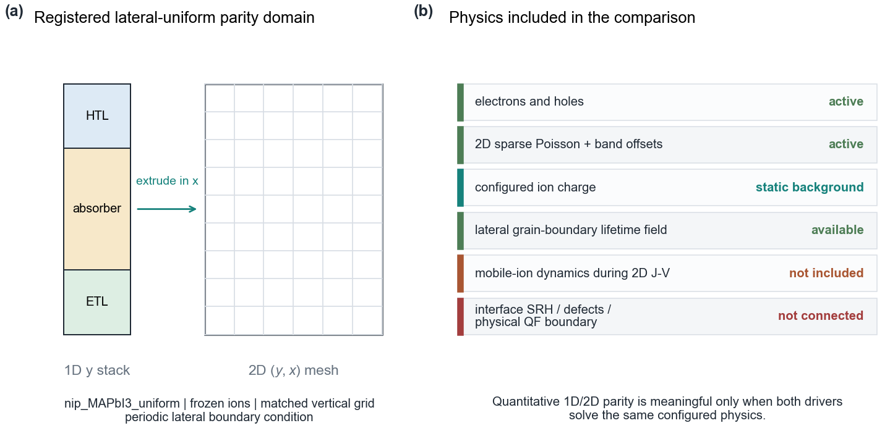

# perovskite-sim

The Python simulation package, FastAPI backend, and Vite/TypeScript
frontend that make up the SolarLab simulator.

> **Start here:** the [root README](../README.md) covers installation,
> physics, equations, UI walkthrough, and shipped presets. This file is
> a package-level orientation to the `perovskite-sim/` subtree. The
> [2026-08-11 technical manual](../docs/manual/SolarLabManual260811.pdf)
> is the detailed solver, model-scope, and validation reference.

<br>

## Layout

```
perovskite-sim/
├── .superpowers/     Historical local design/brainstorm records
├── perovskite_sim/   Python library: models, physics, solvers, experiments, 2D
├── backend/          FastAPI HTTP wrapper and SSE job dispatch
├── frontend/         Vite + TypeScript + Plotly workstation
├── configs/          Shipped 1D, tandem, and 2D YAML device presets
├── reproducibility/  Frozen baselines, schemas, hashes, benchmarks, P1 gaps
├── docs/             Package-specific model, benchmark, and implementation docs
├── scripts/          CLI, validation, plotting, import, and probe tools
├── tests/            Unit, integration, regression, and validation suites
├── notebooks/        Exploratory benchmarks
├── band_diagram.png  Retained root-level sample plot
├── charge_distribution.png  Retained root-level sample plot
├── Dockerfile.backend  Backend container definition
├── pyproject.toml    Package metadata and pytest configuration
├── .gitignore        Package-local generated-output rules
├── CLAUDE.md         Package development and validation guidance
└── README.md         This file
```

Local runs may create an ignored `outputs/` directory. A result is not part of
the remote repository or reproducibility registry merely because it exists
there.

<br>

## Quick Install

```bash
pip install -e ".[dev]"        # Python package in editable mode
cd frontend && npm install     # frontend dependencies
```

<br>

## Tests

```bash
pytest                                                  # default unit + integration (~2-3 min)
pytest -m validation -W error::RuntimeWarning           # literature-informed lanes
pytest -m slow -W error::RuntimeWarning                 # heavy physics suite; can exceed 1 h
python scripts/verify_reproducibility.py --json          # P0 + config/schema/resource matrix
pytest --cov=perovskite_sim --cov-report=term-missing   # with coverage
```

Transient solves retain the historical scalar absolute tolerance by default.
For the opt-in reference-scaled policy and the required three-level tolerance
study, see [componentwise-tolerance-policy.md](docs/componentwise-tolerance-policy.md).
For compact-support Poole-Frenkel, interface-density, and thermionic-cap
sensitivity ladders, see
[rhs-regularization-policy.md](docs/rhs-regularization-policy.md).
The staged implementation, test matrices, promotion gates, and explicitly
parked physics are tracked in the
[2026-08-14 physics/numerics hardening roadmap](docs/plans/2026-08-14-physics-numerics-hardening-plan.md).
The corresponding Phase 1 implementation status, immutable certificate IDs,
failed/partial lanes, and evidence boundaries are recorded in the
[Phase 1 implementation and evidence report](docs/phase-1-implementation-and-evidence.md).
The first post-P1 impedance prerequisite, a residual- and conservation-certified
mobile-ion DC state, is documented in
[1D ion-aware DC certification closure](docs/ion-aware-dc-certification.md).
The opt-in Phase 2 mass/storage and central-finite-difference linearization
slice is documented in
[ion-aware impedance reference engine](docs/ion-aware-impedance-reference-engine.md).
The subsequent exact-discrete-Poisson, analytic SG transport, analytic bulk
recombination, defect-free local and clamp-inactive cross-node/projected
interface SRH, positive-density shared-occupancy and additive two-sided SRH,
the residual-resolved interior QSS interface root, selective-contact, analytic
field-mobility, and adaptive per-column operator check is documented in
[ion-aware structured Jacobian comparison](docs/ion-aware-structured-jacobian-comparison.md).

Evidence labels matter: a passing `load_only` or internal regression is not an
external validation. See [reproducibility/README.md](reproducibility/README.md)
for the authoritative status and limitations of every shipped config.

<br>

## Notebooks

**Interactive notebooks** under `notebooks/`:

| Notebook | Topic |
|:---------|:------|
| `01_jv_hysteresis.ipynb` | J-V sweep with hysteresis |
| `02_impedance.ipynb` | Impedance spectroscopy (Nyquist plot) |
| `03_degradation.ipynb` | Long-term degradation simulation |

**Benchmark scripts** (`.py`, run with `python`):

| Script | Topic |
|:-------|:------|
| `04_ionmonger_benchmark.py` | Exploratory IonMonger paper-informed diagnostic |
| `05_comprehensive_benchmark.py` | Exploratory multi-physics diagnostic |
| `06_e2e_notebook_vs_api.py` | Notebook vs API parity check |

- **Autoloop guardian** (`python perovskite-sim/scripts/autoloop_run.py --once`) — runs the
  L0–L2 ladder, scores SolarLab-vs-SCAPS parity, and records regressions to the gap ledger.
- **Autoloop L3 lab data** — point `--reference` at a tiered descriptor (`scaps_lab_tiered.json`)
  to score absolutes against measured J-V (`LabReferenceSource`) while keeping SCAPS trend sweeps.
  Default stays pure-SCAPS.
- **Autoloop LLM attributor** (`--attribute --llm`) — when the deterministic heuristic can't
  diagnose a gap, an LLM proposes a novel root cause (always a `verdict=uncertain` lead; never
  auto-confirmed). Opt-in; default stays deterministic.

<br>

## Physical Model

The simulator models a thin-film solar cell as a stack of semiconductor
layers between two metallic contacts. The default solver is 1D along the
device stack; the 2D extension extrudes the same stack laterally for
microstructure and grain-boundary studies. Light enters from one side,
generates electron-hole pairs, and the built-in electric field separates them
to produce current.

<p align="center">
  
</p>

<p align="center">
  
</p>

<p align="center">
  
</p>

No single driver contains every optional model. `transient`,
`steady_state`, `quasi_fermi`, `quasi_fermi_frequency`, and `2D` use different
unknowns and certification checks. The experiment selects the driver
explicitly; unsupported combinations fail before the numerical solve. Likewise,
`legacy`, `fast`, and `full` are feature ceilings rather than accuracy grades.

### Supported Device Architectures

| Config | Structure | Ions | Optics |
|:-------|:----------|:----:|:------:|
| `nip_MAPbI3` | spiro / MAPbI3 / TiO2 | Yes | Beer-Lambert |
| `nip_MAPbI3_tmm` | Glass / spiro / MAPbI3 / TiO2 | Yes | TMM |
| `pin_MAPbI3` | TiO2 / MAPbI3 / spiro | Yes | Beer-Lambert |
| `ionmonger_benchmark` | Courtier 2019 reference | Yes | Beer-Lambert |
| `cigs_baseline` | ZnO / CdS / CIGS | No | Beer-Lambert |
| `cSi_homojunction` | n+ / p Si wafer | No | Beer-Lambert |
| `csi_vannijen2025_pn_cv` | Gaussian p+ / n Si C-V cross-check | No | Dark only |
| `tandem_lin2019` | Wide-gap / narrow-gap tandem | Yes | TMM |
| `twod/nip_MAPbI3_uniform` | 2D lateral-uniform MAPbI3 | Frozen in 2D | Beer-Lambert |
| `twod/nip_MAPbI3_singleGB` | 2D MAPbI3 with one vertical grain boundary | Frozen in 2D | Beer-Lambert |
| `twod/bcx_combined_demo` | 2D combined Robin / field-mobility / microstructure demo | Frozen in 2D | Beer-Lambert |

Continuous `chi/Eg` grading currently changes electrical transport only.
Optical `alpha(lambda, x)` and `n,k(lambda, x)` are not composition-graded, so
CIGS notch studies must not be interpreted as graded-optics Jsc/PCE
optimization.

<br>

## Initial Conditions and Boundary Conditions

The simulator solves the coupled 1D drift-diffusion + Poisson + mobile-ion
system. Below are the conditions applied at the device contacts (boundary
conditions) and the strategies used to seed the state vector (initial conditions).

### Governing Equations

| Equation | PDE |
|:---------|:----|
| Poisson | $\partial/\partial x(\varepsilon_0 \varepsilon_r \, \partial\varphi/\partial x) = -\rho$ |
| Electron continuity | $\partial n/\partial t = (1/q) \, \partial J_n/\partial x + G - R$ |
| Hole continuity | $\partial p/\partial t = -(1/q) \, \partial J_p/\partial x + G - R$ |
| Ion (vacancy) continuity | $\partial P/\partial t = -\partial F_P/\partial x$ |

State vector per grid node: $\mathbf{y} = (n, p, P)$ — electron density, hole
density, and positive-ion (vacancy) density. Dual-species mode adds a
negative-ion field $P^-$.

<br>

### Boundary Conditions

#### Electrostatic Potential (Poisson) — Dirichlet

| Contact | Value |
|:--------|:------|
| Left ($x = 0$) | $\varphi = 0$ (grounded) |
| Right ($x = L$) | $\varphi = V_{\text{bi}} - V_{\text{app}}$ |

Forward bias ($V_{\text{app}} > 0$) reduces the built-in field; $V_{\text{app}} \approx V_{\text{oc}}$ yields
near-open-circuit conditions.

The Poisson operator uses **harmonic-mean face permittivities**:

$$\tilde{\varepsilon}_{i+\frac{1}{2}} = \frac{2\,\varepsilon_r[i]\,\varepsilon_r[i+1]}{\varepsilon_r[i] + \varepsilon_r[i+1]}$$

This is the exact series-capacitor result for a sharp dielectric interface and
avoids the field concentration artefact of nodal averaging.

*Source:* `perovskite_sim/physics/poisson.py`

<br>

#### Electron and Hole Densities — Ohmic or Robin Contacts

By default, both contacts are treated as ideal ohmic contacts. Carrier
densities at the boundaries are clamped to the **thermal-equilibrium values**
derived from the doping of the outermost layers:

$$n \cdot p = n_i^2 \quad\text{(mass-action law)}$$

$$n - p = N_D - N_A \quad\text{(charge neutrality)}$$

Solved via the numerically stable two-branch formula (avoids cancellation
and overflow):

$$\text{net} = N_D - N_A, \qquad \text{disc} = \sqrt{\text{net}^2 + 4\,n_i^2}$$

$$\text{n-type (net} \ge 0\text{):}\quad n = \tfrac{1}{2}(\text{net} + \text{disc}),\quad p = n_i^2 / n$$

$$\text{p-type (net} < 0\text{):}\quad p = \tfrac{1}{2}(-\text{net} + \text{disc}),\quad n = n_i^2 / p$$

These values are computed once per experiment in `build_material_arrays()`
and stored as `n_L, p_L, n_R, p_R`. With default ohmic contacts, the time
derivatives at the contact nodes are set to zero
(`dn[0] = dn[-1] = dp[0] = dp[-1] = 0`) so the Dirichlet values remain
constant throughout the transient.

In FULL mode, optional selective-contact coefficients replace the ohmic pin
for the configured carrier/side with a Robin-type boundary flux:

$$J_{c,s} = \sigma_{c,s}\,qS_{c,s}(u_c - u_{c,\mathrm{eq}})$$

where $c \in \{n,p\}$, $s \in \{\text{left},\text{right}\}$, $u_n=n$, and
$u_p=p$. The YAML schema supports both flat keys (`S_n_left`, `S_p_left`,
`S_n_right`, `S_p_right`) and a nested readable block:

```yaml
device:
  mode: full
  contacts:
    left:
      S_p: 1.0e3
      S_n: 1.0e-3
    right:
      S_n: 1.0e3
      S_p: 1.0e-3
```

Missing or `null` means the default ohmic pin remains active for that
carrier/side. A finite value activates the Robin flux; `S = 0` is blocking,
and large `S` approaches the ohmic limit. The 2D solver maps left/right onto
top/bottom contacts.

*Source:* `perovskite_sim/solver/mol.py`, `perovskite_sim/physics/contacts.py`,
`perovskite_sim/twod/solver_2d.py`

<br>

#### Ion (Vacancy) Densities — Neumann (Zero-Flux)

Ions cannot leave the device. At both contacts the vacancy flux is set to
zero:

$$F_P(x = 0) = F_P(x = L) = 0$$

Implemented by padding the internal flux array with zeros at each end
before computing the finite-difference divergence. The same zero-flux
condition applies to both positive and negative ion species.

A finite-site modified-PNP chemical potential supplies the default crowding
term. For one positive species,

$$
F_P=-D_{\text{ion}}\left[
\frac{1}{1-P/P_{\text{lim}}}\frac{\partial P}{\partial x}
+\frac{P}{V_t}\frac{\partial\varphi}{\partial x}
\right].
$$

The dual-ion default uses shared occupancy
$\theta=(P_+ + P_-)/P_{\text{lim}}$. The `legacy` tier retains the former
whole-flux multiplier for frozen benchmark compatibility. `P_lim` enters the
chemical potential; it is not a numerical projection of every trial state.

*Source:* `perovskite_sim/physics/ion_migration.py`

<br>

### 2D Extension Boundary Conditions

The Stage A/B 2D solver uses the same physical stack but extrudes it onto a
tensor-product grid. The vertical stack direction carries the device-contact
boundary conditions: top/bottom carrier rows are ohmic by default, or Robin
when FULL-mode selective-contact coefficients are configured. The lateral
direction is periodic, so laterally uniform presets reproduce the 1D J-V
semantics while microstructure presets can add vertical grain boundaries.
Positive and negative ions are frozen as static Poisson background fields
during 2D J-V runs. The 2D continuity path also omits the 1D interface-defect
and interface-plane recombination channels. Its certified scope is the
lateral-uniform/frozen-ion limit and prescribed lifetime patterns, not a
complete 2D perovskite microstructure model.

2D presets live in `configs/twod/`; the backend exposes them through
`GET /api/configs` and runs them with `kind="jv_2d"` or
`kind="voc_grain_sweep"`.

*Source:* `perovskite_sim/twod/solver_2d.py`,
`perovskite_sim/twod/experiments/jv_sweep_2d.py`

<br>

#### Thermionic Emission at Heterointerfaces

The default density-variable path retains one bidirectional
Scharfetter-Gummel face and may apply the empirical thermionic cap above a
0.05 eV band offset. The dimensionally normalized
`te_physical_norm` form remains opt-in.

The supported ion-free QF path can instead use
`interface_boundary=true`. It removes the ordinary SG face and solves
reciprocal thermionic transport plus shared-occupancy interface SRH on an
exclusive zero-thickness boundary. Unsupported physics stops before Newton.
The registered CBO grid envelope passes, but external SCAPS shape agreement
does not; this is a development model rather than an externally certified CBO
threshold.

*Source:* `perovskite_sim/physics/continuity.py`, `perovskite_sim/discretization/fe_operators.py`

<br>

#### Interface Recombination

At each heterointerface, surface recombination is parameterised by
velocities $(v_n, v_p)$ [m/s] carried in `DeviceStack.interfaces`. The
surface SRH rate is converted to a volumetric rate by dividing by the
local dual-grid cell width.

These active interface paths are recombination-only. The explicit
`interface_charge_closure` schema defaults to `off`; its reserved
`equilibrium_referenced` research value is recognized but fails closed in all
production experiment routes. The retired `iface_state_charge` scalar cannot
feed the shared-node Poisson scaffold. A dedicated ion-free QF research lane
does couple the signed law `Delta sigma = -q Nt (f-f_eq)` into the outer
two-sided Poisson residual and analytic/IFT Jacobian. It is available through
the two-call Python API and the fail-closed
`POST /api/research/interface-charge/steady-state` endpoint only; it is not a
production trap-electrostatics capability. See
[`docs/interface-charge-closure-policy.md`](docs/interface-charge-closure-policy.md).

<br>

### Initial Conditions

#### Quasi-Neutral Dark Seed (Default)

`solve_equilibrium` constructs a **quasi-neutral carrier seed** with a neutral
ionic background. It is an initializer, not by itself a residual-certified
ion-relaxed equilibrium. At every grid node:

$$n \cdot p = n_i^2(\text{layer}) \quad\text{(mass-action law)}$$

$$n - p = N_D - N_A \quad\text{(charge neutrality, ions treated as neutral background)}$$

The configured vacancy density $P_0$ is treated as a **neutral ionic
background** — it does not appear as net space charge in the initial
carrier balance. This avoids the enormous artificial carrier imbalance
that arises when $P_0$ is treated as net positive charge.

The ion profile is initialised to the uniform per-layer value `P0`.
Contact nodes are overwritten with the ohmic-contact equilibrium densities.

*Source:* `perovskite_sim/solver/newton.py`

<br>

#### Illuminated Carrier Preconditioning

For experiments that begin under illumination (J-V sweep, impedance,
degradation), the initial state is obtained by **integrating the full MOL
system for $t_{\text{settle}} = 1$ ms** starting from dark equilibrium, under
illumination at the starting voltage:

```python
y_dark  = solve_equilibrium(x, stack)
y_light = run_transient(x, y_dark, [0, t_settle], illuminated=True, V_app)
```

The default 1 ms integration is a carrier-preconditioning protocol, not a claim
of full ion-relaxed equilibrium. Carrier densities typically settle much
faster than the ionic profile, so ions remain nearly frozen over this interval.
Longer light soaking defines a different device history and can change a
history-dependent J-V result. If the transient solve fails or returns an
invalid terminal density state, the helper raises; it never substitutes the
dark seed as an illuminated result.

*Source:* `perovskite_sim/solver/illuminated_ss.py`

<br>

### Built-in Potential

`built_in_potential_mode` selects the signed contact potential used by the
Poisson boundary:

| Mode | Source | Intended use |
|:-----|:-------|:-------------|
| `semiconductor_work_function` | Endpoint semiconductor work functions from $\chi$, $E_g$, DOS, doping, grading, and temperature | New physical stacks whose outer layers represent the contact reservoirs |
| `metal_work_function` | Explicit `work_function_left_eV - work_function_right_eV` | Devices with known electrode work functions |
| `legacy_manual` | Non-negative `V_bi_override` magnitude with orientation inferred separately | Frozen published benchmarks; `V_bi` remains a deprecated compatibility alias |

The fail-closed semiconductor mode requires complete positive band/DOS inputs.
Carrier contact kinetics remain independent: Dirichlet pins or finite-rate
Robin `S_*` values do not select the Poisson voltage. With
$s=\operatorname{sign}(V_{\text{bi}}^{\text{bc}})$, positive forward bias is
mapped as

$$
\varphi(0)=0,\qquad
\varphi(L)=V_{\text{bi}}^{\text{bc}}-sV_{\text{app}}.
$$

Pre-mode YAML files retain their historical compatibility behavior. New files
that omit both manual keys resolve to `semiconductor_work_function`.

`assess_contact_thermodynamics(stack, mat)` evaluates the four endpoint
Maxwell-Boltzmann quasi-Fermi levels using the exact reservoir densities,
band/DOS arrays, device temperature, and Poisson drop consumed by the solver.
The fixed internal gate is 5 meV and callers may tighten but not relax it.
`metal_work_function` additionally requires each electrode work function to
match its local semiconductor reservoir in absolute energy; matching only the
left-right difference is insufficient. Results are labelled `certified`,
`inconsistent`, `compatible_unverified`, or `not_assessable`. Legacy decks are
reported rather than silently migrated or rejected; research workflows can use
`require_contact_thermodynamic_certificate` to fail closed. This is an internal
boundary-consistency certificate, not validation of a real contact barrier or
surface kinetics.

*Source:* `perovskite_sim/physics/contacts.py`

<br>

### J-V Sweep Voltage Range

`run_jv_sweep(stack, V_max=None, ...)` opens the forward sweep to

$$V_{\text{upper}} = \max\bigl(V_{\text{bi,eff}} \cdot 1.3,\; 1.4\ \text{V}\bigr)$$

where $V_{\text{bi,eff}}$ is the magnitude returned by
`stack.operating_built_in_potential()`. Explicit modes use their selected
work-function source consistently; pre-mode compatibility stacks retain the
historical band-derived operating value. The 1.3× headroom and 1.4 V floor
avoid silently clipping a high-$V_{\text{oc}}$ stack before $J=0$.
`compute_metrics` still exposes `voc_bracketed=false` when the sampled window
does not resolve open circuit.

*Source:* `perovskite_sim/experiments/jv_sweep.py::_default_V_max`

<br>

### V<sub>oc</sub> Bracket Detection

`compute_metrics(V, J)` returns a frozen `JVMetrics(V_oc, J_sc, FF, PCE,
voc_bracketed)`. The `voc_bracketed` flag is `True` when the sweep contains a
zero-current crossing (V<sub>oc</sub> is then computed by linear interpolation between the
two adjacent samples whose J flip sign) and `False` when the sweep window stops
before J flips sign — in which case `V_oc`, `FF`, and `PCE` are zeroed
sentinels and only `J_sc` is physically meaningful. The 2D driver
`run_jv_sweep_2d` calls `compute_metrics(..., assume_jsc_positive=False)` so
the 2D Scharfetter–Gummel sign convention is normalised centrally and
`JV2DResult.metrics` matches the 1D semantics bit-for-bit. The workstation 2D
J–V pane reads `voc_bracketed` to render `—` for V<sub>oc</sub> / FF / PCE and an inline
`V_oc not bracketed — increase V_max` warning, and exposes an
`Operational range / Full sweep` toolbar that toggles a display-only y-axis
clip $[-0.5\,J_{\text{sc}},\ +1.5\,J_{\text{sc}}]$ (mA/cm²) so the deep
forward-bias diode tail does not compress the working-quadrant signal — raw
V/J data are unchanged between the two modes.

*Source:* `perovskite_sim/experiments/jv_sweep.py::compute_metrics`,
`frontend/src/workstation/panes/main-plot-pane.ts::renderJV2D`

<br>

### Summary Table

| Variable | Contact BCs | Type | Source |
|:---------|:------------|:-----|:-------|
| $\varphi$ | $\varphi(0)=0$, $\varphi(L)=V_{\text{bi}}^{\text{bc}}-sV_{\text{app}}$ | Signed Dirichlet | `models/device.py`, `solver/mol.py` |
| $n$ | default $n(0) = n_L$, $n(L) = n_R$; optional FULL-mode Robin flux for configured sides | Dirichlet or Robin | `solver/mol.py`, `physics/contacts.py` |
| $p$ | default $p(0) = p_L$, $p(L) = p_R$; optional FULL-mode Robin flux for configured sides | Dirichlet or Robin | `solver/mol.py`, `physics/contacts.py` |
| $P$ (ions) | $F(0) = F(L) = 0$ | Neumann | `physics/ion_migration.py` |
| $P^-$ (neg ions) | $F(0) = F(L) = 0$ | Neumann | `physics/ion_migration.py` |

<br>

---

## Python-Only Quick Start

```python
from perovskite_sim.models.config_loader import load_device_from_yaml
from perovskite_sim.experiments.jv_sweep import run_jv_sweep

stack = load_device_from_yaml("configs/nip_MAPbI3.yaml")
result = run_jv_sweep(stack, N_grid=80, n_points=40, v_rate=1.0)
print(f"PCE: {result.metrics_fwd.PCE*100:.2f} %")
```

### Dark J-V

```python
result = run_jv_sweep(stack, N_grid=80, n_points=40, v_rate=1.0, illuminated=False)
# result.J_fwd is the diode injection-current characteristic
```

### Current Decomposition

```python
from perovskite_sim.experiments.jv_sweep import compute_current_components

cc = compute_current_components(x, y_state, stack, V_app=0.5, mat=mat)
# cc.J_n, cc.J_p, cc.J_ion, cc.J_disp, cc.J_total — all shape (N-1,)
```

### Spatial Profiles

```python
result = run_jv_sweep(stack, N_grid=80, n_points=40, v_rate=1.0, save_snapshots=True)
snap = result.snapshots_fwd[20]  # snapshot at the 20th voltage point
# snap.phi, snap.E, snap.n, snap.p, snap.P, snap.rho
```

### Transient Photovoltage (TPV)

```python
from perovskite_sim.experiments.tpv import run_tpv

result = run_tpv(stack, N_grid=80, delta_G_frac=0.05, t_pulse=1e-6, t_decay=50e-6)
print(f"V_oc: {result.V_oc:.4f} V, tau: {result.tau:.3e} s")
```

<br>

## Phase 2 Characterisation Experiments

A family of four higher-level experiments that wrap the core
drift-diffusion solver and produce characterisation-grade fits —
dark-diode ideality, intensity-dependent $V_{\text{oc}}$, wavelength-resolved
quantum efficiency, and capacitance-voltage Mott-Schottky analysis.

Each wrapper returns a frozen dataclass that carries both the raw sweep
and the derived fit. All four accept an optional
`progress=lambda stage, k, n, msg: ...` callback so they plug into the
backend's SSE progress stream unchanged.

### Dark J-V with ideality + $J_0$

```python
from perovskite_sim.experiments.dark_jv import run_dark_jv

r = run_dark_jv(stack, V_max=1.2, n_points=60)
# r.V, r.J                      — dark forward sweep (G = 0 everywhere)
# r.n_ideality                  — diode ideality factor from log|J| vs V
# r.J_0                         — saturation current density [A/m²]
# r.V_fit_lo, r.V_fit_hi        — auto-selected exponential-region window
```

The fit window is chosen as the voltage range where $\log |J(V)|$ is
most linear — the selector minimises the mean $|d^2 \log|J| / dV^2|$ on a
6-point sliding window, then grows outward while the neighbour residual
stays within 10× of that minimum. This rejects the sub-turn-on leakage
tail (where the $-1$ in $J_0 (e^{V/nV_T} - 1)$ dominates) and the
high-V series-resistance roll-off.

*Source:* `perovskite_sim/experiments/dark_jv.py`

<br>

### Suns–$V_{\text{oc}}$ with pseudo-JV

```python
from perovskite_sim.experiments.suns_voc import run_suns_voc

r = run_suns_voc(stack, suns_levels=(0.01, 0.1, 1.0, 5.0, 10.0))
# r.suns, r.V_oc, r.J_sc        — per-intensity sweep
# r.J_pseudo_V, r.J_pseudo_J    — Sinton pseudo-JV: V = V_oc(X),
#                                                    J = J_sc_ref − J_sc(X)
# r.pseudo_FF                   — series-resistance-free fill factor
```

At each illumination level the wrapper scales the cached 1-sun
`G_optical` profile, solves for the illuminated steady state at $V = 0$
(to read $J_{\text{sc}}$), then bisects for $V_{\text{oc}}$. The resulting
$V_{\text{oc}}(X)$ vs $\ln X$ slope gives the effective ideality factor;
the constructed pseudo-JV curve (Sinton convention) is immune to
series resistance because every point is measured at $V_{\text{oc}}$ where
$J = 0$.

*Source:* `perovskite_sim/experiments/suns_voc.py`

<br>

### EQE / IPCE

```python
import numpy as np
from perovskite_sim.experiments.eqe import compute_eqe

wavelengths = np.linspace(350.0, 850.0, 20)
r = compute_eqe(stack, wavelengths_nm=wavelengths)
# r.EQE                         — per-λ external quantum efficiency (signed)
# r.J_sc_per_lambda             — J_sc at each probe wavelength [A/m²]
# r.J_sc_integrated             — q · ∫ EQE(λ) · Φ_AM15G(λ) dλ [A/m²]
# r.J_spread_max                — interior face-to-face current spread [A/m²]
```

At each wavelength, the wrapper builds a single-wavelength TMM
generation profile (absorption $A(x; \lambda)$ scaled by
`Phi_incident`), solves the drift-diffusion problem at $V = 0$ under
that monochromatic source, and reads
$\text{EQE}(\lambda) = \Delta J(\lambda) / (q \cdot \Phi_{\text{inc}})$
from the **signed** incremental current against the dark baseline. The
sign is kept rather than taking a magnitude, so a wrong-way photocurrent
(contact polarity, sign convention, or an unconverged dark baseline)
surfaces as a negative EQE plus a `RuntimeWarning` instead of being
disguised as a physical curve.
A `ValueError` is raised if no layer carries tabulated `optical_material`
data — Beer-Lambert-only stacks cannot produce a wavelength-resolved
EQE. The integrated $J_{\text{sc}}$ cross-checks against a full-spectrum
TMM run to within ~25 % on a 15-point wavelength grid.
`J_spread_max` reports how far the settled states were from the uniform
$J(x)$ that charge conservation implies at steady state; it is a
magnitude diagnostic, not a convergence threshold (see
`perovskite-sim/CLAUDE.md`).

*Source:* `perovskite_sim/experiments/eqe.py`

<br>

### Impedance Protocol and Evidence

`run_impedance` exposes three deliberately separate engines. The
`transient_ion_aware` path retains mobile ions and lock-in extraction; the
`qf_frequency_ion_free` path retains the QF solver's DC residual and
frequency-domain linear-solve diagnostics but rejects mobile ions; and
`ion_aware_frequency_certified` starts from a residual-certified mobile-ion DC
state and returns the reference frequency-domain response. All three use a
strict perturbation bound below 20 mV.

Every result now carries the exact bias/light/cycle protocol, a DC operating
point report, an electrical-grid assessment, and a frequency-window assessment.
For an ionic device the assessment reports Debye, blocking-charge, and
diffusion frequency estimates. It distinguishes merely bracketing the
blocking scale from bracketing the full diffusion/blocking/dielectric envelope
and from covering that envelope with one-decade margins and no sampling gap
above 0.5 decades. A single marker frequency or two sparse endpoints do not
count as branch coverage; recommendations never rewrite requested points.

The certified ion-aware frequency-domain route additionally emits one
certificate per frequency instead of only sweep-wide extrema. Each point
retains its all-face spread, linear-solve diagnostics, both finite-difference
step comparisons, ionic inventory response, current decomposition, and
carrier/ion storage components. Its canonical grid-ladder protocol hashes the
exact coordinates and DC state on at least three strictly increasing meshes;
the finest pair must agree within 2% in impedance magnitude and 1 degree in
phase at every frequency. The public result retains the exact DC and frequency
protocols, their hashes, the DC-state hash, the complete per-frequency evidence,
and separate numerical, frequency-window, grid, and contact-thermodynamic axes.
Set `require_frequency_window_certificate=True` to reject an uncovered ionic
frequency range.

The transient engine applies a continuous sinusoidal boundary voltage in one
Radau solve per frequency. Edge and midpoint states co-locate centered
displacement current with midpoint conduction current; `points_per_cycle`
(default 40) is recorded for time-resolution ladders. Non-finite DC evidence
and unsupported dynamic interface-state blocks fail before AC extraction.
The historical 1 ms transient preconditioner remains available, but its
carrier/ion residuals and contact certificate are reported rather than assumed
to prove steady state. Set `require_operating_point_certificate=True` to fail
closed. Candidate residual thresholds still require lane-specific
grid/tolerance/amplitude/cycle refinement before a result is internally
certified ionic spectroscopy.

*Source:* `perovskite_sim/experiments/impedance.py`

<br>

### Mott-Schottky C-V

```python
import numpy as np
from perovskite_sim.experiments.mott_schottky import run_mott_schottky

r = run_mott_schottky(
    stack,
    V_range=np.linspace(-0.3, 0.4, 8),
    frequency=1e6,       # 1 MHz default; certify a frequency plateau for claims
    # impedance_method="quasi_fermi_frequency",  # audited local ion-free QF only
)
# r.V, r.C, r.one_over_C2       — dark C-V sweep [F/m² and m⁴/F²]
# r.V_bi_fit                    — apparent built-in voltage from 1/C² fit
# r.N_eff_fit                   — ionised-dopant density from slope [m⁻³]
# r.V_fit_lo, r.V_fit_hi        — auto-selected linear window
# r.eps_r_used                  — ε_r taken from the 'absorber'-role layer
```

A thin wrapper over `run_impedance` that drives a single AC excitation
at `frequency` at each DC bias and reads capacitance off as
$C = \text{Im}(1/Z) / \omega$. A non-positive susceptance is rejected
instead of being hidden by an absolute value. Runs dark
(`illuminated=False`) so photogenerated carriers do not screen the
depletion capacitance. The linear-fit helper finds the widest
contiguous $(V, 1/C^2)$ window whose RMS residual is within 1 % of its
ordinate span — rejects the low-bias fully-depleted tail and the
high-bias injection tail without a hand-tuned cutoff. On a clean
Mott-Schottky curve the p-n-junction fit adds the two-edge thermal correction
$2k_BT/q$ to the bare V-axis intercept. Synthetic-data regression tests pin
recovery of $V_{\text{bi}}^{\text{app}}$ to $<0.01$ V and $N$ to $<0.02$
decades. The API field remains `V_bi_fit` for compatibility, but the result is
an apparent depletion-model parameter, not an independent measurement of the
contact-potential barrier.
Flat or positive-slope $1/C^2$ data return an unidentifiable fit rather
than a finite but physically meaningless parameter pair. A transient-path
physical claim also requires grid, frequency, amplitude, and cycle
convergence; a frequency-domain claim instead requires its registered
linearization-step and all-face current certificates.

The default `impedance_method="transient"` retains the general time-domain
model. The explicit `quasi_fermi_frequency` method instead linearizes about a
residual-certified dark QF state and requires a nominal perturbation strictly
below 20 mV. It currently supports only the audited local ion-free QF subset;
mobile ions, selective contacts, thermionic interfaces, and non-local photon
recycling fail closed. Its c-Si N=200/300/400 regression recovers the depletion
capacitance scale, frequency/grid plateaus, and the independent DC electron and
hole inventory derivatives. The corrected finest-grid fit gives
$V_{\text{bi}}^{\text{app}}=0.782$ V, `N_eff=9.554e21 m^-3`, and a 0.111 V gap
to the configured 0.893 V contact-potential magnitude. That gap is consistent
with the published distributed-carrier p-n intercept range, but no compatible
pointwise external curve is frozen. This is an internal numerical certificate,
not external C-V validation or a repair of the legacy endpoint-sampled path.

*Source:* `perovskite_sim/experiments/mott_schottky.py`

<br>

## Validation and Model Scope

The current evidence is intentionally split by claim. See the
[reproducibility registry](reproducibility/README.md) for commands and the
[2026-08-11 manual](../docs/manual/SolarLabManual260811.pdf) for the full
traceability matrix.

<p align="center">
  
</p>

This is internal convergence evidence for the restricted local QF driver, not
external c-Si device validation and not a transient-driver certificate.

<p align="center">
  
</p>

The physical-interface CBO campaign passes the registered numerical grid gate
but fails the declared SCAPS-shape gate (`certified=false`).

<p align="center">
  
</p>

The 1D/2D parity claim covers the registered interface-free, frozen-ion domain.
Mobile-ion dynamics and the 1D interface-SRH/physical-QF boundary are not part
of that comparison.

Phase 4.1 now includes research-only semi-explicit DAE residuals for three
single-layer, ohmic, no-interface slices: no ions, one blocking positive ion,
and blocking positive/negative ions on a shared finite-site lattice. All retain
Poisson potential as an algebraic coordinate, construct a
residual-certified consistent initial condition, and provide dense reference
and sparse analytic Newton paths. The ion slices add bounded coordinates,
production blocking flux/tangents, per-species dual-cell inventory, and exact
ion-storage derivatives. The registered 9-cell `no-ion-dae-transient-v1`,
`single-positive-ion-dae-transient-v1`, and `dual-mobile-ion-dae-transient-v1`
matrices are internally certified at source commits `985a234`, `6e9a274`, and
`2d6b32f` (certificates `44807d654d...`, `7538fa4ace...`, and
`15a6a4dcf...`). The dual lane's negative-ion parameters are synthetic protocol
inputs. These certificates do not extend the claim to interfaces, algebraic
interface states, selective contacts, experiments, or backend routes; see
[the DAE capability boundary](docs/dae-research-backbone.md).
